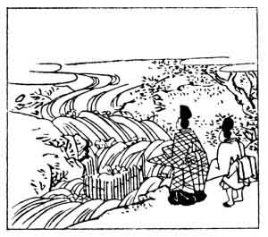

  
[Intangible Textual Heritage](../../index)  [Japan](../index) 
[Index](index)  [Previous](hvj064)  [Next](hvj066) 

------------------------------------------------------------------------

[Buy this Book on
Kindle](https://www.amazon.com/exec/obidos/ASIN/B002HRE8VG/internetsacredte)

------------------------------------------------------------------------

  
*A Hundred Verses from Old Japan (The Hyakunin-isshu)*, tr. by William
N. Porter, \[1909\], at Intangible Textual Heritage

------------------------------------------------------------------------

p. 64

 

### 64

### THE ASSISTANT IMPERIAL ADVISER SADA-YORI

### GON CHŪ-NAGON SADA-YORI

  Asaborake  
Uji no kawagiri  
  Tae-dae ni  
Araware wataru  
Seze no ajiro-gi.

SO thickly lies the morning mist,  
  That I can scarcely see  
The fish-nets on the river bank,  
  The River of Uji,  
  Past daybreak though it be.

The writer was the son of the author of verse No.
[55](hvj056.htm#page_55); he died in the year 1004. The River Uji is in
the Province of Omi, and drains into Lake Biwa. Seze is a village on the
lake-side, and a suburb of the larger town of Otsu. The poet, looking
across the river, can hardly make out the fish-nets on the shore at
Seze, because of the rising morning mist.

------------------------------------------------------------------------

[Next: 65. Sagami](hvj066)
