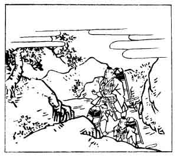

  
[Intangible Textual Heritage](../../index)  [Japan](../index) 
[Index](index)  [Previous](hvj066)  [Next](hvj068) 

------------------------------------------------------------------------

[Buy this Book on
Kindle](https://www.amazon.com/exec/obidos/ASIN/B002HRE8VG/internetsacredte)

------------------------------------------------------------------------

  
*A Hundred Verses from Old Japan (The Hyakunin-isshu)*, tr. by William
N. Porter, \[1909\], at Intangible Textual Heritage

------------------------------------------------------------------------

p. 66

 

### 66

### THE ARCHBISHOP GYŌSON

### DAISŌJŌ GYŌSON

  Morotomo ni  
Aware to omoe  
  Yama zakura  
Hana yori hoka ni  
Shiru hito mo nashi.

IN lonely solitude I dwell,  
  No human face I see;  
And so we two must sympathize,  
  Oh mountain cherry tree;  
  I have no friend but thee.

The Archbishop is said to have ended his life in the
year 1135, by the method described in the note to verse No.
[12](hvj013.htm#page_12). The scene of this poem was the sacred mountain
Ōmine, in the Province of Yamato, famous for its cherry blossoms, and
the illustration shows the Priest with his two attendants addressing the
cherry tree.

------------------------------------------------------------------------

[Next: 67. The Lady-in-Waiting Suwo: Suwo no Naishi](hvj068)
