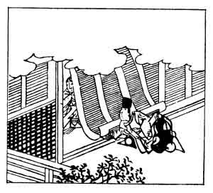

  
[Intangible Textual Heritage](../../index)  [Japan](../index) 
[Index](index)  [Previous](hvj067)  [Next](hvj069) 

------------------------------------------------------------------------

[Buy this Book on
Kindle](https://www.amazon.com/exec/obidos/ASIN/B002HRE8VG/internetsacredte)

------------------------------------------------------------------------

  
*A Hundred Verses from Old Japan (The Hyakunin-isshu)*, tr. by William
N. Porter, \[1909\], at Intangible Textual Heritage

------------------------------------------------------------------------

p. 67

 

### 67

### THE LADY-IN-WAITING SUWO

### SUWO NO NAISHI

  Haru no yo no  
Yume bakari naru  
  Te-makura ni  
Kainaku tatan  
Na koso oshi kere.

IF I had made thy proffered arm  
  A pillow for my head  
For but the moment's time, in which  
  A summer's dream had fled,  
  What would the world have said?

The authoress was the daughter of Tsugunaka Taira,
the Governor of the Province of Suwo, and a lady-in-waiting at the Court
of the Emperor Goreizei, who reigned A.D. 1046-1068. She was present one
day at a long and tedious court function, and, feeling very tired and
sleepy, she called to a servant for a pillow; a nobleman on the other
side of the screen, the First Adviser of State Tadaie, gallantly offered
her his arm, with a request that she would rest her head there, and she
replied with this verse. She intended him to understand that, though she
was willing to accept him as her husband for life, she feared that his
attachment would last no longer than a fleeting summer-night's
dream.

------------------------------------------------------------------------

[Next: 68. The Retired Emperor Sanjō: Sanjō In](hvj069)
