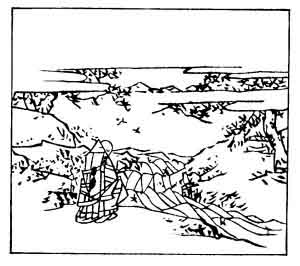

  
[Intangible Textual Heritage](../../index)  [Japan](../index) 
[Index](index)  [Previous](hvj069)  [Next](hvj071) 

------------------------------------------------------------------------

[Buy this Book on
Kindle](https://www.amazon.com/exec/obidos/ASIN/B002HRE8VG/internetsacredte)

------------------------------------------------------------------------

  
*A Hundred Verses from Old Japan (The Hyakunin-isshu)*, tr. by William
N. Porter, \[1909\], at Intangible Textual Heritage

------------------------------------------------------------------------

p. 69

 

### 69

### THE PRIEST NŌ-IN

### NŌ-IN HOSHI

  Arashi fuku  
Mimuro no yama no  
  Momiji-ba wa  
Tatsuta no kawa no  
Nishiki nari keri.

THE storms, which round Mount Mimuro  
  Are wont to howl and scream,  
Have thickly scattered maple leaves  
  Upon Tatsuta's stream;  
  Like red brocade they seem.

The poet's lay name was Nagayasu Tachibana; he was
the son of Motoyasu Tachibana, the Governor of the Province of Hizen.
Mount Mimuro and the Tatsuta River are both in the Province of Yamato,
not far from Nara. The picture is not very clear, but the river is
plainly depicted, and maple leaves are scattered all around.

------------------------------------------------------------------------

[Next: 70. The Priest Riyō-zen: Riyō-zen Hōshi](hvj071)
