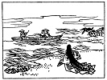
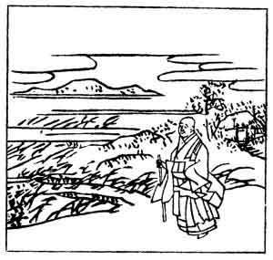

  
[Intangible Textual Heritage](../../index)  [Japan](../index) 
[Index](index)  [Previous](hvj070)  [Next](hvj072) 

------------------------------------------------------------------------

[Buy this Book on
Kindle](https://www.amazon.com/exec/obidos/ASIN/B002HRE8VG/internetsacredte)

------------------------------------------------------------------------

  
*A Hundred Verses from Old Japan (The Hyakunin-isshu)*, tr. by William
N. Porter, \[1909\], at Intangible Textual Heritage

------------------------------------------------------------------------

p. 70

 

### 70

### THE PRIEST RIYŌ-ZEN

### RIYŌ-ZEN HOSHI

  Sabishisa ni  
Yado wo, tachi-idete  
  Nagamureba  
Izuko mo onaji  
Aki no yūgure.

THE prospect from my cottage shows  
  No other hut in sight;  
The solitude depresses me,  
  Like deepening twilight  
  On a chill autumn night.

Nothing is known of this author, but he appears to
have lived during the eleventh century. The Priest appears in the
illustration, looking out over the bare landscape, with his tiny hut in
the background.

------------------------------------------------------------------------

[Next: 71. The First Adviser of State Tsune-nobu: Dai-Nagon
Tsune-nobu](hvj072)
