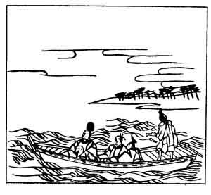

  
[Intangible Textual Heritage](../../index)  [Japan](../index) 
[Index](index)  [Previous](hvj076)  [Next](hvj078) 

------------------------------------------------------------------------

[Buy this Book on
Kindle](https://www.amazon.com/exec/obidos/ASIN/B002HRE8VG/internetsacredte)

------------------------------------------------------------------------

  
*A Hundred Verses from Old Japan (The Hyakunin-isshu)*, tr. by William
N. Porter, \[1909\], at Intangible Textual Heritage

------------------------------------------------------------------------

p. 76

 

### 76

### THE LATE REGENT AND PRIME MINISTER, THE LAY PRIEST OF THE HŌSHŌ TEMPLE

### HŌSHŌ-JI NYŪDŌ SAKI NO KWAMBAKU DAIJŌDAIJIN

  Wada no hara  
Kogi idete mireba  
  Hisakata no  
Kumoi ni magau  
Okitsu shira nami.

WHEN rowing on the open sea,  
  The waves, all capped with white,  
Roll onward, like the fleecy clouds  
  With their resistless might;  
  Truly a wondrous sight!

The real name of this poet was Tadamichi Fujiwara, mentioned in
connexion with the previous verse, who retired from the world and
entered the church. He was the father of the author of verse No.
[95](hvj096.htm#page_95), and is supposed to have died in the year 1164,
at the age of sixty-eight.

The 'pillow-word' *hisakata*, here used in connexion with the clouds, is
referred to in the note to verse No. [33](hvj034.htm#page_33).

------------------------------------------------------------------------

[Next: 77. The Retired Emperor Sutoku: Sutoku In](hvj078)
