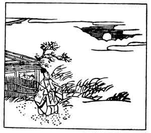

  
[Intangible Textual Heritage](../../index)  [Japan](../index) 
[Index](index)  [Previous](hvj079)  [Next](hvj081) 

------------------------------------------------------------------------

[Buy this Book on
Kindle](https://www.amazon.com/exec/obidos/ASIN/B002HRE8VG/internetsacredte)

------------------------------------------------------------------------

  
*A Hundred Verses from Old Japan (The Hyakunin-isshu)*, tr. by William
N. Porter, \[1909\], at Intangible Textual Heritage

------------------------------------------------------------------------

p. 79

 

### 79

### THE SHINTO OFFICIAL AKI-SUKE, OF THE LEFT SIDE OF THE CAPITAL

### SAKYŌ NO TAIU AKI-SUKE

  Aki kaze ni  
Tanabiku kumo no  
  Taema yori  
More-izaru tsuki no  
Kage no sayakesa.

SEE how the wind of autumn drives  
  The clouds to left and right,  
While in between the moon peeps out,  
  Dispersing with her light  
  The darkness of the night.

Aki-suke died about the year 1155. *More-izuru*
literally means, that the light of the moon 'leaks out'; the verse is a
charming example of a Japanese picture-poem. Probably the first word of
the verse was purposely made to coincide with the poet's first name in
sound, although the two words are written with different characters in
the original.

------------------------------------------------------------------------

[Next: 80. Lady Horikawa, in Attendance on the Dowager Empress Taiken:
Taiken Mon-in Horikawa](hvj081)
