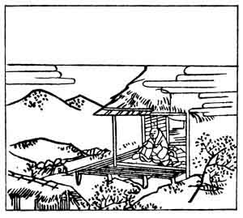

  
[Intangible Textual Heritage](../../index)  [Japan](../index) 
[Index](index)  [Previous](hvj082)  [Next](hvj084) 

------------------------------------------------------------------------

[Buy this Book on
Kindle](https://www.amazon.com/exec/obidos/ASIN/B002HRE8VG/internetsacredte)

------------------------------------------------------------------------

  
*A Hundred Verses from Old Japan (The Hyakunin-isshu)*, tr. by William
N. Porter, \[1909\], at Intangible Textual Heritage

------------------------------------------------------------------------

p. 82

 

### 82

### THE PRIEST DŌ-IN

### DŌ-IN HOSHI

  Omoi-wabi  
Satemo inochi wa  
  Aru mono wo  
Uki ni taenu wa  
Namida nari keri.

How sad and gloomy is the world,  
  This world of sin and woe!  
Ah! while I drift along Life's stream,  
  Tossed helpless to and fro,  
  My tears will ever flow.

The Priest Dō-in was a member of the Fujiwara
family. The date of this verse is not known, but it was probably written
in the twelfth century. The illustration shows the priest alone in his
hut, lamenting over the sorrows of humanity.

------------------------------------------------------------------------

[Next: 83. Toshi-Nari, A Shinto Official in Attendance on the Empress
Dowager: Kwō-tai-kōgū no Taiu Toshi-nari](hvj084)
