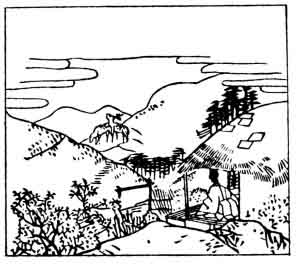

  
[Intangible Textual Heritage](../../index)  [Japan](../index) 
[Index](index)  [Previous](hvj083)  [Next](hvj085) 

------------------------------------------------------------------------

[Buy this Book on
Kindle](https://www.amazon.com/exec/obidos/ASIN/B002HRE8VG/internetsacredte)

------------------------------------------------------------------------

  
*A Hundred Verses from Old Japan (The Hyakunin-isshu)*, tr. by William
N. Porter, \[1909\], at Intangible Textual Heritage

------------------------------------------------------------------------

p. 83

 

### 83

### TOSHI-NARI, A SHINTO OFFICIAL IN ATTENDANCE ON THE EMPRESS DOWAGER

### KWŌ-TAI-KŌGŪ NO TAIU TOSHI-NARI

  Yo no naka yo  
Michi koso nakere  
  Omoi iru  
Yama no oku ni mo  
Shika zo naku naru.

FROM pain and sorrow all around  
  There 's no escape, I fear;  
To mountain wilds should I retreat,  
  There also I should hear  
  The cry of hunted deer.

Toshi-nari was a celebrated poet and nobleman in the
reign of the Emperor Gotoba. He, however, gave up his position at Court
and entered the church in the year 1176. He was the father of the
writers of verses Nos. [94](hvj095.htm#page_94) and
[97](hvj098.htm#page_97), and died in the year 1204, at the age of
ninety-one.

------------------------------------------------------------------------

[Next: 84. The Minister Kiyo-suke Fujiwara: Fujiwara No Kiyo-suke
Ason](hvj085)
