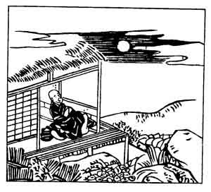

  
[Intangible Textual Heritage](../../index)  [Japan](../index) 
[Index](index)  [Previous](hvj086)  [Next](hvj088) 

------------------------------------------------------------------------

[Buy this Book on
Kindle](https://www.amazon.com/exec/obidos/ASIN/B002HRE8VG/internetsacredte)

------------------------------------------------------------------------

  
*A Hundred Verses from Old Japan (The Hyakunin-isshu)*, tr. by William
N. Porter, \[1909\], at Intangible Textual Heritage

------------------------------------------------------------------------

p. 86

 

### 86

### THE PRIEST SAIGYŌ

### SAIGYŌ HŌSHI

  Nageke tote  
Tsuki ya wa mono wo  
  Omowasuru  
Kakochi-gao naru  
Waga namida kana.

O’ERCOME with pity for this world,  
  My tears obscure my sight;  
I wonder, can it be the moon  
  Whose melancholy light  
  Has saddened me to-night?

Saigyō was a member of the Fujiwara family, an
eccentric monk, and a famous poet, who lived A.D. 1115-1188. He was once
in attendance on the Emperor, when a bird by fluttering its wings began
scattering the blossoms of a plum tree. The Emperor directed him to
drive off the bird, but the priest, with an excess of zeal, killed it by
a stroke of his fan. On reaching home his wife told him that she had
dreamt that she was changed into a bird and that he had struck her; and
this incident made such an impression upon him, that he retired from
Court, and spent the rest of his life in the church.

------------------------------------------------------------------------

[Next: 87. The Priest Jaku-ren: Jaku-ren Hōshi](hvj088)
