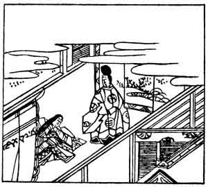

  
[Intangible Textual Heritage](../../index)  [Japan](../index) 
[Index](index)  [Previous](hvj089)  [Next](hvj091) 

------------------------------------------------------------------------

[Buy this Book on
Kindle](https://www.amazon.com/exec/obidos/ASIN/B002HRE8VG/internetsacredte)

------------------------------------------------------------------------

  
*A Hundred Verses from Old Japan (The Hyakunin-isshu)*, tr. by William
N. Porter, \[1909\], at Intangible Textual Heritage

------------------------------------------------------------------------

p. 89

 

### 89

### PRINCESS SHIKISHI

### SHIKISHI NAISHINNŌ

  Tama no o yo  
Taenaba taene  
  Nagaraeba  
Shinoburu koto no  
Yowari mo zo suru.

THE ailments of advancing years  
  Though I should try to hide,  
Some day the thread will break, the pearls  
  Be scattered far and wide;  
  Age cannot be defied.

The Princess was the daughter of the Emperor Goshirakawa, who reigned
A.D. 1156-1158. In this short reign, however, the country suffered from
a very severe earthquake and a devastating civil war.

The second line is a play upon the two verbs *tae*, which are both
pronounced the same, but which are written with different ideographic
characters. The first couplet, taken literally, reads, 'If the string of
pearls (i.e. my life) *break*, I must *bear* it.'

The illustration seems to show the Princess sitting down with a nobleman
in attendance.

------------------------------------------------------------------------

[Next: 90. The Chief Vice-Official in Attendance on the Dowager Empress
Impu: Impu Mon-in no Ōsuke](hvj091)
