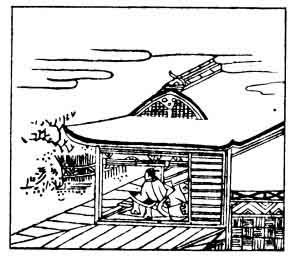

  
[Intangible Textual Heritage](../../index)  [Japan](../index) 
[Index](index)  [Previous](hvj091)  [Next](hvj093) 

------------------------------------------------------------------------

[Buy this Book on
Kindle](https://www.amazon.com/exec/obidos/ASIN/B002HRE8VG/internetsacredte)

------------------------------------------------------------------------

  
*A Hundred Verses from Old Japan (The Hyakunin-isshu)*, tr. by William
N. Porter, \[1909\], at Intangible Textual Heritage

------------------------------------------------------------------------

p. 91

 

### 91

### THE REGENT AND FORMER PRIME MINISTER GO-KYŌ-GOKU

### GO-KYŌ-GOKU SESSHŌ SAKI NO DAIJŌDAIJIN

  Kirigirisu  
Naku ya shimo yo no  
  Samushiro ni  
Koromo katashiki  
Hitori kamo nen.

I'M sleeping all alone, and hear  
  The crickets round my head;  
So cold and frosty is the night,  
  That I across the bed  
  My koromo have spread.

This writer was another of the great Fujiwara family, and died in the
year 1206.

The word *kirigirisu*, a cricket, is supposed to represent its song; the
Japanese say that the chirping of crickets means cold weather.

In the picture the poet is sitting up in bed with his arm on his pillow,
listening to the crickets; and in the original illustrated edition
underneath the verse is drawn a cricket hiding in the grass.

------------------------------------------------------------------------

[Next: 92. Sanuki, in Attendance on the Retired Emperor Nijō: Nijō In
Sanuki](hvj093)
