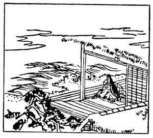

  
[Intangible Textual Heritage](../../index)  [Japan](../index) 
[Index](index)  [Previous](hvj092)  [Next](hvj094) 

------------------------------------------------------------------------

[Buy this Book on
Kindle](https://www.amazon.com/exec/obidos/ASIN/B002HRE8VG/internetsacredte)

------------------------------------------------------------------------

  
*A Hundred Verses from Old Japan (The Hyakunin-isshu)*, tr. by William
N. Porter, \[1909\], at Intangible Textual Heritage

------------------------------------------------------------------------

p. 92

 

### 92

### SANUKI, IN ATTENDANCE ON THE RETIRED EMPEROR NIJŌ

### NIJŌ IN SANUKI

  Waga sode wa  
Shiohi ni mienu  
  Oki no ishi no  
Hito koso shirane  
Kawaku ma mo nashi.

MY sleeve is wet with floods of tears  
  As here I sit and cry;  
’Tis wetter than a low-tide rock,—  
  No one, howe’er he try,  
  Can find a spot that 's dry!

The Lady Sanuki was one of the Minamoto family, and
lived at the Court of the Emperor Nijō, who reigned A.D. 1159-1165. She
was the daughter of the retired Emperor Goshirakawa, and died A.D.
1165.

------------------------------------------------------------------------

[Next: 93. The Minister of the Right District of Kamakura: Kamakura
Udaijin](hvj094)
