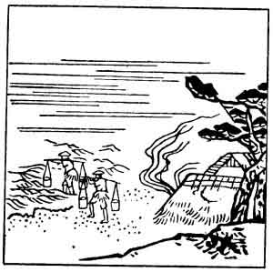

  
[Intangible Textual Heritage](../../index)  [Japan](../index) 
[Index](index)  [Previous](hvj097)  [Next](hvj099) 

------------------------------------------------------------------------

[Buy this Book on
Kindle](https://www.amazon.com/exec/obidos/ASIN/B002HRE8VG/internetsacredte)

------------------------------------------------------------------------

  
*A Hundred Verses from Old Japan (The Hyakunin-isshu)*, tr. by William
N. Porter, \[1909\], at Intangible Textual Heritage

------------------------------------------------------------------------

p. 97

 

### 97

### THE ASSISTANT IMPERIAL ADVISER SADA-IYE

### GON CHU-NAGON SADA-IYE

  Konu hito wo  
Matsu-hō no ura no  
  Yūnagi ni  
Yaku ya moshio no  
Mi mo kogare-tsutsu.

UPON the shore of Matsu-hō  
  For thee I pine and sigh;  
Though calm and cool the evening air,  
  These salt-pans caked and dry  
  Are not more parched than I!

Sada-iye, of the Fujiwara family, was the Compiler of this Collection of
verses; he was the son of Toshi-nari, the writer of verse No.
[83](hvj084.htm#page_83), and he entered the priesthood, dying in the
year 1242, at the age of eighty.

*Matsu-hō* is on the north coast of the Island of Awaji, in the Inland
Sea; but the word also means 'a place of waiting and longing for
somebody'. *Kogare* means 'scorching or evaporating' (sea-water in the
saltpans), but it also has the meaning 'to long for, or to love
ardently.'

The illustration shows two men carrying pails of sea-water to the
salt-pans.

------------------------------------------------------------------------

[Next: 98. The Official Iye-Taka: Jūnii Iye-taka](hvj099)
