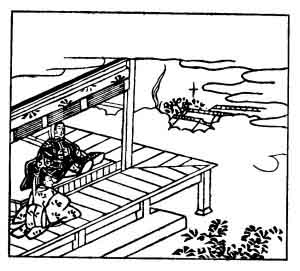

  
[Intangible Textual Heritage](../../index)  [Japan](../index) 
[Index](index)  [Previous](hvj099)  [Next](hvj101) 

------------------------------------------------------------------------

[Buy this Book on
Kindle](https://www.amazon.com/exec/obidos/ASIN/B002HRE8VG/internetsacredte)

------------------------------------------------------------------------

  
*A Hundred Verses from Old Japan (The Hyakunin-isshu)*, tr. by William
N. Porter, \[1909\], at Intangible Textual Heritage

------------------------------------------------------------------------

p. 99

 

### 99

### THE RETIRED EMPEROR GOTOBA

### GOTOBA NO IN

  Hito mo oshi  
Hito mo urameshi  
  Ajiki-naku  
Yo wo omou yue ni.  
Mono omou mi wa.

How I regret my fallen friends  
  How I despise my foes!  
And, tired of life, I only seek  
  To reach my long day's close,  
  And gain at last repose.

The Emperor Gotoba, or Toba II, reigned A.D. 1186-1198. He was the son
of the retired Emperor Takakura, and was banished to Amagori, in the Oki
Islands, where he took the name of Sen-Tei, busied himself in making
swords, and died in the year 1239. He was very sensitive to noises, and
it is said that the frogs of the pool of Shike-kuro have been dumb ever
since the year 1200; for their croaking at night disturbed his rest, and
he commanded them to be silent. It was in the eleventh year of his reign
that the title of Shōgun was created and conferred upon the great
General Yoritomo; which title, down to the year 1868, was borne by the
real rulers of the country, the Emperor himself being not much more than
a figure-head.

Notice the resemblance in sound between the first and second lines, and
between the fourth and fifth lines, not fully brought out in the
translation.

------------------------------------------------------------------------

[Next: 100. The Retired Emperor Jun-toku: Jun-Toku In](hvj101)
