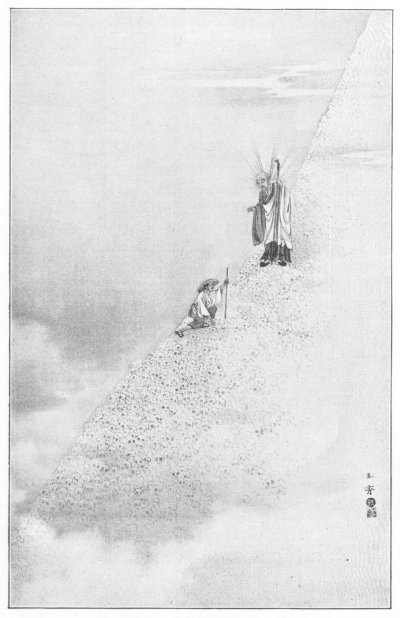

[Intangible Textual Heritage](../../index)  [Shinto](../index) 
[Images](imglist)  [Index](index)  [Next](igj01) 

------------------------------------------------------------------------

# IN GHOSTLY JAPAN

#### By LAFCADIO HEARN

#### Little, Brown, and Co., Boston

#### \[1899\]

{scanned at Intangible Textual Heritage, February, 2002}

------------------------------------------------------------------------

  
THE MOUNTAIN OF SKULLS

------------------------------------------------------------------------

{p. v}

To

MRS. ALICE VON BEHRENS

for Auld Lang Syne

{p. vii}

------------------------------------------------------------------------

[Next: Table of Contents](igj01)
