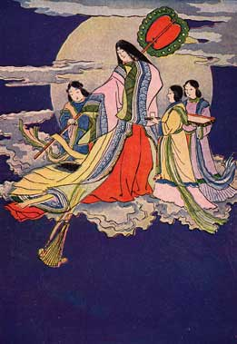

  
[Intangible Textual Heritage](../../index)  [Shinto](../index) 

------------------------------------------------------------------------

<table width="75%">
<colgroup>
<col style="width: 50%" />
<col style="width: 50%" />
</colgroup>
<tbody>
<tr class="odd">
<td width="50%" data-valign="CENTER"> 
</td>
<td width="50%" data-valign="TOP"><h1 id="japanese-fairy-tales" data-align="CENTER">JAPANESE FAIRY TALES</h1>
<h5 id="second-series." data-align="CENTER">Second Series.</h5>
<h2 id="by-teresa-peirce-williston" data-align="CENTER">by TERESA PEIRCE WILLISTON</h2>
<h4 id="section" data-align="CENTER">[1911]</h4></td>
</tr>
</tbody>
</table>

------------------------------------------------------------------------

[Title Page](jft200)  
[A Foreword](jft201)  
[Contents](jft202)  
[The First Rabbits](jft203)  
[Lord Bag of Rice](jft204)  
[Peach Darling](jft205)  
[The Old Man with a Wart](jft206)  
[The Eighty-One Brothers](jft207)  

### The Bamboo-Cutter's Daughter

[The Bamboo Princess](jft208)  
[The Great Stone Bowl](jft209)  
[The Branch of the Jewel Tree](jft210)  
[The Fire Robe](jft211)  
[The Shell in the Swallows' Nest](jft212)  
[The Dragon Jewel](jft213)  
[The Smoke of Fuji Yama](jft214)  
