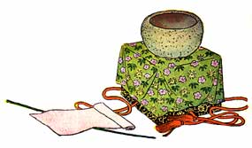

  
[Intangible Textual Heritage](../../index)  [Shinto](../index) 
[Index](index)  [Previous](jft208)  [Next](jft210) 

------------------------------------------------------------------------

### THE GREAT STONE BOWL

PEOPLE say that far away in India there is a stone bowl that belonged to
the great god Buddha. They also say that it gleams and sparkles as
though set with the most beautiful gems.

It is hidden deep in the darkness of a great temple. Few have ever seen
it, but those who have can never talk enough about its beauty.

The prince who promised to go to India in search of the bowl was a very
lazy man. At first he really meant to go, but the more he thought about
it the lazier he felt.

He asked the sailors how long it took to go to India and return. They
said it took three years. At that he made up his mind he never would go.
The idea of spending three years looking for a bowl, an old one, too!

So he went away to another city and stayed for three years. At the end
of that time he went into a little temple. There he found an old stone
bowl sitting it, front of the shrine.

He took this bowl and wrapped it in a cloth of richest silk. To this he
tied a letter telling of his long hard journey to find the bowl for her.
Then he sent it to the princess.

|                   |
|-------------------|
|  |

When the princess read the letter she was sorry that he had suffered so
much to bring her the bowl. Then she opened the silk wrappings and saw
the bowl of common stone. She now saw that he had tried to deceive her,
and was very angry.

When he came she would not even see him, but sent, the bowl and letter
back to him.

The prince felt very sad, but he knew that he deserved it, so he went
home to his own house. He kept the bowl to remind him that you get
nothing good in this world unless you work for it.

------------------------------------------------------------------------

[Next: The Branch of the Jewel Tree](jft210)
