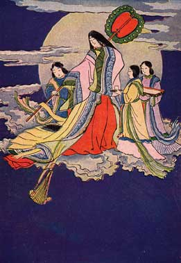

  
[Intangible Textual Heritage](../../index)  [Shinto](../index) 
[Index](index)  [Previous](jft213) 

------------------------------------------------------------------------

### THE SMOKE OF FUJI YAMA

YEARS passed by and the princess took good care of her old father and
mother. They were very old now.

Now they saw why she had asked the five princes to do impossible things.
She really wanted to stay with her parents, and yet she knew that if she
refused to marry the princes they might be angry with her and harm her
father.

Each day she grew more beautiful and more kind and gentle.

When she was twenty years old, which is quite old for a Japanese maiden,
her mother died. Then she seemed to grow very sad.

Whenever the full moon whitened the earth with its soft light she would
go away by herself and weep.

One evening late in summer she was sitting on a balcony looking up at
the moon, and sobbing as though her heart would break.

Her old father came to her and said, "My daughter, tell me your trouble.
I know that you have tried to keep it from me lest I should grieve, too,
but it will kill me to see you so sad if I cannot help you."

Then the princess said, "I weep, dear father, because I know that I must
soon leave you. My home is really in the moon. I was sent here to take
care of you, but now the time comes when I must go. I do not wish to
leave you, but I must. When the next full moon comes they will send for
me."

Her father was sad indeed to hear this, but answered: "Do you think that
I will let anyone come and take you away? I shall go to the Emperor
himself and ask his aid."

"It will be of no use. No one can keep me when the time comes," she
answered sadly.

However, her father went to the Emperor and told him the whole story.
The great Emperor was touched by the love of the maiden who had chosen
to stay with her parents and care for them. He promised to send a whole
army to guard the house when the time came.

The old bamboo-cutter went home very cheerful, but the princess was
sadder than ever.

The old moon faded away. A few nights showed only the blue of the
heavens and the gold of the stars. Then a tiny silver thread showed just
after sunset. Each night it widened and brightened. Each day the
princess grew sadder and sadder.

The Emperor remembered his promise, and sent a great army who camped
about the house. Hundreds of men were placed on the roof of the house.
Surely no one could enter through such a guard.

The first night of the full moon came. The princess waited on her
balcony for the moon to rise.

Slowly over the tops of the trees on the mountain rose the great silver
ball. Every sound was hushed.

The princess went to her father. He lay as if asleep. When she came near
he opened his eyes. "I see now why you must go," he said. "It is because
I am going, too. Thank you, my daughter, for all the happiness you have
brought to us." Then he closed his eyes and she saw that he was dead.

The moon rose higher and higher. A line of light like a fairy bridge
reached from heaven to earth.

Drifting down it, like smoke before the wind, came countless troops of
soldiers in shining armor. There was no sound, no breath of wind, but on
they came.

The soldiers of the Emperor stood as though turned to stone. The
princess went forward to meet the leader of these heavenly visitors.

"I am ready," she said. There was no other sound. Silently he handed her
a tiny cup. As silently she drank from it. It was the water of
forgetfulness. All her life on earth faded from her. Once more she was a
moon maiden and would live forever.

The leader gently laid a mantle of gleaming snow-white feathers over her
shoulders. Her old garments slipped to the earth and disappeared.

|                   |
|-------------------|
|  |

Rising like the morning mists that lie along the lake the white company
passed slowly to the top of Fuji Yama, the sacred mountain of Japan.

On, on, up through the still whiteness of the moonlight, the long line
passed, until once more they reached the silver gates of the moon city,
where all is happiness and peace.

Men say that even now a soft white wreath of smoke curls up from the
sacred crown of Fuji Yama, like a floating bridge to that fair city far
off in the sky.

THE END
