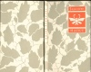
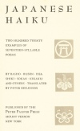
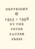

  
[Intangible Textual Heritage](../../index)  [Japan](../index) 
[Index](index)  [Next](jh01) 

------------------------------------------------------------------------

*Japanese Haiku*, by Peter Beilenson, \[1955\], at Intangible Textual
Heritage

------------------------------------------------------------------------

# JAPANESE

# HAIKU

 

<table data-border="0">
<colgroup>
<col style="width: 50%" />
<col style="width: 50%" />
</colgroup>
<tbody>
<tr class="odd">
<td data-valign="top" width="327">
TWO HUNDRED TWENTY 
EXAMPLES OF 
SEVENTEEN-SYLLABLE 
POEMS

 
</td>
<td data-valign="top" width="327">
 
</td>
</tr>
<tr class="even">
<td data-valign="top" width="327">
 
</td>
<td data-valign="top" width="327">
 
</td>
</tr>
<tr class="odd">
<td data-valign="top" width="327">
BY BASHO • BUSON • ISSA 
SHIKI SOKAN • KIKAKU 
AND OTHERS • TRANSLATED 
BY PETER BEILENSON

 
</td>
<td data-valign="top" width="327">
 
</td>
</tr>
<tr class="even">
<td data-valign="top" width="327">
 
</td>
<td data-valign="top" width="327">
 
</td>
</tr>
<tr class="odd">
<td data-valign="top" width="327">
PUBLISHED BY THE 
PETER PAUPER PRESS 
MOUNT VERNON 
NEW YORK
</td>
<td data-valign="top" width="327">
 
</td>
</tr>
</tbody>
</table>

 

#### \[1955\]

Scanned at Intangible Textual Heritage, April 2007. Proofed and
formatted by John Bruno Hare. This text is in the public domain in the
United States because it was not renewed in a timely fashion as required
by law at the time. These files may be used for any non-commercial
purpose, provided this notice of attribution is left intact in all
copies.

[  
Click to enlarge](img/cover.jpg)  
Cover  

[  
Click to enlarge](img/title.jpg)  
Title Page  

[  
Click to enlarge](img/verso.jpg)  
Verso  

------------------------------------------------------------------------

[Next: A Note On Japanese Haiku](jh01)
