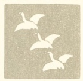
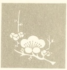

  
[Intangible Textual Heritage](../../index)  [Japan](../index) 
[Index](index)  [Previous](jh04)  [Next](jh06) 

------------------------------------------------------------------------

*Japanese Haiku*, by Peter Beilenson, \[1955\], at Intangible Textual
Heritage

------------------------------------------------------------------------

p. 36

<table data-border="0">
<colgroup>
<col style="width: 50%" />
<col style="width: 50%" />
</colgroup>
<tbody>
<tr class="odd">
<td data-valign="top" width="327">
LADY BUTTERFLY 
  PERFUMES HER WINGS 
  BY FLOATING 
OVER THE ORCHID 
 

</td>
<td data-valign="top" width="327">
 
</td>
</tr>
<tr class="even">
<td data-valign="top" width="327">
BASHO
</td>
<td data-valign="top" width="327">
 
</td>
</tr>
</tbody>
</table>

 

<table data-border="0">
<colgroup>
<col style="width: 50%" />
<col style="width: 50%" />
</colgroup>
<tbody>
<tr class="odd">
<td data-valign="top" width="327">
IF STRANGERS THREATEN 
  TURN INTO FAT 
  GREEN BULLFROGS... 
POND-COOLING MELONS 
 

</td>
<td data-valign="top" width="327">
 
</td>
</tr>
<tr class="even">
<td data-valign="top" width="327">
ISSA
</td>
<td data-valign="top" width="327">
 
</td>
</tr>
</tbody>
</table>

 

<table data-border="0">
<colgroup>
<col style="width: 50%" />
<col style="width: 50%" />
</colgroup>
<tbody>
<tr class="odd">
<td data-valign="top" width="327">
YELLOW EVENING SUN ... 
  LONG SHADOW 
  OF THE SCARECROW 
REACHES TO THE ROAD 
 

</td>
<td data-valign="top" width="327">
 

 
</td>
</tr>
<tr class="even">
<td data-valign="top" width="327">
SHOHA
</td>
<td data-valign="top" width="327">
 
</td>
</tr>
</tbody>
</table>

 

<table data-border="0">
<colgroup>
<col style="width: 50%" />
<col style="width: 50%" />
</colgroup>
<tbody>
<tr class="odd">
<td data-valign="top" width="327">
A CAMELLIA 
  DROPPED DOWN INTO 
  STILL WATERS 
OF A DEEP DARK WELL 
 

</td>
<td data-valign="top" width="327">
 
</td>
</tr>
<tr class="even">
<td data-valign="top" width="327">
BUSON
</td>
<td data-valign="top" width="327">
 
</td>
</tr>
</tbody>
</table>

 

p. 37

<table data-border="0">
<colgroup>
<col style="width: 50%" />
<col style="width: 50%" />
</colgroup>
<tbody>
<tr class="odd">
<td data-valign="top" width="327">
FOR THE EMPEROR 
  HIMSELF HE WILL NOT 
  LIFT HIS HAT ... 
A STIFF-BACKED SCARECROW 
 

</td>
<td data-valign="top" width="327">
 
</td>
</tr>
<tr class="even">
<td data-valign="top" width="327">
DANSUI
</td>
<td data-valign="top" width="327">
 
</td>
</tr>
</tbody>
</table>

 

<table data-border="0">
<colgroup>
<col style="width: 50%" />
<col style="width: 50%" />
</colgroup>
<tbody>
<tr class="odd">
<td data-valign="top" width="327">
IN THE HOLY DUSK 
  NIGHTINGALES BEGIN 
  THEIR PSALM... 
GOOD! THE DINNER-GONG! 
 

</td>
<td data-valign="top" width="327">
 
</td>
</tr>
<tr class="even">
<td data-valign="top" width="327">
BUSON
</td>
<td data-valign="top" width="327">
 
</td>
</tr>
</tbody>
</table>

 

<table data-border="0">
<colgroup>
<col style="width: 50%" />
<col style="width: 50%" />
</colgroup>
<tbody>
<tr class="odd">
<td data-valign="top" width="327">
LIVE IN SIMPLE FAITH ... 
  JUST AS THIS 
  TRUSTING CHERRY 
FLOWERS, FADES, AND FALLS 
 

</td>
<td data-valign="top" width="327">
 
</td>
</tr>
<tr class="even">
<td data-valign="top" width="327">
ISSA
</td>
<td data-valign="top" width="327">
 
</td>
</tr>
</tbody>
</table>

 

<table data-border="0">
<colgroup>
<col style="width: 50%" />
<col style="width: 50%" />
</colgroup>
<tbody>
<tr class="odd">
<td data-valign="top" width="327">
NIGHT IS BRIGHT WITH STARS 
  ... SILLY WOMAN, 
  WHIMPERING: 
SHALL I LIGHT THE LAMP? 
 

</td>
<td data-valign="top" width="327">
 
</td>
</tr>
<tr class="even">
<td data-valign="top" width="327">
ETSUJIN
</td>
<td data-valign="top" width="327">
 
</td>
</tr>
</tbody>
</table>

 

p. 38

<table data-border="0">
<colgroup>
<col style="width: 50%" />
<col style="width: 50%" />
</colgroup>
<tbody>
<tr class="odd">
<td data-valign="top" width="327">
BLACK DESOLATE MOOR... 
  I BOW BEFORE 
  THE BUDDHA 
LIGHTED IN THUNDER 
 

</td>
<td data-valign="top" width="327">
 
</td>
</tr>
<tr class="even">
<td data-valign="top" width="327">
KAKEI
</td>
<td data-valign="top" width="327">
 
</td>
</tr>
</tbody>
</table>

 

<table data-border="0">
<colgroup>
<col style="width: 50%" />
<col style="width: 50%" />
</colgroup>
<tbody>
<tr class="odd">
<td data-valign="top" width="327">
DIRTY BATH-WATER 
  WHERE CAN I POUR 
  YOU? ... INSECTS 
SINGING IN THE GRASS 
 

</td>
<td data-valign="top" width="327">
 
</td>
</tr>
<tr class="even">
<td data-valign="top" width="327">
ONITSURA
</td>
<td data-valign="top" width="327">
 
</td>
</tr>
</tbody>
</table>

 

<table data-border="0">
<colgroup>
<col style="width: 50%" />
<col style="width: 50%" />
</colgroup>
<tbody>
<tr class="odd">
<td data-valign="top" width="327">
WEE BITTER CRICKET 
  CRYING ALL THIS 
  SUNNY DAY ... 
OR IS HE LAUGHING? 
 

</td>
<td data-valign="top" width="327">
 
</td>
</tr>
<tr class="even">
<td data-valign="top" width="327">
OEMARU
</td>
<td data-valign="top" width="327">
 
</td>
</tr>
</tbody>
</table>

 

<table data-border="0">
<colgroup>
<col style="width: 50%" />
<col style="width: 50%" />
</colgroup>
<tbody>
<tr class="odd">
<td data-valign="top" width="327">
A SHORT SUMMER NIGHT... 
  BUT IN THIS SOLEMN 
  DARKNESS 
ONE PEONY BLOOMED 
 

</td>
<td data-valign="top" width="327">
 
</td>
</tr>
<tr class="even">
<td data-valign="top" width="327">
BUSON
</td>
<td data-valign="top" width="327">
 
</td>
</tr>
</tbody>
</table>

 

p. 39

<table data-border="0">
<colgroup>
<col style="width: 50%" />
<col style="width: 50%" />
</colgroup>
<tbody>
<tr class="odd">
<td data-valign="top" width="327">
LONG THE SUMMER DAY ... 
  PATTERNS ON 
  THE OCEAN SAND... 
OUR IDLE FOOTPRINTS 
 

</td>
<td data-valign="top" width="327">
 
</td>
</tr>
<tr class="even">
<td data-valign="top" width="327">
SHIKI
</td>
<td data-valign="top" width="327">
 
</td>
</tr>
</tbody>
</table>

 

<table data-border="0">
<colgroup>
<col style="width: 50%" />
<col style="width: 50%" />
</colgroup>
<tbody>
<tr class="odd">
<td data-valign="top" width="327">
ANGRY I STRODE HOME... 
  BUT STOOPING IN 
  MY GARDEN 
CALM OLD WILLOW-TREE 
 

</td>
<td data-valign="top" width="327">
 
</td>
</tr>
<tr class="even">
<td data-valign="top" width="327">
RYOTA
</td>
<td data-valign="top" width="327">
 
</td>
</tr>
</tbody>
</table>

 

<table data-border="0">
<colgroup>
<col style="width: 50%" />
<col style="width: 50%" />
</colgroup>
<tbody>
<tr class="odd">
<td data-valign="top" width="327">
OH DO NOT SWAT THEM ... 
  UNHAPPY FLIES 
  FOREVER 
WRINGING THEIR THIN HANDS 
 

</td>
<td data-valign="top" width="327">
 
</td>
</tr>
<tr class="even">
<td data-valign="top" width="327">
ISSA
</td>
<td data-valign="top" width="327">
 
</td>
</tr>
</tbody>
</table>

 

<table data-border="0">
<colgroup>
<col style="width: 50%" />
<col style="width: 50%" />
</colgroup>
<tbody>
<tr class="odd">
<td data-valign="top" width="327">
SEE ... THE HEAVY LEAF 
  ON THE SILENT 
  WINDLESS DAY ... 
FALLS OF ITS OWN WILL 
 

</td>
<td data-valign="top" width="327">
 
</td>
</tr>
<tr class="even">
<td data-valign="top" width="327">
BONCHO
</td>
<td data-valign="top" width="327">
 
</td>
</tr>
</tbody>
</table>

 

p. 40

<table data-border="0">
<colgroup>
<col style="width: 50%" />
<col style="width: 50%" />
</colgroup>
<tbody>
<tr class="odd">
<td data-valign="top" width="327">
RASH TOM-CAT LOVER... 
  CARELESS EVEN 
  OF THAT RICE 
STUCK IN YOUR WHISKERS 
 

</td>
<td data-valign="top" width="327">
 
</td>
</tr>
<tr class="even">
<td data-valign="top" width="327">
TAIGI
</td>
<td data-valign="top" width="327">
 
</td>
</tr>
</tbody>
</table>

 

<table data-border="0">
<colgroup>
<col style="width: 50%" />
<col style="width: 50%" />
</colgroup>
<tbody>
<tr class="odd">
<td data-valign="top" width="327">
MOON SO BRIGHT FOR LOVE! 
  OH, HEAR THE FARMER 
  BY THAT LIGHT... 
FLAILING HIS LOVELY RICE! 
 

</td>
<td data-valign="top" width="327">
 
</td>
</tr>
<tr class="even">
<td data-valign="top" width="327">
ETSUJIN
</td>
<td data-valign="top" width="327">
 
</td>
</tr>
</tbody>
</table>

 

<table data-border="0">
<colgroup>
<col style="width: 50%" />
<col style="width: 50%" />
</colgroup>
<tbody>
<tr class="odd">
<td data-valign="top" width="327">
NOW THE SWINGING BRIDGE 
  IS QUIETED 
  WITH CREEPERS... 
LIKE OUR TENDRILLED LIFE 
 

</td>
<td data-valign="top" width="327">
 
</td>
</tr>
<tr class="even">
<td data-valign="top" width="327">
BASHO
</td>
<td data-valign="top" width="327">
 
</td>
</tr>
</tbody>
</table>

 

<table data-border="0">
<colgroup>
<col style="width: 50%" />
<col style="width: 50%" />
</colgroup>
<tbody>
<tr class="odd">
<td data-valign="top" width="327">
DANCING IN MY SILKS 
  MONEY TOSSED ITSELF 
  AWAY... 
PRETTY, THIS PAPER DRESS! 
 

</td>
<td data-valign="top" width="327">
 
</td>
</tr>
<tr class="even">
<td data-valign="top" width="327">
SONO-JO
</td>
<td data-valign="top" width="327">
 
</td>
</tr>
</tbody>
</table>

 

p. 41

<table data-border="0">
<colgroup>
<col style="width: 50%" />
<col style="width: 50%" />
</colgroup>
<tbody>
<tr class="odd">
<td data-valign="top" width="327">
THE SEA DARKENING... 
  OH VOICES OF THE 
  WILD DUCKS 
CRYING, WHIRLING, WHITE 
 

</td>
<td data-valign="top" width="327">
 
</td>
</tr>
<tr class="even">
<td data-valign="top" width="327">
BASHO
</td>
<td data-valign="top" width="327">
 
</td>
</tr>
</tbody>
</table>

 

<table data-border="0">
<colgroup>
<col style="width: 50%" />
<col style="width: 50%" />
</colgroup>
<tbody>
<tr class="odd">
<td data-valign="top" width="327">
WHITE MOTH, FLUTTER OFF: 
  FLY BACK INTO 
  MY BREAST NOW 
QUICKLY, MY OWN SOUL! 
 

</td>
<td data-valign="top" width="327">
 
</td>
</tr>
<tr class="even">
<td data-valign="top" width="327">
WAFU
</td>
<td data-valign="top" width="327">
 
</td>
</tr>
</tbody>
</table>

 

<table data-border="0">
<colgroup>
<col style="width: 50%" />
<col style="width: 50%" />
</colgroup>
<tbody>
<tr class="odd">
<td data-valign="top" width="327">
NINE TIMES ARISING 
  TO SEE THE MOON... 
  WHOSE SOLEMN PACE 
MARKS ONLY MIDNIGHT YET 
 

</td>
<td data-valign="top" width="327">
 
</td>
</tr>
<tr class="even">
<td data-valign="top" width="327">
BASHO
</td>
<td data-valign="top" width="327">
 
</td>
</tr>
</tbody>
</table>

 

<table data-border="0">
<colgroup>
<col style="width: 50%" />
<col style="width: 50%" />
</colgroup>
<tbody>
<tr class="odd">
<td data-valign="top" width="327">
WATCHING, I WONDER 
  WHAT POET COULD PUT 
  DOWN HIS QUILL... 
A PLUPERFECT MOON! 
 

</td>
<td data-valign="top" width="327">
 
</td>
</tr>
<tr class="even">
<td data-valign="top" width="327">
ONITSURA
</td>
<td data-valign="top" width="327">
 
</td>
</tr>
</tbody>
</table>

 

p. 42

<table data-border="0">
<colgroup>
<col style="width: 50%" />
<col style="width: 50%" />
</colgroup>
<tbody>
<tr class="odd">
<td data-valign="top" width="327">
DO YOUR WORST, OLD FROST 
  YOU CAN NO LONGER 
  WOUND ME ... 
LAST CHRYSANTHEMUM I 
 

</td>
<td data-valign="top" width="327">
 
</td>
</tr>
<tr class="even">
<td data-valign="top" width="327">
OEMARU
</td>
<td data-valign="top" width="327">
 
</td>
</tr>
</tbody>
</table>

 

<table data-border="0">
<colgroup>
<col style="width: 50%" />
<col style="width: 50%" />
</colgroup>
<tbody>
<tr class="odd">
<td data-valign="top" width="327">
PEBBLES SHINING CLEAR, 
  AND CLEAR 
  SIX SILENT FISHES... 
DEEP AUTUMN WATER 
 

</td>
<td data-valign="top" width="327">
 
</td>
</tr>
<tr class="even">
<td data-valign="top" width="327">
BUSON
</td>
<td data-valign="top" width="327">
 
</td>
</tr>
</tbody>
</table>

 

<table data-border="0">
<colgroup>
<col style="width: 50%" />
<col style="width: 50%" />
</colgroup>
<tbody>
<tr class="odd">
<td data-valign="top" width="327">
A BRIGHT AUTUMN MOON... 
  IN THE SHADOW OF 
  EACH GRASS 
AN INSECT CHIRPING 
 

</td>
<td data-valign="top" width="327">
 
</td>
</tr>
<tr class="even">
<td data-valign="top" width="327">
BUSON
</td>
<td data-valign="top" width="327">
 
</td>
</tr>
</tbody>
</table>

 

<table data-border="0">
<colgroup>
<col style="width: 50%" />
<col style="width: 50%" />
</colgroup>
<tbody>
<tr class="odd">
<td data-valign="top" width="327">
YOU TURN AND SUDDENLY 
  THERE IN PURPLING 
  AUTUMN SKY ... 
WHITE FUJIAMI 
 

</td>
<td data-valign="top" width="327">
 
</td>
</tr>
<tr class="even">
<td data-valign="top" width="327">
ONITSURA
</td>
<td data-valign="top" width="327">
 
</td>
</tr>
</tbody>
</table>

 

p. 43

<table data-border="0">
<colgroup>
<col style="width: 50%" />
<col style="width: 50%" />
</colgroup>
<tbody>
<tr class="odd">
<td data-valign="top" width="327">
HERE, WHERE A THOUSAND 
  CAPTAINS SWORE GRAND 
  CONQUEST ... TALL 
GRASS THEIR MONUMENT 
 

</td>
<td data-valign="top" width="327">
 
</td>
</tr>
<tr class="even">
<td data-valign="top" width="327">
BASHO
</td>
<td data-valign="top" width="327">
 
</td>
</tr>
</tbody>
</table>

 

<table data-border="0">
<colgroup>
<col style="width: 50%" />
<col style="width: 50%" />
</colgroup>
<tbody>
<tr class="odd">
<td data-valign="top" width="327">
YELLOW AUTUMN MOON... 
  UNIMPRESSED 
  THE SCARECROW STANDS 
SIMPLY LOOKING BORED 
 

</td>
<td data-valign="top" width="327">
 
</td>
</tr>
<tr class="even">
<td data-valign="top" width="327">
ISSA
</td>
<td data-valign="top" width="327">
 
</td>
</tr>
</tbody>
</table>

 

<table data-border="0">
<colgroup>
<col style="width: 50%" />
<col style="width: 50%" />
</colgroup>
<tbody>
<tr class="odd">
<td data-valign="top" width="327">
WHITE CHRYSANTHEMUM ... 
  BEFORE THAT 
  PERFECT FLOWER 
SCISSORS HESITATE 
 

</td>
<td data-valign="top" width="327">
 
</td>
</tr>
<tr class="even">
<td data-valign="top" width="327">
BUSON
</td>
<td data-valign="top" width="327">
 
</td>
</tr>
</tbody>
</table>

 

<table data-border="0">
<colgroup>
<col style="width: 50%" />
<col style="width: 50%" />
</colgroup>
<tbody>
<tr class="odd">
<td data-valign="top" width="327">
CRUEL AUTUMN WIND 
  CUTTING TO THE 
  VERY BONES... 
OF MY POOR SCARECROW 
 

</td>
<td data-valign="top" width="327">
 
</td>
</tr>
<tr class="even">
<td data-valign="top" width="327">
ISSA
</td>
<td data-valign="top" width="327">
 
</td>
</tr>
</tbody>
</table>

 

p. 44

<table data-border="0">
<colgroup>
<col style="width: 50%" />
<col style="width: 50%" />
</colgroup>
<tbody>
<tr class="odd">
<td data-valign="top" width="327">
NOW IN LATE AUTUMN 
  LOOK, ON MY OLD 
  RUBBISH-HEAP ... 
BLUE MORNING-GLORY 
 

</td>
<td data-valign="top" width="327">
 
</td>
</tr>
<tr class="even">
<td data-valign="top" width="327">
TAIGI
</td>
<td data-valign="top" width="327">
 
</td>
</tr>
</tbody>
</table>

 

<table data-border="0">
<colgroup>
<col style="width: 50%" />
<col style="width: 50%" />
</colgroup>
<tbody>
<tr class="odd">
<td data-valign="top" width="327">
A SINGLE CRICKET 
  CHIRPS, CHIRPS, CHIRPS, 
  AND IS STILL ... MY 
CANDLE SINKS AND DIES 
 

</td>
<td data-valign="top" width="327">
 
</td>
</tr>
<tr class="even">
<td data-valign="top" width="327">
ANON.
</td>
<td data-valign="top" width="327">
 
</td>
</tr>
</tbody>
</table>

 

<table data-border="0">
<colgroup>
<col style="width: 50%" />
<col style="width: 50%" />
</colgroup>
<tbody>
<tr class="odd">
<td data-valign="top" width="327">
FIREWORKS ENDED 
  AND SPECTATORS 
  GONE AWAY... 
AHD HOW VAST AND DARK! 
 

</td>
<td data-valign="top" width="327">
 
</td>
</tr>
<tr class="even">
<td data-valign="top" width="327">
SHIKI
</td>
<td data-valign="top" width="327">
 
</td>
</tr>
</tbody>
</table>

 

<table data-border="0">
<colgroup>
<col style="width: 50%" />
<col style="width: 50%" />
</colgroup>
<tbody>
<tr class="odd">
<td data-valign="top" width="327">
TWO ANCIENT PINE-TREES ... 
  A PAIR OF GNARLED 
  AND STURDY HANDS 
WITH TEN GREEN FINGERS 
 

</td>
<td data-valign="top" width="327">
 
</td>
</tr>
<tr class="even">
<td data-valign="top" width="327">
RYOTO
</td>
<td data-valign="top" width="327">
 
</td>
</tr>
</tbody>
</table>

 

p. 45

<table data-border="0">
<colgroup>
<col style="width: 50%" />
<col style="width: 50%" />
</colgroup>
<tbody>
<tr class="odd">
<td data-valign="top" width="327">
I MUST TURN OVER... 
  BEWARE OF LOCAL 
  EARTHQUAKES 
BEDFELLOW CRICKET! 
 

</td>
<td data-valign="top" width="327">
 
</td>
</tr>
<tr class="even">
<td data-valign="top" width="327">
ISSA
</td>
<td data-valign="top" width="327">
 
</td>
</tr>
</tbody>
</table>

 

<table data-border="0">
<colgroup>
<col style="width: 50%" />
<col style="width: 50%" />
</colgroup>
<tbody>
<tr class="odd">
<td data-valign="top" width="327">
OH! I ATE THEM ALL 
  AND OH! WHAT A 
  STOMACH-ACHE... 
GREEN STOLEN APPLES 
 

</td>
<td data-valign="top" width="327">
 
</td>
</tr>
<tr class="even">
<td data-valign="top" width="327">
SHIKI
</td>
<td data-valign="top" width="327">
 
</td>
</tr>
</tbody>
</table>

 

<table data-border="0">
<colgroup>
<col style="width: 50%" />
<col style="width: 50%" />
</colgroup>
<tbody>
<tr class="odd">
<td data-valign="top" width="327">
NOW IN SAD AUTUMN 
  AS I TAKE MY 
  DARKENING PATH ... 
A SOLITARY BIRD 
 

</td>
<td data-valign="top" width="327">
 
</td>
</tr>
<tr class="even">
<td data-valign="top" width="327">
BASHO
</td>
<td data-valign="top" width="327">
 
</td>
</tr>
</tbody>
</table>

 

<table data-border="0">
<colgroup>
<col style="width: 50%" />
<col style="width: 50%" />
</colgroup>
<tbody>
<tr class="odd">
<td data-valign="top" width="327">
AT OUR LAST PARTING 
  BENDING BETWEEN 
  BOAT AND SHORE... 
THAT WEEPING WILLOW 
 

</td>
<td data-valign="top" width="327">
 
</td>
</tr>
<tr class="even">
<td data-valign="top" width="327">
SHIKI
</td>
<td data-valign="top" width="327">
 
</td>
</tr>
</tbody>
</table>

 

------------------------------------------------------------------------

[Next: Part 5](jh06)
