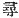

  
[Intangible Textual Heritage](../../index)  [Shinto](../index) 
[Index](index)  [Previous](kj010)  [Next](kj012) 

------------------------------------------------------------------------

[Buy this Book at
Amazon.com](https://www.amazon.com/exec/obidos/ASIN/B0028Y4SZY/internetsacredte)

------------------------------------------------------------------------

  
*The Kojiki*, translated by Basil Hall Chamberlain, \[1919\], at
Intangible Textual Heritage

------------------------------------------------------------------------

p. 20

## \[SECT. IV.—COURTSHIP OF THE DEITIES THE MALE-WHO-INVITES AND THE FEMALE WHO-INVITES.\]

Having descended from Heaven onto this island, they saw to the
erection [1](#fn_150) of an heavenly august
pillar, they saw to the erection of an hall of eight fathoms. [2](#fn_151) Tunc \[20\] quæsivit \[Augustus
Mas-Qui-Invitat\] a minore sorore Augustâ Feminâ-Qui-Invitat: "Tuum
corpus quo in modo factum est?" Respondit dicens: "Meum corpus crescens
crevit, sed est una pars quæ non crevit continua." Tunc dixit Augustus
Mas-Qui-Invitat: "Meum corpus crescens crevit, sed est una pars quæ
crevit superflua. Ergo an bonum erit ut hanc corporis mei partem quæ
crevit, superflua in tui corporis partem quæ non crevit continua
inseram, et regiones procreem?" Augusta Femina-Quæ-Invitat respondit
dicens: "Bonum erit." Tunc dixit Augustus Mas-Qui-Invitat: "Quod

p. 21

quum ita sit, ego et tu hanc cœlestem augustam, columnam circumeuntes
mutuoque occurrentes, augustarum \[*i.e.* privatarum\] partium augustam
coitionem faciemus." [3](#fn_152) Hâc pactione
factâ, dixit \[Augustus Mas-Qui-Invitat\]: "Tu a dexterâ circumeuns
occurre; ego a sinistrâ occurram." Absolutâ pactione ubi circumierunt,
Augusta Femina-Qui-Invitat primum inquit: "O venuste et amabilis
adolescens!" Deinde Augustus Mas-Qui-Invitat inquit: "O venusta et
amabilis virgo!" Postquam singuli orationi finem fecerunt, \[Augustus
Mas-Qui-Invitat\] locutus est sorori, dicens: "Non decet feminam primum
verba facere." Nihilominus in thalamo \[opus procreationis\] inceperunt,
et filium \[nomine\] Hirudinem [4](#fn_153)
\[vel Hirudini similem\] pepererunt. This child they placed in a boat of
reeds, and let it float away. Next they gave birth to the Island of
Aha. [5](#fn_154) This likewise is not reckoned
among their children. [6](#fn_155)

------------------------------------------------------------------------

### Footnotes

[20:1](kj011.htm#fr_150) p.
21 The original of this quasi-causative phrase, of which there is
no other example in Japanese literature so far as the translator's
reading goes, is interpreted by Motowori in the sense of the English
locution to which it literally corresponds, and it has here been
rendered accordingly, though with considerable hesitation. Hirata does
not approve of Motowori's view; but then the different text which he
here adopts imposes on him the necessity of another interpretation. (See
his "Exposition of the Ancient Histories," Vol. II, pp. 39-40).

[20:2](kj011.htm#fr_151) The original word
*hiro* (written  ) is
defined as the distance between the hands when the arms are
outstretched. The word rendered "hall" may also be translated
"palace."—The text of the parallel passage of the "Chronicles" is "they
made the Island of Onogoro the central Pillar of the land,"—a statement
which seems more rational and more in accordance with general tradition
than that of these "Records."

[21:3](kj011.htm#fr_152) This is Hirata's view
of the import of the somewhat obscure original (see his "Exposition of
the Ancient Histories," Vol. II, pp. 61-64). Motowori's interpretation
is: "auguste in thalamo coibimus."

[21:4](kj011.htm#fr_153) p.
22 The name in the original is Hiru-go, an instance of the
fortuitous verbal resemblances occasionally found between unrelated
languages.

[21:5](kj011.htm#fr_154) Literary "foam." It is
supposed to have been an islet near the island of Ahaji in the province
of Sanuki.

[21:6](kj011.htm#fr_155) Hiru-go was not so
reckoned, because he was a failure.

------------------------------------------------------------------------

[Next: Section V.—Birth of the Eight Islands](kj012)
