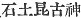
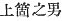
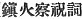
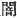
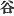
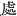

  
[Intangible Textual Heritage](../../index)  [Shinto](../index) 
[Index](index)  [Previous](kj012)  [Next](kj014) 

------------------------------------------------------------------------

[Buy this Book at
Amazon.com](https://www.amazon.com/exec/obidos/ASIN/B0028Y4SZY/internetsacredte)

------------------------------------------------------------------------

  
*The Kojiki*, translated by Basil Hall Chamberlain, \[1919\], at
Intangible Textual Heritage

------------------------------------------------------------------------

p. 28

## \[SECT. VI.—BIRTH OF THE VARIOUS DEITIES.\]

When they had finished giving birth to countries, they began afresh
giving birth to Deities. So the name of the Deity they gave birth to was
the Deity Great-Male-of-the-Great-Thing; [1](#fn_192) next they gave birth to the Deity
Rock-Earth-Prince; [2](#fn_193) next they gave
birth to the Deity Rock-Nest-Princess; [3](#fn_194) \[26\] next they gave birth to the Deity
Great-Door-Sun-Youth; [4](#fn_195) next they
gave birth to the Deity Heavenly-Blowing-Male; [5](#fn_196) next they gave birth to the Deity
Great-House-Prince; [6](#fn_197) next they gave
birth to the Deity Youth-of-the-Wind-Breath-the-Great-Male; [7](#fn_198) next they gave birth to the Sea-Deity,
whose name is the Deity Great-Ocean-Possessor; [8](#fn_199) next they gave birth to the Deity of the
Water-Gates, [9](#fn_200) whose name is the
Deity Prince-of-Swift-Autumn; [10](#fn_201)
next they gave birth to his younger sister the Deity
Princess-of-Swift-Autumn. (Ten Deities in all from
the Deity-Great-Male-of-the-Great-Thing to the Deity
Princess-of-Autumn.) [11](#fn_202) The
names of the Deities given birth to by these two Deities
Prince-of-Swift-Autumn and \[27\] Princess-of-Swift-Autumn from their
separate dominions of river and sea were: the Deity Foam-Calm;  [12](#fn_203) next the Deity Foam-Waves; next the
Deity Bubble-Calm; next the Deity Bubble-Waves; next the Deity
Heavenly-Water-Divider; [13](#fn_204) next the
Deity Earthly-Water-Divider; next the Deity
Heavenly-Water-Drawing-Gourd-Possessor; [14](#fn_205) next the Deity
Earthly-Water-Drawing-Gourd-Possessor. (Eight
Deities in all from the Deity Foam-Prince to the Deity
Earthly-Water-Drawing-Gourd-Possessor.) Next they gave birth to
the Deity of Wind, whose name is the Deity Prince-of-Long-Wind. [15](#fn_206) Next they gave birth to the Deity of
Trees, whose name is Deity Stem-Elder, [16](#fn_207) next

p. 29

they gave birth to the Deity of Mountains, whose name is the Deity
Great-Mountain-Possessor. [17](#fn_208) Next
they gave birth to the Deity of Moors, whose name is the Deity
Thatch-Moor-Princess, [18](#fn_209) another
name for whom is the Deity Moor-Elder. (Four Deities
in all from the Deity Prince-of Long-Wind to Moor-Elder.) The
names of the Deities given \[28\] birth to by these two Deities, the
Deity Great-Mountain-Possessor and the Deity Moor-Elder from their
separate dominions of mountain and moor were: the Deity
Heavenly-Elder-of-the-Passes; next the Deity
Earthly-Elder-of-the-Passes; [19](#fn_210) next
the Deity Heavenly-Pass-Boundary, next the Deity
Earthly-Pass-Boundary; [20](#fn_211) next the
Deity Heavenly-Dark-Door; next the Deity Earthly Dark-Door; [21](#fn_212) next the Deity Great-Vale-Prince; next
the Deity Great-Vale-Princess.  [22](#fn_213)
(Eight Deities in all from the Deity
Heavenly-Elder-of-the-Passes to the Deity Great-Vale-Princess.)
The name of the Deity they [23](#fn_214) next
gave birth to was the Deity Bird's-Rock-Camphor-tree-Boat, [24](#fn_215) another name for whom is the
Heavenly-Bird-Boat. Next they gave birth to the Deity
Princess-of-Great-Food. [25](#fn_216) Next they
gave \[29\] birth to the Fire-Burning-Swift-Male-Deity, [26](#fn_217) another name for whom is the Deity
Fire-Shining-Prince, and another name is the Deity Fire-Shining-Elder.

p. 30 p. 31

------------------------------------------------------------------------

### Footnotes

[28:1](kj013.htm#fr_192) p.
29 *Oho-koto-oshi-wo-no-kami*. "The Male-Enduring-Great-Things"
would be a possible, but less good rendering. This god is identified by
Motowori with *Koto-toke-no-wo* mentioned in "One account" of the
"Chronicles of Japan."

[28:2](kj013.htm#fr_193) The original
*Ika-tsuchi-biko-no-kami* (
) is identified by Motowori with *Uha-zutsu-no-wo*,
( ) mentioned in Sect. X
(Note 18). He would interpret the first *tsu* (*dzu*) as the Genitive
particle and the second as identical with the "Honorific appellation
*ji* of males," such as *Hikoji*, *Oho-to-no-ji*, etc. If this surmise
were correct, the entire name would signify Upper-Lord-Prince; but it is
safer to be guided by the characters in the text.

[28:3](kj013.htm#fr_194) p.
30 *Iha-zu-bime-no-kami*. Here too Motowori takes the syllable
*zu-* to be "connected with" the syllables *tsu-tsu* interpreted as
above, forgetting apparently that the second *tsu* (*ji*) is said to
occur only in the names of males.

[28:4](kj013.htm#fr_195)
*Oho-to-bi-wake-na-kami*, a name which Motowori, by supposing
corruptions of the text and by making a plentiful use of the pliant and
powerful system of derivation with which the Japanese etymologists lay
siege to the difficulties of their language, identifies with
*Oho-naho-bi-no-kami*, "the Great-Rectifying-Wondrous-Deity," mentioned
in Sect. X (Note 16).

[28:5](kj013.htm#fr_196)
*Ame-no-fuki-wo-no-kami,* identified by Motowori with *I-buki-do-nushi*
mentioned in the "Ritual of the General Purification." (See his
Commentary on this Ritual, Vol. II, pp. 29-32.)

[28:6](kj013.htm#fr_197) *Ohoyabikonokami*,
identified by Motowori with *Oho-aya-tsui-bi* mentioned in "One account"
of the "Chronicles."

[28:7](kj013.htm#fr_198)
*Kaza-ge-tsu-wake-no-oshi-wo-no-kami*. Motowori's conjectural
interpretation has been followed; but both the reading and the meaning
of the original are encompassed with difficulties. Motowori identifies
this deity with *Soko-sasura-hime* mentioned in the "Ritual of the
General Purification."

[28:8](kj013.htm#fr_199)
*Oho-wata-tsu-mi-no-kami*. The interpretation of *mochi*, "possessor,"
though not absolutely sure, has for it the weight both of authority and
of likelihood.

[28:9](kj013.htm#fr_200) *I.e.*, river-mouths,
estuaries, or ports. In the original *Minato-no-kami*.

[28:10](kj013.htm#fr_201) *Haya-aki-dzu-hiko*.
*Aki*, whose proper signification is "autumn," might also by metonymy be
interpreted to mean "dragon-fly" or "Japan." Motowori, *àpropos* of this
name, launches forth on very bold derivations and identifications with
the names of other gods. The original of the sister-deity is
*Haya-aki-dzu-hime-no-kami*.

[28:11](kj013.htm#fr_202) The text here omits
the word "Swift" from this name.

[28:12](kj013.htm#fr_203) The original names of
this deity and the three that follow are *Awa-nagi-no-kami*,
*Awa-nami-no-kami*, *Tsura-nagi-no-kami*, and *Tsura-nami*, *no-kami*.
The interpretation of the component parts is open to doubt but that here
adopted has the authority of Motowori and Hirata.

[28:13](kj013.htm#fr_204)
*Ame-no-mi-kumari-no-kami*. The following deity is
*Kuni-nomi-kumari-no-kami*.

[28:14](kj013.htm#fr_205) p.
31 This Deity and the next are in the original
*Ame-no-ku-hiza-mochi-no-kami* and *Kuni-ito-ku-hiza-mochi-no-kami*. The
etymology is obtained by comparison with a passage in the "Ritual for
Averting Fire" ( ).

[28:15](kj013.htm#fr_206)
*Shina-tsu-hiko-no-kami*. The original of this name is explained by
Motowori, who founds his view on two passages in the "Collection of a
Myriad Leaves," to signify Prince-of-Long-*Breath*. But the translator
feels confident that *shi-na* by him interpreted in the sense of "long
breath" (or rather "long of breath") should he connected with *shi*, an
old word for wind which we see in *ara-shi* ("storm-wind"), *ni-shi*
("west-wind"), *hi-gashi* ("east wind"), and perhaps under a slightly
altered form in *kaze*, "wind," whereas shi nowhere occurs in the sense
of "breath." Hirata notices approvingly this etymology of *shi*
("Exposition of the Ancient Histories," Vol. III. p. 63), though without
venturing flatly to contradict his [predecessor's](errata.htm#8)
decision as to the import of the name in question. The difference in the
meaning is after all slight. *Na* is to be taken as an apocopated form
of *nagaki*, "long." In later times *Shinato* has been used as a name
for the north-west wind.

[28:16](kj013.htm#fr_207) Such seems to be the
meaning of the original *Kuku-no-chi-no-kami*.

[29:17](kj013.htm#fr_208)
*Oho-yama-tsuna-ka-mi*.

[29:18](kj013.htm#fr_209)
*Kaya-nu-kimi-no-kami*. The etymology of the alternative personal name
(in the original [*Nu-dzu-chi-no-kami*](errata.htm#9) is not quite
certain.

[29:19](kj013.htm#fr_210) The original of these
two names is *Ame-no-sa-dzu-chi-no-kami* and
*Kuni-no-sa-dzu-chi-no-kami*. Their signification is obscure, but the
translator has, after some hesitation, followed Motowori's
interpretation. The words "heavenly" and "earthly" should probably be
considered as qualifying "passes." This word "pass," used here and
elsewhere to render the Japanese term *saka* (*sa*), must be understood
to include lesser ascents than those very arduous ones which are alone
denoted by the word "pass" in ordinary English parlance. In the later
language of Japan the word *tauge* (*tōge*) generally denotes "passes"
properly so called, while *saka* is restricted to the meaning of small
ascents or hills. But this distinction is by no means strictly observed.

[29:20](kj013.htm#fr_211)
*Ame-no-sa-giri-no-kami* and *Kuni-no-sagiri-no-kami*. *Sa* seems to be
rightly considered, as in the two preceding names, to be an archaic form
of *saka* (properly *sa-ka*, "hill-place"), and *giri* as an apocopated
form of *kagiri*, (properly *ka-giri*, "place-cutting") "limit" or
"boundary". Hirata however, following the Chinese character with which
*kiri* is written, interprets it in the sense of "mist."

[29:21](kj013.htm#fr_212) p.
32 *Ame-no-kura-do-no-kami* and *Kuni-no-kura-do-no-kami*.
Motowori explains *kura* (
, "dark") by *tani* (
, "valley"), and *to* "door" by *tokoro* ( , "place").

[29:22](kj013.htm#fr_213) Such appears to be
the proper interpretation of the original of these two names,
*Oko-tomato-hiko-no-kami* and *Oho-tomato-hime-no-kami*, *tomato* being
plausibly referred to *towomaru* and *tawamu*. It is difficult to find
an English word to represent exactly the idea, which is rather that of a
gentle *fold* in the mountains than of the narrower and steeper hollow
which we call a "valley."

[29:23](kj013.htm#fr_214) *I.e.*, the
Prince-Who-Invites and the Princess-Who-Invites (*Izanagi* and
*Iza-nami*).

[29:24](kj013.htm#fr_215)
*Tori-no-iha-kusa-bune-no-kami*. The alternative name is
*Ame-no-tori-bune*, from which the title of Deity is omitted. Motowori's
Commentary, Vol. V, pp. 52-53 should be consulted on the subject of this
deity.

[29:25](kj013.htm#fr_216) Homonymous with the
alternative personal name of the Island of Aha. (See Sect. V, Note 8).

[29:26](kj013.htm#fr_217)
*Hi-no-haya-yagi-wo-no-kami*. If, as seems likely, *yagi*, is an
incorrect reading for *kagi*, we should have to translate by "shining"
the word here rendered "burning." The alternative names are
*Hino-kaga-biko-no-kami* and *Hino-kaga-tsuchi-no-kami*. In "One
account" of the "Chronicles" and elsewhere in the "Rituals" this
fire-god is called *Ho-musubi* *i.e.* the Fire-Producer."

------------------------------------------------------------------------

[Next: Section VII.—Retirement of Her Augustness The
Princess-Who-Invites](kj014)
