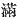
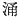
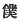
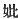

  
[Intangible Textual Heritage](../../index)  [Shinto](../index) 
[Index](index)  [Previous](kj018)  [Next](kj020) 

------------------------------------------------------------------------

[Buy this Book at
Amazon.com](https://www.amazon.com/exec/obidos/ASIN/B0028Y4SZY/internetsacredte)

------------------------------------------------------------------------

  
*The Kojiki*, translated by Basil Hall Chamberlain, \[1919\], at
Intangible Textual Heritage

------------------------------------------------------------------------

## \[SECT. XII.—THE CRYING AND WEEPING OF HIS IMPETUOUS-MALE-AUGUSTNESS.\]

So while \[the other two Deities\] each \[assumed his and her\] rule
according to the command with which \[their father\] had deigned to
charge them, His-Swift-Impetuous-Male-Augustness did not \[assume the\]
rule

p. 51

\[paragraph continues\] \[of\] the
dominion with which he had been charged, but cried and wept till his
eight-grasp beard [1](#fn_307) reached to the
pit of his stomach. [2](#fn_308) The fashion of
his weeping was such as by his weeping to wither the green mountains
into withered mountains, and by his weeping to dry up all the rivers and
seas. [3](#fn_309) For this reason the sound of
bad Deities was like unto the flies in the fifth moon [4](#fn_310) as they all swarmed, [5](#fn_311) and in all things [6](#fn_312) every portent of woe arose. So the Great
August Deity the Male-Who-Invites said to His
Swift-Impetuous-Male-Augustness: "How is it that, instead of ruling the
land with which I charged thee, thou dost wail and weep?" He replied,
saying: "I [7](#fn_313) wail because I wish to
depart to my \[45\] deceased mother's [8](#fn_314) land, to the Nether Distant Land." [9](#fn_315) Then the Great August Deity the
Male-Who-Invites was very angry and said: "If that be so, thou shall not
dwell in this land," [10](#fn_316) and
forthwith expelled him with a divine expulsion. So the Great Deity the
Male-Who-Invites dwells at Taga [11](#fn_317)
in Afumi. [12](#fn_318)

------------------------------------------------------------------------

### Footnotes

[51:1](kj019.htm#fr_310) See Sect. VIII, Note
1.

[51:2](kj019.htm#fr_311) Lit, "in front of his
heart,"

[51:3](kj019.htm#fr_312) *Sic* in the original,
to the perplexity of commentators.

[51:4](kj019.htm#fr_313) "Flies in the fifth
moon" is the received interpretation of the original term *sa-bahe*.
*Conf*. *sa-tsuki*, the old native name for the fifth moon.

[51:5](kj019.htm#fr_314) The text has here the
character  , "to be full,"
for which Motowori somewhat arbitrarily reads  , "to bubble up," taking this
word in the sense of swarming. The translator has endeavoured to
preserve the vagueness of the original Japanese, which leaves it
doubtful at first sight whether the flies or the deities should be
regarded as the logical subject of the Verb. There is an almost
identical passage near the beginning of Sect. XVI.

[51:6](kj019.htm#fr_315) Lit. "a myriad
things," a Chinese phrase for totality.

[51:7](kj019.htm#fr_316) The Chinese character
for the First-Personal Pronoun used here p. 52
and below by this deity is the humble one 
 signifying literally "servant" The commentators read
it simply "I."

[51:8](kj019.htm#fr_317) The Japanese
authorities simply read "mother." But the character  , which is used in this place,
specially designates a mother who is deceased.

[51:9](kj019.htm#fr_318) *I.e.,* Hades. The
translation follows Motowori's explanation of the original term
*Ne-no-kata-su-kuni*, which is obscure.

[51:10](kj019.htm#fr_319) *I.e.*, say the
commentators, "in this realm of ocean which I granted to thee as thy
domain." Probably, however, this is reading into the text more than it
was meant to contain.

[51:11](kj019.htm#fr_320) Derivation unknown.

[51:12](kj019.htm#fr_321) From *aha-umi*,
"fresh sea," *i.e.*, "lake." The province of Afumi was doubtless so
called from Lake Biha which occupies a great portion of its surface. It
is also known as *Chiku-tsu-Afumi*, *i.e.*, "the Nearer Afumi," in
contradistinction to *Toho-tsu-fumi* (in modern pronunciations
*Tōtōmi*), *i.e.*, "Distant Afumi," a province further to the East. The
modern pronunciation of *Afumi* is *Omi*.

------------------------------------------------------------------------

[Next: Section XIII.—The August Oath](kj020)
