  
[Intangible Textual Heritage](../../index)  [Shinto](../index) 
[Index](index)  [Previous](kj019)  [Next](kj021) 

------------------------------------------------------------------------

[Buy this Book at
Amazon.com](https://www.amazon.com/exec/obidos/ASIN/B0028Y4SZY/internetsacredte)

------------------------------------------------------------------------

  
*The Kojiki*, translated by Basil Hall Chamberlain, \[1919\], at
Intangible Textual Heritage

------------------------------------------------------------------------

p. 52

## \[SECT. XIII.—THE AUGUST OATH\]

So thereupon His-Swift-Impetuous-Male-Augustness said: "If that be so, I
will take leave [1](#fn_319) of the
Heaven-Shining-Great-August-Deity, and depart." \[With these words\] he
forthwith went up to Heaven, whereupon all the mountains and rivers
shook, and every land and country quaked. So the
Heaven-Shining-Great-August Deity, alarmed at the noise, said: 'The
reason of the ascent hither of His Augustness my elder brother [2](#fn_320) is surely no good intent. [3](#fn_321) It is only that he wishes to wrest my
land from me." And she forthwith, unbinding her august hair, twisted it
into august bunches; and both into the left and into the right august
bunch, as likewise into her august head-dress and likewise on to \[46\]
her left and her right august arm, [4](#fn_322)
she twisted an augustly complete \[string\] of curved jewels eight feet

p. 53

\[paragraph continues\] \[long\],—of five
hundred jewels, [5](#fn_323) and slinging on
her back a quiver holding a thousand \[arrows\], and adding
\[thereto\] [6](#fn_324) a quiver holding five
hundred \[arrows\], she likewise took and slung at her side a mighty and
high \[-sounding\] elbow-pad, [7](#fn_325) and
brandished and stuck her bow upright so that the top [8](#fn_326) shook, and she stamped her feet into the
hard ground up to her opposing thighs, [9](#fn_327) kicking away \[the earth\] like rotten
snow, [10](#fn_328) and stood valiantly like
unto a mighty man, and waiting, asked: "Wherefore ascendest thou
hither?" Then His-Swift-Impetuous-Male-Augustness replied, saying: "I
have no evil intent. It is only that when the Great-August-Deity \[our
father\] spoke, deigning to enquire the cause \[47\] of my wailing and
weeping, I said 'I wail because I wish to go to my deceased mother's
land,'—whereupon the Great-August-Deity said: 'Thou shalt not dwell in
this land,' and deigned to expel me with a divine expulsion. It is
therefore solely with the thought of taking leave of thee and departing,
that I have ascended hither. I have no strange intentions." Then the
Heaven-Shining-Great-August-Deity said: "If that be so, whereby shall I
know the sincerity of thine intentions?' Thereupon
His-Swift-Impetuous-Male-Augustness replied, saying: "Let each of us
swear, [11](#fn_329) and produce children." So
as they then swore to each other from the opposite banks of the Tranquil
River of Heaven. [12](#fn_330) the august names
of the Deities that were born from the mist \[of her breath\] when,
having first begged His-Swift-Impetuous-Male-Augustness to hand her the
ten-grasp sabre which was girded on him and broken it into three
fragments, and with the jewels making a jingling sound [13](#fn_331) having brandished and washed them in
the True-Pool-Well of

p. 54

\[paragraph continues\] Heaven, [14](#fn_332) and having crunchingly crunched them,
the \[48\] Heaven-Shining-Great-Deity blew them away, were Her
Augustness Torrent-Mist-Princess, [15](#fn_333)
another august name for whom is Her Augustness
Princess-of-the-Island-of-the Offing; next Her Augustness
Lovely-Island-Princess, [16](#fn_334) another
august name for whom is Her Augustness Good-Princess; next Her
Augustness, Princess-of-the-Torrent. [17](#fn_335) The august name of the Deity that was
born from the mist \[of his breath\] when, having begged the
Heaven-Shining. Great-August-Deity to hand him the augustly complete
\[string\] of curved jewels eight feet \[long\],—of five hundred
jewels,—that was twisted in the left august bunch \[of her hair\], and
with the jewels making a jingling sound having brandished and washed
them in the True-Pool. Well of Heaven, and having crunchingly crunched
them, His-Swift-Impetuous-Male-Augustness blew them away, was His
Augustness
Truly-Conquer-I-Conqueror-Conquering-Swift-Heavenly-Great-Great-Ears. [18](#fn_336) The august name of the Deity that was
born from the mist \[of his breath\] when again, having begged her to
hand him the \[49\] jewels that were twisted in the right august bunch
\[of her hair\], and having crunchingly crunched them, he blew them
away, was His Augustness Ame-no-hohi. [19](#fn_337) The august name of the Deity that was
born from the mist \[of his breath\] when again, having begged her to
hand him the jewels that were twisted in her august head-dress, and
having crunchingly crunched them, he blew them away, was His Augustness
Prince-Lord-of-Heaven. [20](#fn_338) The august
name of the Deity that was born from the mist \[of his breath\] when
again, having begged her to hand him the jewels that were twisted on her
left august arm, [21](#fn_339) and having
crunchingly crunched them,

p. 55

he blew them away, was His Augustness Prince-Lord-of-Life. [22](#fn_340) The august name of the Deity that was
born from the mist \[of his breath\] when again, having begged her to
hand him the jewels that were twisted on her right august arm, [23](#fn_341) and having crunchingly crunched them,
he blew them away, was His-Wondrous-Augustness-of-Kumanu. [24](#fn_342) (Five Deities in
all).

p. 56 p. 57

------------------------------------------------------------------------

### Footnotes

[52:1](kj020.htm#fr_322) p.
55 The English locution "to take leave" exactly represents the
Chinese character here used which, from having the sense of "asking
permission," has come to mean "bidding adieu."

[52:2](kj020.htm#fr_323) He was her younger
brother. But see what is said on the subject of names expressive of
relationship on [p. xxxvii](kj005.htm#page_xxxvii) of Introduction. The
phonetic characters  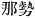 are
here used to represent  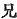,
"elder brother."

[52:3](kj020.htm#fr_324) Literally "heart,"
here and elsewhere.

[52:4](kj020.htm#fr_325) Or "hand."

[53:5](kj020.htm#fr_326) The original is here
obscure, but the translator has, as usual. followed the Chinese
characters as far as possible, and has been chiefly guided by Moribe's
interpretation. According to this, the "eight feet" (which Moribe takes
to mean simply "several feet") must be supposed to refer to the length
of the necklace which, he says, probably resembled a Buddhist rosary,
only that the beads were somewhat larger. For a discussion of the
various interpretations to which this phrase descriptive of the
Sun-Goddess's ornaments may be subjected, see Note 4 to Mr. Satow's
third paper on the "Rituals" in Vol. IX Pt. II, p. 198 of these
"Transactions," and Moribe's "Examination of Difficult Words," Vol. II.
pp. 4-5, *s.v.* *Ya-saka-ni no iho-tsu no mi sumaru no tama*. Mr. Satow,
adopting some of the bolder etymologies of the Japanese commentators,
translates thus: "the ever-bright curved (or glittering) jewels, the
many assembled jewels," and concludes that "a long string of, perhaps,
claw-shaped stone beads" was what the author meant to describe.

[53:6](kj020.htm#fr_327) Hirata supposes this
additional quiver to have been slung in front.

[53:7](kj020.htm#fr_328) Motowori's long note
on the expression *taka-tomo*, to be found in Vol. VII, pp. 39-40 of his
"Commentary" seems to prove that "high-low-sounding elbow-pad" ( 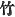 being written phonetically for
 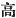) is the most likely
meaning,—these pads, of which one was worn on the left elbow, having
been made of skin. Arawi Hakuseki however takes  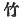 in its p.
56 literal sense of "bamboo" and Moribe suggests the ( 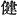) which occurs so often in
proper names with the signification of "bold," "brave," or "stout."

[53:8](kj020.htm#fr_329) The reading *yu-hara*,
here rendered "top \[of the bow\]" is doubtful, and *yu-hadsu*,
"bow-notch," has been proposed as an emendation.

[53:9](kj020.htm#fr_330) *I.e.*, "both legs
penetrated into the ground up to the thigh," a proof of the vigour with
which she used her limbs in stamping.

[53:10](kj020.htm#fr_331) Lit. "bubble-snow."

[53:11](kj020.htm#fr_332) *I.e.*, "pledge our
faith," "bind ourselves," in order to show forth the sincerity of our
intentions.—Hirata has a long note on the word *ukehi*, here rendered
"swear" (elsewhere as a Substantive, "oath,") which the student will do
well to consult. It is contained in his "Exposition of the Ancient
Histories," Vol. VII, pp. 61-63.

[53:12](kj020.htm#fr_333) *Ame-no-yasu-kaha*
(according to Motowori's reading *Ame-no-yasu-no-kaha*), our Milky Way.
The "Chronicles of Old Matters of Former Ages" perhaps preserve the true
etymology of the word by writing it *Ama-no-ya-se-kaha*, *i.e.*, "the
Heavenly River of eight currents (or reaches)." This would mean simply
"a broad river." The text literally says: "having placed the Tranquil
River of Heaven in the middle," etc.; but the sense of the clause is
that given in the translation.

[53:13](kj020.htm#fr_334) These words seem, as
Motowori says. to have been erroneously brought in here from the next
sentence, where they come in appropriately.

[54:14](kj020.htm#fr_335) *Ame-no-ma-na-wi*.
The interpretation adopted is that which has the authority of Motowori
and Hirata. Perhaps only "Heavenly Well" is intended. The above
authorities warn us that the word *wi*, "well," was not in ancient days
restricted to its modern sense, but was used to designate any place at
which water could be drawn, and Motowori thinks that Heaven contained
several such. That mentioned in the text seems to have been a pool in
the bed of the Tranquil River of Heaven.

[54:15](kj020.htm#fr_336) This is the
interpretation of the original name *Ta-kiri-bime-no-mikoto* which is
proposed by Moribe. It is less far-fetched, and agrees better with the
name of the sister deity Princess-of-the-Torrent, than do the other
explanations that have been attempted. The alternative name is
*Oki-tsu-shima-no-mikoto*.

[54:16](kj020.htm#fr_337)
*Ichiki-shima-hime-no-mikoto*, *ichiki* being an unusual form of
*itsuki*. The island, which is in the Inland Sea, is still celebrated,
but bears in common parlance the name of *Miya-shima*, *i.e.*, "Temple
Island." p. 57 The alternative name is
*Sa-yori-bime-no-mikato*, in which *sa* is an Ornamental Prefix not
calling for translation.

[54:17](kj020.htm#fr_338)
*Tagi-tsu-hime-no-mikoto*.

[54:18](kj020.htm#fr_339)
*Masa-ka-a-katsu-kachi-hayabi-ame-no-oshi-ho-mimi-no-mikoto*. The word
*mimi* ( 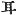 "ears") forms
part of a large number of Ancient Japanese proper names. Motowori, who
of course passes over in silence the fact that large ears are considered
lucky, not only in Japan, *but also in China and Korea*, suggests the
etymology *hi hi* or *bi bi* (
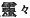), *i.e.*, the word "wondrous" or "miraculous"
repeated. But there are examples of such names in which the
interpretation of *mimi* as "ears" is unavoidable. Thus Prince Umayado
(commonly called *Shō-to-ku Tai-shi*) had also the name of *Yatsu-mimi
no Tai-shi*  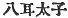 bestowed
upon him on account of his extraordinary intelligence. Is it not
therefore simpler in all cases to allow to the word this its natural
meaning? The proper names in mi do however undoubtedly offer some
difficulty, and Motowori scarcely seems content with his own derivation
of the troublesome syllable. *Oshi*, as in other cases, is taken to
represent *ohoshi*, "great"; and after much hesitation the translator
has followed Motowori in regarding ho likewise as an abbreviated form of
that word.

[54:19](kj020.htm#fr_340) *Ame-no* signifies
"of Heaven" or "heavenly." The syllables hohi are incomprehensible.

[54:20](kj020.htm#fr_341)
*Amatsu-hiko-ne-no-mikoto*.

[54:21](kj020.htm#fr_342) Or "hand."

[55:22](kj020.htm#fr_343)
*Iku-tsu-hiko-ne-no-mikoto*.

[55:23](kj020.htm#fr_344) This god does not
seem to be known by any other name: but is conjectured by Hirata to be
identical with *Ame-no-hohi*, the second of these divine brothers.
*Kumanu*, or less archaically *Kumano*, is said to be, not the
well-known Kumano in the province of Kishiu, but a place in Idzumo near
Suga (see Sect. XIX, Notes 1 and 2). The name is written with the
characters,  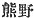, "bear
moor." The native commentators however interpret it as a corruption of
*Komori-nu*,  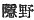, "the moor
of retirement," on account of a tradition preserved in the "Chronicles"
of Izanami (the Female-Who-invites) having been interred at the Kishiu
Kumano.

[55:24](kj020.htm#fr_345) There is no footnote
24—*JBH*.

------------------------------------------------------------------------

[Next: Section XIV.—The August Declaration of the Division of the August
Male Children and the August Female Children](kj021)
