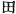
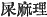
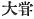
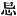
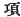
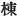

  
[Intangible Textual Heritage](../../index)  [Shinto](../index) 
[Index](index)  [Previous](kj021)  [Next](kj023) 

------------------------------------------------------------------------

[Buy this Book at
Amazon.com](https://www.amazon.com/exec/obidos/ASIN/B0028Y4SZY/internetsacredte)

------------------------------------------------------------------------

  
*The Kojiki*, translated by Basil Hall Chamberlain, \[1919\], at
Intangible Textual Heritage

------------------------------------------------------------------------

p. 61

## \[SECT XV.—THE AUGUST RAVAGES OF HIS IMPETUOUS-MALE-AUGUSTNESS\]

Then His-Swift-Impetuous-Male-Augustness said to the
Heaven-Shining-Great-August-Deity: "Owing to the sincerity of my
intentions I have, in begetting children, gotten delicate females.
judging from this, [1](#fn_369) I have
undoubtedly gained the victory! With these words, and impetuous with
victory, he broke down the divisions of the ricefields [2](#fn_370) laid out by the
Heaven-Shining-Great-August-Deity, filled up the ditches, and moreover
strewed \[53\] excrements [3](#fn_371) in the
palace where she partook of the great food. [4](#fn_372) So, though he did thus, the
Heaven-Shining-Great-August-Deity upbraided him not, [5](#fn_373) but said: "What looks like excrements
must be something that His Augustness mine elder brother has vomited
through drunkenness. Again, as to his breaking down the divisions of the
rice

p. 62

fields and filling up the ditches, it must be because he grudges the
land \[they occupy [6](#fn_374)\] that His
Augustness mine elder brother acts thus." But notwithstanding these
apologetic words, he still continued his evil acts, and was more and
more \[violent\]. As the Heaven-Shining-Great-August-Deity sat in her
awful [7](#fn_375) weaving-hall [8](#fn_376) seeing to the weaving of, the august
garments of the Deities, he broke a hole in the top [9](#fn_377) of the weaving-hall, and through it let
fall a heavenly piebald horse \[54\] which he had flayed with a backward
flaying, [10](#fn_378) at whose sight the women
weaving the heavenly garments were so much alarmed that impegerunt
privatas partes adversis radiis et obierunt. [11](#fn_379)

------------------------------------------------------------------------

### Footnotes

[61:1](kj022.htm#fr_372) p.
62 Literally "if one speak from this."

[61:2](kj022.htm#fr_373) The character used is
 , which in Chinese does
not necessarily signify a *rice*-field. But in Japanese it seems to have
been always limited to this narrower meaning, to which likewise the
context here clearly points.

[61:3](kj022.htm#fr_374) In the original
written   which is partly
ideographic and partly phonetic for *kuso-mari*. Motowori interprets it
to signify "excrements and urine"; but the parallel passage of the
"Chronicles" which he himself quotes goes to prove that *mari* had not
the latter meaning, as does also another well-known passage in the "Tale
of a Bamboo-Cutter."

[61:4](kj022.htm#fr_375)   read *oh-nihe*. The word
*nihe* now denotes "a sacrifice," and *oh-nihe no matsuri* is the
religious festival of the tasting of the first new rice of the season.

[61:5](kj022.htm#fr_376) We might, following
classical usage, translate the Verb *togamezu*, which is written
phonetically, by the words "took no heed" or "made no observation"; but
in this passage it certainly seems to have the stronger and more
specialized signification of "upbraiding," "scolding," which attaches to
it in the colloquial dialect.

[62:6](kj022.htm#fr_377) *I.e.*, he thinks that
none of the land should be wasted in ditches and embankments, but should
all be devoted to the production of food.

[62:7](kj022.htm#fr_378) The character used is
  "to shun," which in
Japanese has approximately the meaning of "sacred." Thus a certain
family of priests p. 63 was called by the name
of *Imibe*, lit. "the shunning clan," on account of the uncleanness from
which they were bound to abstain.

[62:8](kj022.htm#fr_379) Written with
characters signifying literally "garment-house," but the meaning, as
understood by the native commentators is that given in the text.

[62:9](kj022.htm#fr_380)  . This character is taken by
the native commentators in the sense of 
, *mune*, "ridge-pole."

[62:10](kj022.htm#fr_381) *I.e.,* it is
supposed, beginning at the tail. That this was considered criminal may
be seen by comparing Sect. XCVII. Note 3.

[62:11](kj022.htm#fr_382) In the parallel
passage of the "Chronicles" it is the goddess who injures herself with
her shuttle, but without dying of the effects of the accident.

------------------------------------------------------------------------

[Next: Section XVI.—The Door of the Heavenly Rock-Dwelling](kj023)
