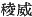
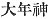
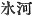
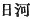
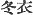
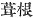

  
[Intangible Textual Heritage](../../index)  [Shinto](../index) 
[Index](index)  [Previous](kj026)  [Next](kj028) 

------------------------------------------------------------------------

[Buy this Book at
Amazon.com](https://www.amazon.com/exec/obidos/ASIN/B0028Y4SZY/internetsacredte)

------------------------------------------------------------------------

  
*The Kojiki*, translated by Basil Hall Chamberlain, \[1919\], at
Intangible Textual Heritage

------------------------------------------------------------------------

p. 78

## \[SECT. XX.—THE AUGUST ANCESTORS OF THE DEITY-MASTER-OF-THE-GREAT LAND.\]

Quare, quum incepit in thalamo \[opus procreationis\] cum
Mirâ-Herâ-Inadâ, procreavit Deum nomine Eight-Island Ruler. [1](#fn_450) And again, having wedded the
Divine-Princess-of-Great-Majesty, [2](#fn_451)
daughter of the Deity Great-Mountain-Possessor, he begot children: the
Great-Harvest Deity [3](#fn_452) and the
August-Spirit-of-Food. [4](#fn_453) The elder
brother the Deity Eight-Island-Ruler wedded
Princess-Falling-Like-the-Flowers-of-the-Trees, [5](#fn_454) daughter of the Deity
Great-Mountain-Possessor, and begot a child: the Deity
Fuha-no-moji-Ku-nu-su-nu. [6](#fn_455) This
Deity wedded Princess Hikaha, [7](#fn_456)
daughter of the Deity Okami, [8](#fn_457) and
begot a child: Water-Spoilt-Blossom-of-Fuka-buchi. [9](#fn_458) This Deity \[67\] wedded the Deity
Ame-no-tsudohe-chi-ne, [10](#fn_459) and begot
a child: the Deity Great-Water-Master. [11](#fn_460) This Deity wedded the Deity
Grand-Ears [12](#fn_461) daughter of the Deity
Funu-dzu-nu, [13](#fn_462) and begot a child:
the Deity Heavenly-Brandishing-Prince-Lord. [14](#fn_463) This Deity wedded the
Young-Princess-of-the-Small-Country, [15](#fn_464) daughter of the
Great-Deity-of-the-Small-Country, [16](#fn_465)
and begot a child: the

p. 79

\[paragraph continues\] Deity
Master-of-the-Great-Land, [17](#fn_466) another
name for whom is the Deity Great-Name-Possessor, [18](#fn_467) and another name is the
Deity-of-the-Reed-Plains, [19](#fn_468) and
another name is the Deity of Eight-Thousand-Spears, [20](#fn_469) and another name is the
Deity-Spirit-of-the-Living-Land. [21](#fn_470)
In all there were five names. [22](#fn_471)

p. 80

------------------------------------------------------------------------

### Footnotes

[78:1](kj027.htm#fr_454) p.
79 *Ya-shima-zhi-nu-mi*. Ya-shima means "eight islands." The
syllables *zhi-nu-mi* are obscure, but the translator has little doubt
"ruler" fairly represents their import. Motowori takes *zhi* to be an
apocopated and *nigori’ed* form of *shiru*, "to rule," nu to be an
apocopated form of *nushi*, "master," and *mi* to be an apocopated form
of the Honorific termination *mimi*. Tanigaha Shisei considers *zhimu*
to stand for *shidzumuru*, "to govern," which comes to the same thing so
far as the sense is concerned.

[78:2](kj027.htm#fr_455) *Kamu-oho-ichi-hime*.
The rendering of *Oho-ichi* as "Great Majesty" rests on a plausible
conjecture of Hirata's, who proposes to, identify *ichi* with *idzu*
( ). Motowori thinks that
*Oho-ichi* should be taken as the name of a place; but this seems less
good.

[78:3](kj027.htm#fr_456) *Oho-toshi-no-kami*,
written  , the obvious
rendering of which would be "great year." But the Japanese term *toshi*
is believed to have originally signified, not "year" in the abstract,
but that which was produced each year, viz., the harvest (conf. *toru*,
"to take").

[78:4](kj027.htm#fr_457) *Uka-no-mi-tama*.

[78:5](kj027.htm#fr_458)
*Ko-no-hana-chiru-hime*, so called, says Motowori, because she probably
died young, as a blossom that falls from the tree. We might however
perhaps take the Verb *chiru* in a Causative sense, and consider the
name to signify "the Princess-Who-Causes-the-Flowers-of-the-Trees-to-
Fall. A sister of this goddess appears in the pretty legend narrated in
Sect. XXXVII under the parallel name of the
Princess-Blossoming-Brilliantly-Like-the-Flowers-of-the-Trees. See Note
3 to that Sect.

[78:6](kj027.htm#fr_459)
*Fuha-no-moji-ku-nu-su-nu-no-kami*. The import of this name is quite
uncertain. *Fuha* however seems to be the name of a place.

[78:7](kj027.htm#fr_460) "*Hi-kaha-mime*.
*Hi-kaha* (lit. "sun-river") is supposed to stand for the name of a
place in Musashi, which is however written "ice-river" (  and not  ), the old Japanese words for
"ice" and "sun" being homonymous.

[78:8](kj027.htm#fr_461) p.
80 See Sect. VIII. (Note 9), where the name is given as *Kura
okami*.

[78:9](kj027.htm#fr_462)
*Fuka-buchi-no-midzu-yare-hana*. If Fuka-buchi were ascertained to be
not, as is supposed, the name of a place, we should have to render it
"deep pool," and the whole would mean in English
"Water-Spoilt-Blossom-of-the-Deep-Pool."

[78:10](kj027.htm#fr_463)
*Ame-no-tsudohe-chi-ne-no-kami*. In this name nothing is clear but the
first three syllables, which signify "heavenly." But if Mabuchi's
conjecture as to the meaning of the rest were accepted, we should have
to translate the whole by "Heavenly-Assembling-Town-Lady."

[78:11](kj027.htm#fr_464) This is the meaning
plausibly assigned by Motowori to the original *O-midzu-nu-no-kami*.

[78:12](kj027.htm#fr_465) *Fute-mimi-no-kami*,
plausibly conjectured by Tominobu to stand for *Futo-mimi*, etc., which
gives the sense here adopted.

[78:13](kj027.htm#fr_466)
*Funu-dzu-nu-no-kami*. Motowori believes Funu to be the name of a place,
and interprets the name to signify "Master of Funu." But this seems
highly uncertain.

[78:14](kj027.htm#fr_467)
*Ame-no-fuyu-kinu-no-kami* (Motowori's reading) or *Ama-no*, etc.
(Hirata's reading). The translation of the name follows Hirata's
explanation, which is based on Motowori's, and according to which the
characters   ("winter
garments") in this text, and 
 read *Fuki-ne* in the "Chronicles," are merely
phonetic, while the meaning is derived from a comparison of the sounds
given by each. Though himself believing in the soundness of Hirata's
conclusion, the translator must admit that it is not indisputable.

[78:15](kj027.htm#fr_468)
*Sasu-kuni-waka-hime*, or *Sashi-kuni*, etc. The former reading, which
Hirata's adopts, seems best. The meaning of *sasu*, here rendered
"small," is open to doubt.

[78:16](kj027.htm#fr_469)
*Sasu-kuni-oho*-\[*no*-\]*kami*, or *Sashi*, etc. The syllable *no* in
the Japanese reading seems to be a superfluous addition of the modern
commentators.

[79:17](kj027.htm#fr_470)
*Oho-kuni-nushi-ne-kami*.

[79:18](kj027.htm#fr_471)
*Oho-na-muji-no-kami*, to which Tominobu proposes to give the sense of
"Great Hole-Possessor," in connection with the story of the mouse-hole
in which he took refuge from the fire lit by the Impetuous-Male-Deity
(*Susa-no-wo*) for his destruction (see Sect. XXIII). But the
interpretation followed in the translation is the most likely as well as
the orthodox one, this Deity being entitled the possessor of a Great
Name or of Great Names on account of his renown in Japanese mythic
story.

[79:19](kj027.htm#fr_472) p.
81 *Ashi-hara-shiko-wo-no-kami*. The "reed-plains" are doubtless
put by metonymy for Japan.

[79:20](kj027.htm#fr_473) *Yachi-hoko-no-kami*.

[79:21](kj027.htm#fr_474)
*Utsushi-kuni-tama-no-kami*. The name must be understood to mean "Spirit
of the Land of the Living," and to be antithetical to that of one of his
fathers-in-law, the Impetuous Male-Deity (*Susa-no-wo*) who became the
god of Hades.

[79:22](kj027.htm#fr_475) Or "he had five
names."

------------------------------------------------------------------------

[Next: Section XII.—The White Hare of Inaba](kj028)
