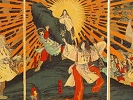

  
[Intangible Textual Heritage](../../index)  [Shinto](../index) 
[Index](index)  [Previous](kj030)  [Next](kj032) 

------------------------------------------------------------------------

[Buy this Book at
Amazon.com](https://www.amazon.com/exec/obidos/ASIN/B0028Y4SZY/internetsacredte)

------------------------------------------------------------------------

  
*The Kojiki*, translated by Basil Hall Chamberlain, \[1919\], at
Intangible Textual Heritage

------------------------------------------------------------------------

p. 91

## \[SECT. XXIV.—THE WOOING OF THE DEITY-OF-EIGHT-THOUSAND-SPEARS.\]

This Deity-of-Eight-Thousand-Spears, [1](#fn_522) when he went forth [2](#fn_523) to woo the Princess of Nuna-kaha, [3](#fn_524) in the land of Koshi, on arriving at the
house of the Princess of Nuna kaha sang, saying:

"\[I\] His Augustness the Deity-of-Eight-Thousand-Spears, \[76\] having
been unable to find a spouse in the Land of the Eight islands, and
having heard that in the far off Land of Koshi there is a wise maiden,
having heard that there is a beauteous maiden, I am standing \[here\] to
truly woo her, I am going backwards and forwards to woo her. Without
having yet untied even the cord of my sword, without having yet untied
even my veil, I push back the plank-door shut by the maiden; while I am
standing \[here\], I pull it forward. While I am standing \[here\], the
*nuye* sings upon the green mountain, and \[the voice of\] the true bird
of the moor, the pheasant, resounds; the bird of the yard, the cock,
crows. Oh! the pity that \[the\] birds should sing! Oh! these birds!
Would that I could beat them till they were sick! Oh! swiftly-flying
heaven-racing messenger, the tradition of the thing, too, this!" [4](#fn_525)

Then the Princess of Nuna-kaha, without yet opening \[77\] the door,
sang from the inside saying:—

p. 92

"Thine Augustness the Deity-Of-Eight-Thousand-Spears! Being a maiden
like a drooping plant, my heart is just a bird on a sand-bank by the
shore; it will now indeed be a dotterel. Afterwards it will be a gentle
bird; so as for thy life, do not deign to die. Oh! swiftly-flying
heaven-racing messenger! the tradition of the thing, too, this!" [5](#fn_526)

\[78\] \[*Second Song of the Princess*. [6](#fn_527)\]

When the sun shall hide behind the green mountains, in the night \[black
as\] the true jewels of the moor will I come forth. Coming radiant with
smiles like the morning sun, \[thine\] arms white as rope of
paper-mulberry-bark shall softly pat \[my\] breast soft as the melting
snow; and patting \[each other\] interlaced, stretching out and
pillowing \[ourselves\] on \[each other's\] jewel-arms,— true
jewel-arms,—and with outstretched legs, will we sleep. So speak not too
lovingly, Thine Augustness the Deity-of-Eight-Thousand-Spears! The
tradition of the thing, too, this!" [7](#fn_528)

Quamobrem eâ nocte non coierunt, sed sequentis diei nocte auguste
coierunt.

p. 93 p. 94

------------------------------------------------------------------------

### Footnotes

[91:1](kj031.htm#fr_526) p.
92 In this Section, the Deity Master-of-the-Great-Land is spoken
of under this *alias*. See Sect. XX, Note 20).

[91:2](kj031.htm#fr_527) The characters   here, in accordance with the
reading of the commentators, rendered by the words "went forth," as
Honorific, being only properly applied to the progresses of a sovereign.

[91:3](kj031.htm#fr_528) *Kuna-kawa-hime*.
*Nana-kaha* or *Nu-na-kaha* ("lagoon-river"), is supposed to be the name
of a place in the province of Echigo.

[91:4](kj031.htm#fr_529) p.
93 The drift of this poem needs but little elucidation:—After
giving his reasons for coming to woo the Princess of Nuna-kaha, the god
declares that he is in such haste to penetrate to her chamber, that he
does not even stay to ungird his sword or take off his veil, but tries
to push or pull open the door at once. During these vain endeavours, the
mountain. side begins to re-echo with the cries of the birds announcing
the dawn, when lovers must slink away. Would that he could kill these
unwelcome harbingers of day, and bring back the darkness!—The Land of
the Eight Islands (*i.e.* Japan proper, beyond whose boundaries lay the
barbarous northern country of Koshi) is in the original *Ya-shima-huni*
(Conf. Sect. V, Note 27).—The *nuye* is a bird which must be fabulous if
most of the accounts given of it are accepted. The "Commentary on the
Lyric Dramas" tells us (with variations) that "it has the head of a
monkey, the body of a racoon-faced dog, the tail of a serpent, and the
hands (*sic*) and feet of a tiger," adding, as the reader will make no
difficulty in allowing, that "it is a strange and peculiar creature."
The *Wa-Kun Shiwori* says that "it is a bird much larger than a pigeon,
and having a loud and mournful cry." It is likewise said to come out at
night-time and retire during the day, for which reason doubtless Mabuchi
likens it to the owl. A very ancient and curious Chinese book entitled
the "Mountain and Sea Classic" (
) the modern editions of which contain extremely droll
illustrations of fabulous creatures, tells us of a bird called the
"white *nuye*" ( ) which
is "like a pheasant, with markings on its head, white wings, and yellow
feet, and whose flesh is a certain cure for the hiccough." The character
  and  , with which, as well as with
  the word *nuye* is
variously written, seem to be unauthorized—The line here (following
Motowori and Moribe's view) rendered "Would that I could beat them till
they were sick!" will also bear the interpretation formerly proposed by
Keichiyu, "Would that I could beat them till they left off!"—The last
five lines, here rendered "Oh! swiftly flying heaven-racing messenger,"
etc., are extremely obscure. It is possible that *ishi tafu ya*
(rendered "Oh! swiftly flying," in deference to Motowori's and Moribe's
view) may be but a meaningless *refrain*. "Heaven racing messenger" is
tolerably certain. Of the rest it is not easy to make sense. Motowori
proposes to credit the five lines in question with the following general
meaning: "May this song, like a messenger, "run down to future ages,
preserving for them the tradition of this event!" Moribe, in his
Critique of Motowori's Commentary, supposes the lines in question to be
an addition made by the official singers, who in later p. 94 times sang these songs as an accompaniment to
dances. Whatever their origin and proper signification, it is plain that
they had come to be used as a *refrain*, from which the first two lines
were sometimes omitted, as we see in some of the songs further on.

[92:5](kj031.htm#fr_530) The drift of the poem
is this: "Being a tender maiden, my heart flutters like the birds on the
sandy islets by the beach, and I cannot yet be thine. Yet do not die of
despair; for I will soon comply with thy desires."—The word *nuye-kusa*
(here rendered "drooping plant," in accordance with the views of the
commentators) is a Pillow-Word of somewhat obscure derivation.—The word
*chidori* (rendered "dotterel" throughout this translation) denotes in
its modern acceptation, according to Messrs. Blakiston and Pryer, "any
kind of sandpiper, plover or dotterel." Its proper and original
signification is, however, greatly debated by the commentators, and some
think that it is not the specific name of any kind of bird, but stands
simply by apocope for *tachi-dori*, "rising bird," thus designating any
kind of small bird that rises and flies along near the beach.—The word
*na-dori* (here, in accordance with Moribe's view, rendered "gentle
bird") is taken by Motowori to mean simply "gentle," "compliant." But
both the construction and the context seem to impose on us the
interpretation here given. Keichiyu, in his "*Kōgan-Shō*," interprets
the whole passage differently; but in order to do so he, without
sufficient authority, changes the readings of the text into *wa tori*,
"my bird," and *na tori* "thy bird."—The refrain is the same as in the
previous song.

[92:6](kj031.htm#fr_531) There is no break in
the text; but the commentators rightly consider the following to be a
separate poem.

[92:7](kj031.htm#fr_532) The import of this
very plain-spoken poem needs no elucidation.—*Nubatama* (here rendered
"true jewels of the moor") is the Pillow-Word for things black or
related to darkness. The "true jewels of the moor" are supposed to be
the jet-black berries of the *hiafugi* (pron. *hiōgi*, *Ixia
chinensis*). The whole etymology is, however, not absolutely certain.—Of
which of the two lovers the words "coming radiant" with "smiles" are
spoken, is not clear; but they probably refer to the male deity, as do
the white arms, strange though such an expression may appear as applied
to a man. The goddess represents herself and her lover as using each
other's arms for pillows. The word "jewel-arms" means simply "beautiful
arms."

------------------------------------------------------------------------

[Next: Section XXV.—The Cup Pledge](kj032)
