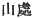
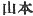
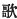
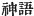

  
[Intangible Textual Heritage](../../index)  [Shinto](../index) 
[Index](index)  [Previous](kj031)  [Next](kj033) 

------------------------------------------------------------------------

[Buy this Book at
Amazon.com](https://www.amazon.com/exec/obidos/ASIN/B0028Y4SZY/internetsacredte)

------------------------------------------------------------------------

  
*The Kojiki*, translated by Basil Hall Chamberlain, \[1919\], at
Intangible Textual Heritage

------------------------------------------------------------------------

p. 95

## \[SECT. XXV.—THE CUP PLEDGE.\]

\[79\] Again this Deity's Chief Empress, [1](#fn_529) Her Augustness the Forward-Princess, was
very jealous. So the Deity her husband, being distressed, was about to
go up from Idzumo to the Land of Yamato; and as he stood attired, with
one august hand on the saddle of his august horse and one august foot in
the august stirrup, he sang, saying:

"When I take and attire myself so carefully in my august garments black
as the true jewels of the moor, and, like the birds of the offing, look
at my breast,—though I raise my fins, \[I say that\] these are not good,
and cast them off on the waves on the beach. When I take and attire
myself so carefully in my august garments green as the kingfisher, and,
like the birds of the oiling, look at my breast.—though I raise my fins,
\[I say that\] these, too, are not good, and cast them off on the waves
on the beach. When I take and attire myself so carefully in my raiment
dyed in the sap of the dye-tree, the pounded madder sought in the
mountain fields, and. like the birds of the offing. look at my
breast,—though I raise my fins, \[I say that\] they are good. My dear
young sister. Thine Augustness! Though thou say that thou wilt not
weep,—if like the flocking birds, I flock and depart, if, like the led
birds, I am led away and depart, thou wilt hang down thy head like p. 96 a single eulalia upon the mountain and thy
weeping shall indeed rise as the mist of \[80\] the morning shower.
Thine Augustness \[my\] spouse like the young herbs! The tradition of
the thing, too, this!" [2](#fn_530)

Then his Empress, taking a great august liquor-cup, and drawing near and
offering it to him, sang, saying:—

"Oh! Thine Augustness the Deity-of-Eight-Thousand-Spears! \[Thou\], my
\[dear\] Master-of-the-Great-Land indeed, being a man, probably hast on
the various island-headlands \[81\] that thou seest, and on every beach
headland that thou lookest on, a wife like the young herbs. But as for
me alas! being a woman, I have no man except thee; I have no spouse
except thee. Beneath the fluttering of the ornamented fence, beneath the
softness of the warm coverlet, beneath the rustling of the cloth
coverlet, \[thine\] arms white as rope of paper-mulberry bark softly
patting \[my\] breast soft as the melting snow, and patting \[each
other\] interlaced, stretching out and pillowing \[our selves\] on
\[each others arms\],—true jewel arms, and with outstretched legs, will
we sleep. Lift up the luxuriant august liquor!" [3](#fn_531)

She having thus sung, they at once pledged \[each other\] by the cup
with \[their hands\] on \[each other's\] necks, [4](#fn_532) and are at rest till the present time.
These are called divine words. [5](#fn_533)

p. 97

------------------------------------------------------------------------

### Footnotes

[95:1](kj032.htm#fr_533) p.
97 *I.e.*, chief wife.

[96:2](kj032.htm#fr_534) The meaning of this
poem is:—"I start for Yamato, there to search for a better wife, and I
carefully array myself for the journey. Black,—the colour of
mourning,—is not fair enough, and red is more beautiful than green; so
it is on my red garments that my choice rests. And thou, jealous and
imperious woman! for all that thou sayest that thou wilt not heed my
going, thou wilt weep when I depart with my retainers as departs a flock
of birds, and thou wilt bury thy head in thy hands, and thy tears shall
be as the misty drops of the morning shower."—The words *hata tagi*
(rendered in accordance with Motowori's view by "raise my fins") are
supposed to signify "raise my sleeve." If the last syllable were found
in any text written with a character not requiring the use of the
*nigori* in the Japanese transcription, we should get the more
satisfactory reading *ha tataki*, *i.e.* "beat my wings;" but the
syllable in question does not seem to be anywhere so written;—The
"madder" is in the original *akane*, here written (but doubtless only
through the error of some copyist) *atane*. The words rendered "sought
in the mountain fields" might also be translated "sown in the mountain
fields," *magashi*, "sought," and *makishi*, "sowed" being thought to be
convertible.—The words "my beloved" represent the Japanese *itokoya no*,
whose meaning is obscure and much disputed.—The words "when I am led
away" must be understood as if they were Active instead of Passive,
signifying as they do "when I lead away my retinue of followers."—The
eulalia (*Eulalia Japonica*) is a long king of grass very often alluded
to in the later classical poetry.—The words "on the mountain" represent
the Japanese words *yama-to no*, in accordance with Motowori's and
Hirata's view of the meaning of the latter (
 or  ).
Th. *primá facie* interpretation of "in the province of Yamato," which
Keichiyu adopts, will not bear investigation.—It is not quite clear
whether "the mist of the morning shower" means mist separate from the
rain, or is simply a phrase for the rain-drops themselves. Motowori
adopts the former opinion.—"Young herbs:" *waka-kusa*, is the
Pillow-Word for "spouse,"—newly married youths and maidens being likened
to the fresh-grown grass. The *refrain* is an abbreviated form of that
found in the two previous poems.

[96:3](kj032.htm#fr_535) The import of this
poem needs little explanation:—The goddess says to her husband, "Come
back and live with me, and quaff this goblet as a sign of
reconciliation; for though thou, as a man, mayest have a wife on every
shore, I shall be left solitary if thou depart."—p.
98 The "ornamented fence" is supposed to mean "a curtain round
the sleeping place."—The latter part to the poem (excepting the
concluding phrase) is a repetition of lines that have already occurred
in the last one of Sect. XXIV (note 7). The word *tate-matsurase* (here
rendered "lift up") occasions some difficulty. It properly signifies
"present to a superior;" but here it must be taken to mean "partake of,"
as the goddess is speaking to her spouse himself, unless indeed we
suppose the final words of the song to be a command addressed to one of
her attendants to present the cup to their common lord and master.

[96:4](kj032.htm#fr_536) This is the probable
and generally accepted meaning of the original of this clause, which is
written phonetically.

[96:5](kj032.htm#fr_537) Explained by Moribe to
mean, with reference to the whole story, "conversation about divine
events." Motowori proposes to supplement the character  , "song," to the two ( ) in the text, and to take the
three together as designating the nature of the preceding songs, in
accordance with the usage in other cases,—"Rustic Songs," "Courtier's
Songs," etc. If this view were adopted, we should have to translate by
"Divine Converse Songs."

------------------------------------------------------------------------

[Next: Section XXVI.—The Deities the August Descendants of the Deity
Master-of-the-Great-Land](kj033)
