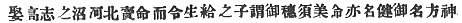

  
[Intangible Textual Heritage](../../index)  [Shinto](../index) 
[Index](index)  [Previous](kj032)  [Next](kj034) 

------------------------------------------------------------------------

[Buy this Book at
Amazon.com](https://www.amazon.com/exec/obidos/ASIN/B0028Y4SZY/internetsacredte)

------------------------------------------------------------------------

  
*The Kojiki*, translated by Basil Hall Chamberlain, \[1919\], at
Intangible Textual Heritage

------------------------------------------------------------------------

p. 98 \[82\]

## \[SECT. XXVI.—THE DEITIES THE AUGUST DESCENDANTS OF THE DEITY MASTER-OF-THE-GREAT-LAND.\]

So this Deity Master-of-the-Great-Land wedded Her Augustness
Torrent-Mist-Princess, the Deity dwelling in the inner temple of
Munakata. [1](#fn_534) and begot children: the
Deity Aji-shiki-taka-hiko-ne, [2](#fn_535) next
his younger sister Her Augustness High-Princess, [3](#fn_536) another name for whom is Her Augustness
Princess Under-Shining. [4](#fn_537) This Deity
Aji-shiki-taka-hiko-ne is he who is now called the Great August Deity of
Kamo. [5](#fn_538) Again the Deity
Master-of-the-Great-Land wedded Her Augustness Princess
Divine-House-Shield [6](#fn_539) and begot a
child: the Deity Thing-Sign-Master. [7](#fn_540) Again he wedded the Deity
Bird-Ears, [8](#fn_541) daughter of the Deity
Eight-Island-Possessor, [9](#fn_542) and begot

p. 99

a child: the Deity Bird-Growing-Ears. [10](#fn_543) This Deity wedded
Hina-teri-nakata-bichi-wo-ikochini, [11](#fn_544) and begot a child: the Deity
Land-Great-Wealth. [12](#fn_545) This Deity
wedded the Deity Ashi-nadaka, [13](#fn_546)
another name for whom is Princess-Eight-Rivers-and-Inlets, [14](#fn_547) and begot a child: the Deity
Swift-Awful-Brave-Sahaya-Land-Ruler. [15](#fn_548) This Deity wedded Princess
Luck-Spirit, [16](#fn_549) daughter of the
\[84\] Deity Heavenly-Awful-Master, [17](#fn_550) and begot a child: the Deity
Awful-Master-Prince. [18](#fn_551) This Deity
wedded Princess Hina-rashi, [19](#fn_552)
daughter of the Deity Okami, [20](#fn_553) and
begot a child: the Deity Tahiri-kishi-marumi. [21](#fn_554) This Deity wedded the Deity
Princess-Life-Spirit-Luck-Spirit, [22](#fn_555)
daughter of the Deity Waiting-to-See-the-Flowers-of-the-Holly, [23](#fn_556) and begot a child: the Deity
Mira-na-mi. [24](#fn_557) This Deity wedded
Princess Awo-numa-oshi, [25](#fn_558) daughter
of the Master-of-Shiki-yama, [26](#fn_559) and
begot a child: the Deity Nunoshi-tomi-tori-naru-mi. [27](#fn_560) This Deity wedded the
Young-Day-Female-Deity, [28](#fn_561) and begot
a child: the Deity Heavenly-Hibara-Great-Long-Wind-Wealth. [29](#fn_562) This Deity wedded the Deity
Toho-tsu-ma-chi-ne, [30](#fn_563) daughter of
the Deity Heavenly-Pass Boundary, [31](#fn_564)
and begot a child: the Deity Toho-tsu-yama-zaki-tarashi. [32](#fn_565)

From the above-mentioned Deity Eight-Island-Ruler down to the Deity
Toho-tsu-yama-zaki-tarashi are called the Deities of seventeen
generations. [33](#fn_566)

 

p. 100 p. 101
p. 102

------------------------------------------------------------------------

### Footnotes

[98:1](kj033.htm#fr_538) p.
99 See Sect. XIII, Note 15 and Sect. XIV. Note 2.

[98:2](kj033.htm#fr_539) *Aji-shiki
taka-hiko-ne no-kami*. The meaning of the first two members of this
compound name is altogether obscure. *Taka-hiko-ne* signifies
"high-prince lord."

[98:3](kj033.htm#fr_540) *Taka-hime-no-mikoto*.
*Taka-hime* is supposed by Hirata to be a mutilated form of
*Taka-teru-hime*, "High-Shining-Princess," which would make the two
names of this personage properly complementary.

[98:4](kj033.htm#fr_541) p.
100 *Shita-teru-hime-no-mikoto*. This goddess is popularly
supposed to have been extremely beautiful, whence perhaps the name,
which might be taken to imply that her beauty shone forth from under her
garments as in the case of *So-towori-hime* (see Sect. CXXXVII, Note 9).

[98:5](kj033.htm#fr_542) Because there
worshipped. The etymology of Kamo is not clear.

[98:6](kj033.htm#fr_543)
*Kamu-ya-tate-hime-no-mikoto*. The translation here follows the Chinese
characters. Another proposal of Motowori's is to regard the syllables
ya-tate as a corruption of *iya-taka-teri*, "more and more high
shining," which would give us for the whole name in English
"Divine-More-and-More-High-Shining-Princess."

[98:7](kj033.htm#fr_544) *I.e.*, "the Deity who
gave a sign of the thing he did." The Japanese original is
*Koto-shire-nushi-no-kami*. The translation of the name here given
follows Motowori's interpretation, which takes it to contain an allusion
to the act by which its bearer symbolized his surrender of the
sovereignty of the land to the descendant of the Sun-Goddess. Lengthened
forms of the name are *Ya-he-koto-shiro-nushi-no-kami* ("the Deity
Eight-Fold-Thing-Sign-Master") and
*Tsumi-ba-ya-he-koto-shiro-nushi-no-kami*, the first three syllables of
which latter are obscure. Both of the lengthened forms are supposed to
contain a reference to the manifold "green branches" mentioned in the
legend referred to,—that. viz., which forms the subject-matter of Sect.
XXXII.

[98:8](kj033.htm#fr_545) *Tori-mimi-no-kami*.
Motowori suggests that tori, "bird," may be but the name of a place in
Yamato.

[98:9](kj033.htm#fr_546)
*Ya-shima-muji-no-kami*. "Possessor" is the probable meaning of *muji*,
regarded here and elsewhere as an alternative form of *mochi*. Motowori
suggests that Yashima may be meant for the name of a district in Yamato,
in which case both this god and his daughter would have been named from
the places of their birth or residence, which are near each other in the
same province.

[99:10](kj033.htm#fr_547)
*Tori-nara-mi-no-kami*. The above interpretation, which is proposed by
Motowori, seems more acceptable than "Bird-Sounding-Sea," which the
Chinese characters yield. *Tori* "bird," if taken above to be the name
of a place, must be likewise so considered here.—Motowori reasonably
conjectures that a clause to the following effect is here omitted: "He
wedded such and such a princess, daughter of such and such a Deity, and
begot a child: the Deity *Take-mina-gata*" \[*i.e.* probably
Brave-August-Name-Firm\] (See Sect. XXXII, Note 21). Hirata's text in
his "Exposition of the Ancient Histories" is  .

[99:11](kj033.htm#fr_548) p. 101 The text is here evidently corrupt, and
Motowori proposes to read either *Hina-teri-nukata-bichi-wo-no-kami no
musume Iko-chi-ni-no-kami* which would give us in English "the Deity
Ikochini, daughter of the male Deity Hina-teri-nukata-bichi," or else to
take the whole as the father's name, and to suppose that the name of the
daughter has been accidentally omitted. *Hina-teri* means "Rustic
Illuminator," and the name resembles that of a deity mentioned in Sect.
XIV, Note 6. *Nukata* and *Bichi* (or *Hiji*, reversing the position of
the *nigori*) are supposed to be names of places. *Ikochini* is
altogether obscure.

[99:12](kj033.htm#fr_549)
*Kuni-oshi-tomi-no-kami*, *oshi*, as in other instances, being
considered a contraction of *ohoshi*, "great."

[99:13](kj033.htm#fr_550)
*Ashi-nakada-no-kami*. It is not clear whether this is a personal name
or, as Motowori supposes, the name of the place where the goddess
resided. He quotes places named Ashidaka and Ashida; but this hardly
seems satisfactory. In any case the name remains obscure.

[99:14](kj033.htm#fr_551) *Ya-kaha-ye-hime*.
The translation follows the meaning of the Chinese characters with which
the name is written. It is, however, also open to us to consider
*Yaka-ha-ye* as a corruption of *iya-ko-haye*, "more flourishing."

[99:15](kj033.htm#fr_552) *Haya-mika-no-take
sahaya-ji-nu-mi-no-kami*. The syllables *sahaya* are obscure, and
Motowori's proposal to consider them as the name of a place has only
been followed in the translation for want of something more
satisfactory.

[99:16](kj033.htm#fr_553) *Saki-tama-bime*.

[99:17](kj033.htm#fr_554)
*Ame-no-mika-a-nushi-no-kami*.

[99:18](kj033.htm#fr_555)
*wika-nushi-hike-no-kami*.

[99:19](kj033.htm#fr_556) *Hina-rashi-bime*.
Motowori takes Hina to be the name of a place, and *rashi*, to be an
apocopated form of *tarashi* or some such word. But this is mere
guess-work.

[99:20](kj033.htm#fr_557) *Okami-no-kami*. See
Sect. VIII, Note 9.

[99:21](kj033.htm#fr_558)
*Tahiri-kishi-marumi-no-kami*. The meaning of this name is quite
obscure. Motowori throws out the suggestion that *Tahiri* may stand for
*Tari-hiri* and *Kishi-marumi* for *Kizhima-tsu-mi*,—*Tarihi* and
*Kizhiwa* being names of places, and *tsu-mi*, as usual, being credited
with the signification of "possessor."

[99:22](kj033.htm#fr_559)
*Iku-tama-saki-tama-hime*.

[99:23](kj033.htm#fr_560)
*Hihira-gi-no-sono-hana-madzu-mi-no-kami*. The interpretation of the
name here given is conjectural as far as the words "waiting to see"
(taken on Tominobu's authority to be the most likely meaning of
*madzu-mi*) p. 102 are concerned. Motowori
suggests that *hihira-gi-no* may be but a sort of Pillow-Word, and not
part of the actual name at all, and the remaining characters corrupted.
*Hihira-gi* rendered "holly," is properly the *Olea Aquifolia*.

[99:24](kj033.htm#fr_561) *Miro-nami-no-kami*.
Meaning obscure. *Miro* is supposed by Motowori to be the name of a
place, and *na* and *mi* to be Honorific appellations.

[99:25](kj033.htm#fr_562)
*Awo-numa-nu-oshi-hime*. Meaning obscure.

[99:26](kj033.htm#fr_563)
*Shiki-yama-nushi-no-kami*. *Shiki-yama* is supposed to be the name of a
place in Echizen.

[99:27](kj033.htm#fr_564)
*Nunoshi-tomi-tori-nara-mi-no-kami*. *Nunoshi* is supposed to be the
name of a place, and identical with *Nunoshi*, which forms part of the
mother's name. Motowori takes *tomi* to be an Honorific, and *Tori* (as
previously in the case of the deities *Tori-mimi* and *Tori-naru-mi*
(See Notes 8 and 10) to be the name of another place. The translator
would prefer to take both words in their common signification, and
(leaving *nunoshi* aside as incomprehensible) to render the rest of the
name thus: "Wealth-Bird-Growing-Ears."

[99:28](kj033.htm#fr_565)
*Waka-hiru-me-na-kami*.

[99:29](kj033.htm#fr_566)
*Ame-no-hibara-oho-shi-na-domi-no-kami*. Motowori supposes Hibara to be
the name of a place, a view which the translator has adopted for want of
a better.

[99:30](kj033.htm#fr_567)
*Toho-tsu-ma-chi-ne-no-kami*. Motowori supposes Tohotsu to be the name
of a place, and the remaining syllables to be Honorific.

[99:31](kj033.htm#fr_568) There is no footnote
31—*JBH*.

[99:32](kj033.htm#fr_569)
*Toho-tsu-yama-zaki-tarashi-no-kami*. *Toho-tsu* (lit. "distant") and
*yamazaki* ("mountain-cape") are both considered by Motowori to be names
of places. Tarashi signifies "perfect" or "perfection." We might perhaps
render the name thus: "Perfection-of-the-Distant-Mountain- Cape."

[99:33](kj033.htm#fr_570) *I.e.* "seventeen
generations of Deities." But the construction is curious. Motowori
points out that there is here an error in the computation, as the text
enumerates but fifteen generations. The names of the gods and goddess
mentioned in this section offer unusual difficulties Motowori says that
it is with hesitation that he proposes many of his interpretations, and
it is with still greater hesitation that the translator has accepted
them.

------------------------------------------------------------------------

[Next: Section XXVII.—The Little-Prince-the-Renowned-Deity](kj034)
