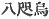
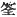
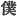
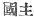
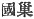
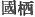

  
[Intangible Textual Heritage](../../index)  [Shinto](../index) 
[Index](index)  [Previous](kj052)  [Next](kj054) 

------------------------------------------------------------------------

[Buy this Book at
Amazon.com](https://www.amazon.com/exec/obidos/ASIN/B0028Y4SZY/internetsacredte)

------------------------------------------------------------------------

  
*The Kojiki*, translated by Basil Hall Chamberlain, \[1919\], at
Intangible Textual Heritage

------------------------------------------------------------------------

p. 167

## \[SECT. XLVI.—EMPEROR JIM-MU (PART III.—THE GIGANTIC CROW AND GODS WITH TAILS)\]

"Then His [1](#fn_932) Augustness the
Great-High-Integrating-Deity again commanded and taught, saying: "August
son of the Heavenly Deity! make no progress hence into the interior. The
savage Deities are very numerous. I will now send from Heaven a crow
eight feet \[long\]. [2](#fn_933) So that crow
eight feet \[long\] shall guide thee. Thou must make thy progress
following after it as it goes." So on \[His Augustness
Kamu-yamato-ihare-biko\] making his progress following after the crow
eight feet \[long\] in obedience to the Deity's instructions, he reached
the lower course of the Yeshinu [3](#fn_934)
river, where there was a \[137\] person catching fish in a weir. [4](#fn_935) Then the august child of the Heavenly
Deity asked, saying: "Who art thou?" He replied, saying: "I [5](#fn_936) am an Earthly Deity [6](#fn_937) and am called by the name of Nihe-motsu
no Ko." [7](#fn_938) (This
is the ancestor of the Cormorant-Keepers of Aha.) [8](#fn_939) On \[His Augustness
Kamu-yamato-ihare-biko\] making his progress thence, a person with a
tail [9](#fn_940) came out of a well. The well
shone. Then \[His Augustness\] asked: "Who art thou?" He

p. 168

replied, saying: "I am an Earthly Deity, and my name is Wi-hika." [10](#fn_941) This is the ancestor of the Headmen of
Yeshinu). [11](#fn_942) On his forthwith
entering the mountains, [12](#fn_943) His
Augustness Kamu-yamato-ihare-biko again met a person with a tail. This
person came forth pushing the cliffs apart. Then \[His Augustness
Kamu-yamato-ihare-biko\] asked: "Who art thou?" He replied, saying; "I
am an Earthly Deity, and my name is Iha-oshi-waku no Ko. I heard
\[just\] now that the august son of the Heavenly Deity was making his
progress. So it is for that that I have come to meet thee." (This is the ancestor of the Territorial \[138\] Owners of
Yeshinu). [13](#fn_944) Thence \[His
Augustness Kamu-yamato-ihare-biko\] penetrated over on foot to
Uda. [14](#fn_945) So they say: "The Ugachi of
Uda." [15](#fn_946)

------------------------------------------------------------------------

### Footnotes

[167:1](kj053.htm#fr_936) p. 168 The intention of the writer is here obscure,
but he probably meant the following passage to form part of the dream,
as is the case in the parallel passage of the "Chronicles." The inverted
commas are therefore continued in the translation.

[167:2](kj053.htm#fr_937) The characters   (*ya to-garasu*), with which
the original of this expression is written, combined with the mention in
the Preface of the "great crow," have determined the translator to adopt
the interpretation favoured by Tanigaha Shisei, [viz.](errata.htm#28), a
"crow eight feet \[long\]." Motowori understands the expression to mean
"an eight-headed crow." For the arguments on both sides see the
Perpetual Commentary on the Chronicles of Japan," Vol. VII, p. 16, and
Motowori's Commentary, Vol. XVIII, pp. 60-62, and Vol. VIII, pp. 34-58.
See also for the translation of a parallel passage Sect. XVI, Note 23.

[167:3](kj053.htm#fr_938) Better known by the
classical and modern form of the name, *Yoshino*. It seems to signify
"good moor." Yoshino, which is in the province of Yamato, has from the
earliest times been renowned for the beauty of its cherry-blossoms, and
also figures largely in the early and mediaeval history. Motowori points
out geographical difficulties in the Imperial progress as here detailed.
In the "Chronicles," the verisimilitudes of the journey are better
observed.

[167:4](kj053.htm#fr_939) p. 169The character 
, here rendered "weir" for want of a better word, is
defined as signifying "a bamboo trap for catching fish."

[167:5](kj053.htm#fr_940) The First Personal
Pronoun is here represented by the humble character  , "servant." The other tailed
deity mentioned immediately below uses the same expression.

[167:6](kj053.htm#fr_941) See Sect. I, Note 11,
and Sect. XLIV, Note 22, for the considerations that make it better to
translate thus than to render by "I am a Deity of the Land."

[167:7](kj053.htm#fr_942) *I.e.*,
"Offering-Bearing Child." Here and elsewhere the word *ko*, "child," as
part of a proper name, should be understood as a kind of Honorific,
employed probably in imitation of Chinese usage.

[167:8](kj053.htm#fr_943) *Ada* No *U-kaki*.
This must be understood to be a "gentile name" (*kabane*). The etymology
of Ada is uncertain. The practice of fishing with the help of
cormorants, though now almost obsolete, seems to have been very common
in Japan down to the Middle ages.

[167:9](kj053.htm#fr_944) Commenting on a
similar passage a little further on, Motowori, naively remarks: "It
appears that in very ancient times such persons were occasionally "to be
met with." It should be added that they are also mentioned in Chinese
literature.

[168:10](kj053.htm#fr_945) *I.e.*,
"Well-Shine."

[168:11](kj053.htm#fr_946) *Yeshinu no obito*.
For Yeshinu see Note 3.

[168:12](kj053.htm#fr_947) *I.e.*, disappearing
among the mountains.

[168:13](kj053.htm#fr_948) *Yeshinu no kuzu*.
*Kuzu* is a contraction of *kuni-nushi* (properly  , with which characters the
name is found written at the commencement of Sect. CVIII, though
elsewhere the semi-phonetic rendering 
 or   is
employed).

[168:14](kj053.htm#fr_949)
[Etymology](errata.htm#29) obscure.

[168:15](kj053.htm#fr_950) *Uda no ugachi*. The
meaning of the sentence is: "Hence the name of the Ugachi of Uda."
*Ugachi* signifies "to penetrate." But the etymology seems a forced one,
and Motowori is probably correct in identifying this "gentile name" with
that of Ukashi, mentioned in the next sentence.

------------------------------------------------------------------------

[Next: Section XLVII.—Emperor Jim-mu (Part IV.—The Ukashi
Brethren)](kj054)
