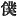

  
[Intangible Textual Heritage](../../index)  [Shinto](../index) 
[Index](index)  [Previous](kj058)  [Next](kj060) 

------------------------------------------------------------------------

[Buy this Book at
Amazon.com](https://www.amazon.com/exec/obidos/ASIN/B0028Y4SZY/internetsacredte)

------------------------------------------------------------------------

  
*The Kojiki*, translated by Basil Hall Chamberlain, \[1919\], at
Intangible Textual Heritage

------------------------------------------------------------------------

p. 184

## \[SECT. LII.—EMPEROR JIM-MU (PART. IX—TROUBLES WHICH FOLLOWED HIS DECEASE).\]

So when, after the decease of the Heavenly Sovereign, [1](#fn_1017) \[150\] the elder half-brother, His
Augustness Tagishi-mimi, [2](#fn_1018)
wedded [3](#fn_1019) the Empress
I-suke-yori-hime, he plotted how he might slay his three younger
brethren, pending which their august [4](#fn_1020) parent I-suke-yori-hime lamented, and
made \[the plot\] known to her august children by a Song. The song said:

"From the River Sawi the clouds have risen across, and the leaves of the
trees have rustled on Mount Unebi: the wind is about to blow." [5](#fn_1021)

Again she sang, saying:

"Ah! What rest on Mount Unebi as clouds in the day-time, will surely
blow as wind at night-fall, \[whence\] the rustling of the
leaves!" [6](#fn_1022)

When hereupon her august children, hearing and knowing \[of the
danger\], were alarmed and forthwith were about to slay Tagishi-mimi,
His Augustness Kamu-nuna-kaha-mimi said to his elder brother His
Augustness Kamu-ya-wi-mimi: "Thy dear Augustness, \[do thou\] take a
weapon, and go in and slay Tagishi-mimi." So he took a weapon and went
in, and was about to slay him. But his arms and legs trembled so, that
he was

p. 185

unable to slay him. So then the younger brother His Augustness
Kamu-nuna-kaha-mimi begged \[to be allowed\] to take the weapon which
his elder brother held, and \[151\] went in and slew Tagishi-mimi. So
again, in praise of his august name, he was called His Augustness
Take-nuna-kaha-mimi. [7](#fn_1023) Then His
Augustness Kamu-ya-wi-mimi resigned \[in favour of\] the younger brother
His Augustness Take-nuha-kaha-mimi, saying: "I could not slay the
foeman; but Thine Augustness was at once able to slay him. So, though I
be the elder brother, it is not right that I should be the
superior. [8](#fn_1024) Wherefore do Thine
Augustness be the superior, and rule \[all\] beneath the Heaven. I [9](#fn_1025) will assist Thine Augustness, becoming
a priest, [10](#fn_1026) and respectfully
serving thee."

------------------------------------------------------------------------

### Footnotes

[184:1](kj059.htm#fr_1021) *I.e.*, the Emperor
Jim-mu. His decease is not otherwise specially mentioned; but a formula
at the end of the Section, which is repeated *mutatis mutandis* in the
case of each Emperor, tells us the number of years he lived or reigned,
and the place of his sepulture. Throughout these "Records," much matter
is often placed in the reign of a Monarch already deceased, and which,
according to our ideas, would more naturally be narrated under the
heading of his successor.

[184:2](kj059.htm#fr_1022) Who was the
deceased Emperor's son by Princess Ahira (see Sect. LI, Note 6,) and
consequently step-son to the Empress and half-brother to her three sons.

[184:3](kj059.htm#fr_1023) This is the meaning
of the Chinese character in the text, Motowori tries to save the
Empress-Dowager's reputation for conjugal fidelity by rendering it in
his *kana* reading by a word signifying "raped."

[184:4](kj059.htm#fr_1024) See Sect. XXII,
Note 4.

[184:5](kj059.htm#fr_1025) The import of this
metaphorical poem, taken in its context, is too clear to need much
comment. The rising off the clouds and the rustling of the leaves may be
supposed to represent the murderer's preparations, and the blowing of
the wind his actual onslaught.

[184:6](kj059.htm#fr_1026) The meaning of this
Song is: "The would-be murderer remains quiet during the day-time like
the clouds hanging to the mountain-side; but at night he will I burst
upon you like the storm-wind. Already I p.
186 hear the leaves begin to rustle; already he is gathering his
men together."

[185:7](kj059.htm#fr_1027) The word *take*
prefixed to the name of this prince signifies "brave."

[185:8](kj059.htm#fr_1028) *I.e.*, either
"superior to thee," or as Motowori understands the phrase, "the superior
of all," *scil*. the Emperor.

[185:9](kj059.htm#fr_1029) Though the elder
brother, he here uses the humble character 
 "servant," to show his respect and deference.

[185:10](kj059.htm#fr_1030) Literally, "a
person who shuns," *q.d.* who shuns all pollution, and avoids certain
food at certain seasons. *Conf*. the gentile name *Imi-be* commented on
in Sect. XXXIII, Note 32.

------------------------------------------------------------------------

[Next: Section LIII.—Emperor Jim-mu (Part X.—Genealogies)](kj060)
