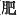

  
[Intangible Textual Heritage](../../index)  [Shinto](../index) 
[Index](index)  [Previous](kj059)  [Next](kj061) 

------------------------------------------------------------------------

[Buy this Book at
Amazon.com](https://www.amazon.com/exec/obidos/ASIN/B0028Y4SZY/internetsacredte)

------------------------------------------------------------------------

  
*The Kojiki*, translated by Basil Hall Chamberlain, \[1919\], at
Intangible Textual Heritage

------------------------------------------------------------------------

p. 186

## \[SECT. LIII.—EMPEROR JIM-MU (PART X.—GENEALOGIES).\]

So His Augustness Hiko-ya-wi (is the ancestor of the
Chieftains of Mamuta, [1](#fn_1027) and of the
Chieftains of Teshima.) [2](#fn_1028)
His Augustness Kamu-ya-wi-mimi (is the ancestor of
the Grandees of Oho, [3](#fn_1029) of the
Chieftains of the Tribe of Chihisako, [4](#fn_1030) of the chieftains of \[152\] the Tribe
of Sahahi, [5](#fn_1031) of the Dukes
[of](errata.htm#40) Hi, [6](#fn_1032) of the
Dukes of Ohokida, [7](#fn_1033) of the Dukes
of Aso, [8](#fn_1034) of the Chieftains of the
Granaries of Tsukushi, [9](#fn_1035) of the
Grandees of the Sazaki Tribe, [10](#fn_1036)
of the Rulers of the Tribe of Sazaki, [11](#fn_1037) of the Rulers of Wo-Hatsuse, [12](#fn_1038) of the Suzerains of Tsuke, [13](#fn_1039) of the Rulers of the land of
Iyo, [14](#fn_1040) of the Rulers of the land
of Shinanu, [15](#fn_1041) of the Rulers of
the land of Ihaki in Michinoku, [16](#fn_1042)
of the Rulers of the Land of Naka \[153\] in Hitachi, [17](#fn_1043) of the Rulers of the land of
Nagasa, [18](#fn_1044) of the Suzerains of
Funaki in Ise, [19](#fn_1045) of the Grandees
of Niha in Wohari, [20](#fn_1046) and of the
Grandees of Shimada.) [21](#fn_1047)

p. 187

------------------------------------------------------------------------

### Footnotes

[186:1](kj060.htm#fr_1031) p. 186 *Mamuta no murazhi*. Mamuta is said to have
been a place in the province of Kahachi. The etymology of the name is
obscure.

[186:2](kj060.htm#fr_1032) *Teshima no
murazhi*. Teshima is said to have been a place in the province of Tsu
(Settsu). The name may signify "luxuriant island."

[186:3](kj060.htm#fr_1033) *Oho no omi*. Oho
is said to have been a place in the province of Yamato. The name is
mostly written with characters signifying "vast" or "numerous."

[186:4](kj060.htm#fr_1034) *Chihisako-be no
murazhi*. Chihisako is said to have been a place in the province of
Etchiū. But the name of this family has also been traced to an incident
mentioned in the "Newly Selected Catalogue of Family Names "as having
occurred in the reign of the Emperor Yūriyaku, p.
187when, owing to a verbal error, a tax was collected in children
instead of in cocoons. The monarch, amused at the mistake, is said to
have granted to the tax-collector the "gentile name" of *Chihisako*,
i.e., "Little Child."

[186:5](kj060.htm#fr_1035) *Sakahi-be no
muhazhi*. *Sakahi* signifies "boundary," and this "gentile name" is
traced to the fact, mentioned in the "Newly Selected Catalogue of Family
Names," that the founder of the family distinguished himself by setting
up boundary-marks on the frontiers of different provinces in the reign
of the Emperor In-giyō (first half of the fifth century of the Christian
era).

[186:6](kj060.htm#fr_1036) *Hi no kimi*, Hi
( ) is the name of a
province (now two provinces) in the south-western island of Tsukushi. It
is first mentioned in Sect. V, Note 17.

[186:7](kj060.htm#fr_1037) *Ohokida no kimi*.
Ohokida is the name of a district in the province of Toyo.

[186:8](kj060.htm#fr_1038) *Aso no himi*. Aso
is the name of a district in Higo, containing a celebrated volcano.

[186:9](kj060.htm#fr_1039) *Tsukushi no miyake
no murazhi*.

[186:10](kj060.htm#fr_1040) *Sazaki-be no
omi*. This name is connected by the compiler of the "Newly Selected
Catalogue of Family Names" with that of the Emperor Nin-toku (Oho-sazaki
no Mikoto), for which see Sect. CIV, Note 18.

[186:11](kj060.htm#fr_1041) *Sazaki-be no
miyatsuko*.

[186:12](kj060.htm#fr_1042) *Wo hatsuse no
miyatsuko*. This name is connected with that of the Emperor Mu-retsu,
whose name was Wo-Hatsuse no Waka-Sazaki.

[186:13](kj060.htm#fr_1043) *Tsuke no atahe*.
Tsuke is the name of a place in Yamato.

[186:14](kj060.htm#fr_1044) *Iyo no kuni no
miyatsuko*. For the province of Iyo see Sect. V, Note 26.

[186:15](kj060.htm#fr_1045) *Shinanu no kuni
no miyatsuko*. For the province of Shinanu (Shinano) see Sect. XXXII,
Note 26.

[186:16](kj060.htm#fr_1046) *Michinoku no
Ihaki no kuni no miyatsuko*. A popular derivation of Michinoku is from
*michi no kuni*, "the country of the road;" but a more likely one,
sanctioned by Motowori, is from *michi no oku*, "the furthest or more
distant part of the road." (For the word "road," as here used, *conf*.
Sect. LXV, Note 2.). It was for many centuries, and is still in poetry,
a vague name for the entire north of Japan. *Ihaki*, sometimes
considered a province, and at others only ranking as a district, formed
its south-eastern portion along the Pacific sea-board. The name seems to
signify "rock (or hard) castle."

[186:17](kj060.htm#fr_1047) p. 188 *Hitachi no naka no huni no miyatzuko*.
Hitachi is a province to the south of Ihaki. Motowori quotes more than
one traditional derivation of its name, the best of which, taken from
the old Topography of the province, is hita-michi, "plain road,"
referring to the level nature of that part of the country. Naka is the
name of a district. The word signifies "middle," and may have arisen
from the fact of the district bearing it being situated between two
considerable rivers.

[186:18](kj060.htm#fr_1048) *Nagasa no kuni no
miyatsuko*. Nagasa is a district in that portion of the old province of
Kadzusa which was in very early historical times cut off from the little
province of Aha. The import of the name is not clear.

[186:19](kj060.htm#fr_1049) *Ise no Funaki no
atahe*. For Ise see Sect. XLIX, Note 4. Of Funaki nothing is known. The
characters with which the name is written signify "boat-tree."

[186:20](kj060.htm#fr_1050) *Ohari no Niha no
omi*. Wohari is one of the central provinces of Japan. The name is of
uncertain origin. Niha is the name of a district, and is of uncertain
origin.

[186:21](kj060.htm#fr_1051) *Shimada no omi*.
Shimada is the name of a district in Wohari, and signifies "island
rice-fields."

------------------------------------------------------------------------

[Next: Section LIV.—Emperor Jim-mu (Part XI.—His Age and Place Of
Burial)](kj061)
