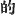

  
[Intangible Textual Heritage](../../index)  [Shinto](../index) 
[Index](index)  [Previous](kj067)  [Next](kj069) 

------------------------------------------------------------------------

[Buy this Book at
Amazon.com](https://www.amazon.com/exec/obidos/ASIN/B0028Y4SZY/internetsacredte)

------------------------------------------------------------------------

  
*The Kojiki*, translated by Basil Hall Chamberlain, \[1919\], at
Intangible Textual Heritage

------------------------------------------------------------------------

p. 199 \[162\]

## \[SECT. XLI.—EMPEROR KŌ-GEN.\]

His Augustness Oho-yamato-ne-ko-hiko -kuni-kuru dwelt in the palace of
Sakaki-bara at Karu, [1](#fn_1140) and ruled
the Empire. This heavenly Sovereign wedded Her Augustness
Utsu-shiko-me, [2](#fn_1141) younger sister of
His Augustness Utsu-shiko-wo, [3](#fn_1142)
ancestor of the Grandees of Hodzumi, [4](#fn_1143) and begot august children: His
Augustness Oho-biko, [5](#fn_1144) next His
Augustness Sukuna-biko-take-wi-goro; [6](#fn_1145) next His Augustness
Waka-yamato-ne-ko-hiko-oho-bibi [7](#fn_1146)
(three Deities).

p. 200

\[paragraph continues\] Again, wedding Her
Augustness I-gaka-shiko-me, [8](#fn_1147)
daughter of His Augustness Utsu-shiko-wo, he begot an august child: His
Augustness Hiko-futu-oshi-no-makoto. [9](#fn_1148) Again, wedding Princess
Haniyasu, [10](#fn_1149) daughter of
Awotama [11](#fn_1150) of Kafuchi, he begot an
august child: His Augustness Take-hani-yasu-biko [12](#fn_1151) (one
Deity). The august children of this Heavenly Sovereign \[numbered
in all five Deities\]. So His Augustness Waka-yamato-ne-ko-hiko-oho-bibi
\[was he who afterwards\] ruled the Empire. The children of \[163\] his
elder brother, His Augustness Oho-biko, were His Augustness
Take-numa-kaha-wake [13](#fn_1152) (ancestor of the Grandees of Abe); [14](#fn_1153) next His Augustness
Hiko-inakoshi-wake [15](#fn_1154) (This was the ancestor of the Butler
Grandees.) [16](#fn_1155) His
Augustness Hiko-futu-oshi-no-mikoto wedded Princess Takachina of
Kadzuraki, [17](#fn_1156) young sister of
Cho-nabi, [18](#fn_1157) ancestor of the
Chiefs of Wohari, [19](#fn_1158) and begot a
child: the Noble Umashi Uchi. [20](#fn_1159)
(This was the ancestor of the Grandees of Uchi in
Yamashiro.) [21](#fn_1160) Again,
wedding Princess Yama-shita-kage, [22](#fn_1161) younger sister of Udzu-hiko, [23](#fn_1162) ancestor of the Rulers of the Lord of
Ki, [24](#fn_1163) he begot a child, the Noble
Take-Uchi [25](#fn_1164) The children of this
Noble Take-Uchi \[numbered\] in all nine (seven
males and two females),— namely\] the Noble of
Hata-no-Yashiro, [26](#fn_1165) \[who\] (was the ancestor of the Grandees of Hata, [27](#fn_1166) of the Grandees of Hayashi, [28](#fn_1167) of the Grandees of Hami, [29](#fn_1168) of the Grandees of Hoshikaha, [30](#fn_1169) of the Grandees of Afumi, [31](#fn_1170) and of the Dukes of the Hatsuse
Tribe); [32](#fn_1171) next the Noble
Kose-no-Wo-Kara [33](#fn_1172) \[who\] (was the ancestor of the Grandees of Kose, [34](#fn_1173) of the Grandees of the Sazaki
Tribe, [35](#fn_1174) and of the Grandees of
the Karu Tribe); [36](#fn_1175) next
the Noble Soga no Ishikaha [37](#fn_1176)
\[who\] (was the ancestor of the Grandees of
Soga, [38](#fn_1177) of the Grandees of
Kahanobe, [39](#fn_1178) of the Grandees of
Tanaka, [40](#fn_1179) of the Grandees of
Takamuko, [41](#fn_1180) of the Grandees of
Woharida [42](#fn_1181) of the Grandees of
Sakurawi, [43](#fn_1182) and of the Grandees
of Kishida); [44](#fn_1183) next the
Noble Heguri-no-Tsuku, [45](#fn_1184)

p. 201

\[paragraph continues\] \[who\] (was the ancestor of the Grandees of Heguri, [46](#fn_1185) of the Grandees of Sawara, [47](#fn_1186) and of the Uma-mi-kuhi
Chiefs) [48](#fn_1187) next the Noble
Kino-Tsunu [49](#fn_1188) \[who\] (was the ancestor of the Grandees of Ki, [50](#fn_1189) of the Grandees of Tsumu; [51](#fn_1190) and of the Grandees of
Sakamoto) [52](#fn_1191) next Princess
Mato of Kume; [53](#fn_1192) next Princess
Nu-no-iro; [54](#fn_1193) next
Kadzuraki-no-Nagaye-no-sotsu-biko [55](#fn_1194) \[who\] (was the
ancestor of the Grandees of Tamade, [56](#fn_1195) of the Grandees of Ikuha, [57](#fn_1196) of the Grandees \[166\] of
Ikuye [58](#fn_1197) and of the Grandees of
Agina), [59](#fn_1198) moreover \[there
was\] the Noble Waku-go [60](#fn_1199) (the ancestor of the Grandees of Yenuma). [61](#fn_1200) This Heavenly Sovereign's august
years were fifty-seven. His august mausoleum is on the mound in the
middle of the Pool of Tsurugi. [62](#fn_1201)

p. 202 p. 203
p. 204

------------------------------------------------------------------------

### Footnotes

[199:1](kj068.htm#fr_1144) p. 201 In Yamato. For Karu see Sect. LVII, Note I.
*Sakahi-bara* signifies "boundary moor."

[199:2](kj068.htm#fr_1145) *I.e.*, perhaps,
"the beautiful but alarming female."

[199:3](kj068.htm#fr_1146) *I.e.*, perhaps,
"the beautiful but alarming male."

[199:4](kj068.htm#fr_1147) *Hodzumi no omi*.
There are several places called Hodzumi in various provinces. The name
appears to signify "piling up rice-ears."

[199:5](kj068.htm#fr_1148) *I.e.*, "great
prince."

[199:6](kj068.htm#fr_1149) *I.e.*, "little
prince-fierce-boar-heart," the boar being known for its savage
disposition.

[199:7](kj068.htm#fr_1150) Excluding the last
member of the compound, this name signifies
"young-Yamato-lord-prince-great" *Bibi* is identified by Motowori with
the word *mimi*, which so often recurs in proper names (see Sect. XIII,
Note 18).

[200:8](kj068.htm#fr_1151) Motowori explains
this name in the sense of "brilliant-alarming-female," but some doubt
must attach to it.

[200:9](kj068.htm#fr_1152) *I.e.*, perhaps,
"prince vast-great-truth."

[200:10](kj068.htm#fr_1153) *Hani-yasu-bime*.
This name has already been met with in Sect. VII, Note 3. Motowori
however supposes that in this place Haniyasu should be considered to be
the name of a place in Yamato.

[200:11](kj068.htm#fr_1154) *I.e.*, a man
called "green jewel" who lived in the province of Kafuchi.

[200:12](kj068.htm#fr_1155) *Take* signifies
"brave." For the rest of the name see Note 10.

[200:13](kj068.htm#fr_1156) *Take* signifies
"brave." *Wake* is either "young" or "lord." For *Nuna-kaha* see Sect.
LI, Note 31.

[200:14](kj068.htm#fr_1157) p. 202 *Abe no omi*. There are several places
called Abe, and it is doubtful to which of them the text here refers.

[200:15](kj068.htm#fr_1158) The signification
of *inakoshi* seems to be "rice-chariot". *Hiko* is "prince," and *wake*
either "young "or "lord."

[200:16](kj068.htm#fr_1159) *Kashihade no
omi*, This name is traditionally referred to an incident in the reign of
the Emperor Kei-ko, who is said to have bestowed it on one of his
attendants who served up to him a particularly savoury dish of
shell-fish. "Butlers" (perhaps the word might also be rendered "cooks")
have been mentioned towards the end of Sect. XXXII, and again in the
legend of Jim-mu's slaughter of the "earth-spiders "related in Sect.
XLVIII.

[200:17](kj068.htm#fr_1160)
*Katsuraki-no-takachina-bime-no-mikoto*. The signification of
*Takachina* is obscure.

[200:18](kj068.htm#fr_1161) By aphaeresis for
*Oho-inabi*, the form of the name given in the "Chronicles of Old
Matters of Former Ages." itself perhaps standing by apocope for
*Oho-ina-biko*, which would signify "great rice-prince."

[200:19](kj068.htm#fr_1162) *Wohari no
Murazhi*.

[200:20](kj068.htm#fr_1163) *Umashi Uchi no
sukune*. Umashi signifies "sweet," and *Uchi* is the name of a place in
Yamashiro.

[200:21](kj068.htm#fr_1164) *Yamashiro no Uchi
no omi*.

[200:22](kj068.htm#fr_1165) This name may be
rendered literally "the shade beneath the mountains," but the
signification is "the glow from the autumn leaves on the mountain-side."

[200:23](kj068.htm#fr_1166) *I.e.*, probably
"wonderful (or precious) prince."

[200:24](kj068.htm#fr_1167) *Ki no kuni no
miyatsuko no aya*.

[200:25](kj068.htm#fr_1168) *Take-Uchi no
sukune*. *Take* signifies "brave," and *Uchi* is the name of a district
in Yamato. The common, but erroneous, reading of this name is *Take no
Uchi no sukune*. The celebrated personage, who may be styled the
Methuselah of Japan, is said to have lived during the reigns of five
Emperors, who themselves averaged over a hundred years of life each. His
own age is variously given as 255, 260, etc. up to 360 years.

[200:26](kj068.htm#fr_1169) *Hata no Yashiro
no sukune*. *Hata* and *Yashiro* are supposed by Motowori to be the
names of places in Yamato. *Yashiro* signifies "shrine." *Hata* is of
uncertain derivation.

[200:27](kj068.htm#fr_1170) *Hata no omi*.

[200:28](kj068.htm#fr_1171) *Hayashi no omi*.
Hayashi is the name of a place in Kawachi, and signifies "forest."

[200:29](kj068.htm#fr_1172) *Hami no omi*.
There is a Hami in Afumi and another in Tamba. The signification of the
name is obscure.

[200:30](kj068.htm#fr_1173) p. 203 *Hoshikaha no omi*. Hoshikaha is a place in
Yamato. The name signifies "star river."

[200:31](kj068.htm#fr_1174) *Afumi no omi*.
For Afumi see Sect. XXIX, Note 20.

[200:32](kj068.htm#fr_1175) *Hatsuse-be no
Kimi*. For Hatsuse see Sect. CXLIII, Note 8.

[200:33](kj068.htm#fr_1176) *Kose no Wo-kara
no sukune*. Kose is the name of a place in Yamato. The meaning of
Wo-kara is obscure.

[200:34](kj068.htm#fr_1177) *Kose no omi*.

[200:35](kj068.htm#fr_1178) *Sazakibe no omi*.
See Sect. LIII, Note 10.

[200:36](kj068.htm#fr_1179) *Kurube no omi*.

[200:37](kj068.htm#fr_1180) *Soga no Ishikaha
no sukune*. Soga is a place in Yamato, and Ishikaha a district in
Kahachi. In cases like this it must generally be presumed that the
family had two seats, or was divided into two branches residing in
different places. Sometimes, however, the original seat and that to
which the family afterwards removed are meant to be indicated.

[200:38](kj068.htm#fr_1181) *Soga no omi*. The
signification of Soga is obscure.

[200:39](kj068.htm#fr_1182) *Kahanobe no omi*.
Kahanobe is the name of a district in Settsu, and signifies
"river-bank."

[200:40](kj068.htm#fr_1183) *Tanaka no omi*.
Tanaka is the name of a place in Yamato and signifies "among the
rice-fields."

[200:41](kj068.htm#fr_1184) *Takamuko no omi*.
Takamuko seems to be the name of a place in Echizen. Its signification
is uncertain.

[200:42](kj068.htm#fr_1185) *Woharida no omi*.
Woharida is a place in Yamato. The name seems to mean "little ploughed
field."

[200:43](kj068.htm#fr_1186) *Sakurawi no omi*.
Sakurawi is the name of a place in Kahachi and signifies "cherry-tree
well."

[200:44](kj068.htm#fr_1187) *Kishida no omi*.
Kishida is a place in Yamato. The signification of the name is not
clear.

[200:45](kj068.htm#fr_1188) *Heguri no Tsuku
no sukune*. Heguri is the name of a district in Yamato, and is of
uncertain signification. *Tsuku* (modern *dzuku*), "owl," is a name
which is referred to a tradition that will be found in Motowori's
Commentary, Vol. XXII, p. 29.

[201:46](kj068.htm#fr_1189) *Heguri no omi*.

[201:47](kj068.htm#fr_1190) *Sawara no omi*.
Sawara was perhaps a district in Chikuzen. The signification of the name
is obscure.

[201:48](kj068.htm#fr_1191) *Uma mi-kuhi no
murazhi*. The literal significance of the characters with which
*Uma-mi-kuhi* is written is "horse august post." But whether this name
had any relation to horses, or whether it should simply be regarded as
the name of a place is quite uncertain.

[201:49](kj068.htm#fr_1192) *Ki no Tsunu no
sukune*. Ki is the name of a province, and p.
204 Tsunu that of a district in another province,—the province of
Suhau (Suwō). *Conf*. Note 37.

[201:50](kj068.htm#fr_1193) *Ki no omi*.

[201:51](kj068.htm#fr_1194) *Tsunu no omi*.

[201:52](kj068.htm#fr_1195) *Sakamoto no omi*.
Sakamoto is the name of a place in Idzumi and signifies "base of the
hill."

[201:53](kj068.htm#fr_1196) *Kume no
Ma-ito-hime*. Kume may be, as Motowori says, the name of a place. But
see Sect. XXXIV, Note 7. In any case the place, if it existed, was
probably called after some person of the name of Kume. The signification
of Ma-iro is obscure.

[201:54](kj068.htm#fr_1197) *Nu-no-iro-hime*.
The meaning of this name is obscure.

[201:55](kj068.htm#fr_1198) Kadzuraki is the
already frequently mentioned name of a district in Yamato, and Nagaye is
likewise the name of a place,—whether in Yamato or in Kahachi is not
certain. It signifies "long inlet." Motowori thinks that the syllable
*so* in this place is the same as the of *kuma-so*, and signifies
"valiant "or "fierce."

[201:56](kj068.htm#fr_1199) *Tamade no omi*.
There is a Tamade in Yamato and another in Kahachi. The signification of
the name is uncertain.

[201:57](kj068.htm#fr_1200) *Ikuha no omi*.
The "Chronicles of Japan" tell us that the original form of this name
*Ikuha* was *uki-ha*, *i.e.*, "floating leaf," and give a story to
account for it. See Motowori's Commentary, Vol. XXII, pp. 36-37, where
the reason traditionally given to explain the fact of the name Ikuha
being written with the character 
 is also mentioned at length.

[201:58](kj068.htm#fr_1201) *Ikuye no omi*.
Ikuye must have been the name of a place; but nothing is known of it.

[201:59](kj068.htm#fr_1202) Agina no anti. The
same observation applies to this as to the preceding name.

[201:60](kj068.htm#fr_1203) *Waku-go no
sukune*. *Waku-go* signifies "young child "or youth," an Honorific
designation.

[201:61](kj068.htm#fr_1204) *Yenuma no omi*.
Yenuma is the name of a district in Kaga, and signifies "inlet-lagoon."

[201:62](kj068.htm#fr_1205) In Yamato. This
pool or lake is often mentioned in the poems of the "Collection of a
Myriad Leaves" and was celebrated for its lotus-flowers. We hear of it
in the "Chronicles of Japan," as having been dug in the reign of the
Emperor Ō-jin, but it was probably, like many others, a natural pool or
marsh, which was afterwards improved. The name signifies "sabre."

------------------------------------------------------------------------

[Next: Section LXII.—Emperor Kai-kuwa](kj069)
