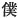

  
[Intangible Textual Heritage](../../index)  [Shinto](../index) 
[Index](index)  [Previous](kj070)  [Next](kj072) 

------------------------------------------------------------------------

[Buy this Book at
Amazon.com](https://www.amazon.com/exec/obidos/ASIN/B0028Y4SZY/internetsacredte)

------------------------------------------------------------------------

  
*The Kojiki*, translated by Basil Hall Chamberlain, \[1919\], at
Intangible Textual Heritage

------------------------------------------------------------------------

p. 215 \[175\]

## \[SECT. LXIV.—EMPEROR SŪ-JIN (PART II.—A PESTILENCE IS STAID BY OHO-TATA-NE-KO).\]

In the reign of this Heavenly Sovereign a great pestilence arose, and
the people died as if none were to be left. [1](#fn_1311) Then the Heavenly Sovereign grieved
and lamented, and at night, while on his divine couch, [2](#fn_1312) there appeared \[to him\] in an august
dream the Great Deity the Great-Master-of-Things, [3](#fn_1313) and said: "This is my august
doing. [4](#fn_1314) So if thou wilt cause me
to be worshipped [5](#fn_1315) by
Oho-tata-ne-ko, [6](#fn_1316) the divine
spirit shall not arise, [7](#fn_1317) and the
land will be tranquillized." When, therefore, couriers [8](#fn_1318) were dispatched in every
direction [9](#fn_1319) to search for the
person \[named\] Oho-tata-ne-ko, he was discovered in the village of
Minu [10](#fn_1320) in Kafuchi, and was
respectfully sent \[to the Heavenly Sovereign\]. [11](#fn_1321) Then the Heavenly Sovereign deigned
to ask: "Whose child art thou?" He replied, saying: "I [12](#fn_1322) am Oho-tats-ne-ko, child of

p. 216

\[paragraph continues\] His Augustness
Take-mika-dzu-chi [13](#fn_1323) \[who was\]
child of His Augustness Ihi-gata-sumi, [14](#fn_1324) \[who was\] child of His Augustness
Kushi-mi-gata, [15](#fn_1325) \[who was\]
child of the Great Deity the Great-Master-of-Things by his wife
Iku-tama-yori-bime, [16](#fn_1326) daughter of
His Augustness Suwe-tsu-mimi. [17](#fn_1327)
Hereupon the Heavenly Sovereign, being greatly rejoiced, commanded that
the Empire should be tranquil, and the people flourish, and forthwith
made His Augustness Oho-tata-ne-ko high priest [18](#fn_1328) to worship [19](#fn_1329) the Great Deity of Great Miwa [20](#fn_1330) on Mount Mimoro. [21](#fn_1331) Again he ordered His Augustness
Igaka-shiko-wo [22](#fn_1332) to make eighty
heavenly platters, and reverently to establish the shrines of the
Earthly Deities; [23](#fn_1333) likewise to
worship with a red-coloured shield and spear the Deity of
Sumi-saka [24](#fn_1334) at Uda, and with a
black-coloured shield and spear the Deity of Oho-sake; [25](#fn_1335) likewise to present august offerings
of cloth to all the Deities of the august declivities of the hills and
to all the Deities of the reaches of the rivers, without neglecting
any. [26](#fn_1336) [27](#fn_1337) In consequence of this the
pestilential vapour ceased altogether, and the country was
tranquillized.

p. 217

------------------------------------------------------------------------

### Footnotes

[215:1](kj071.htm#fr_1315) p. 216 Literally, "about to be exhausted."

[215:2](kj071.htm#fr_1316) This expression,
which recurs at the commencement of Sect. CXLV, is difficult to explain.
See Motowori's remarks in Vol. XXIII, pp. 24-25, and again in Vol. XL,
pp. 14-15, of his Commentary.

[215:3](kj071.htm#fr_1317) See Sect. LI, Note
12.

[215:4](kj071.htm#fr_1318) Literally, "my
august heart."

[215:5](kj071.htm#fr_1319) Or, "cause my
shrine to be worshipped at." The import of the god's words is that he
wishes Oho-tata-ne-ko to be appointed chief priest of his temple. For
the origin of this latter see the second half of Sect. XXXII (pp.
[103](kj034.htm#page_103)-105).

[215:6](kj071.htm#fr_1320) Oho signifies
"great," *Tata* (or *Tada*) is taken to be the name of a place, and the
syllables *ne* and *ko* are regarded as Honorifics. The p. 217 whole name may therefore, though with some
hesitation, be interpreted to mean "the Lord of the Great \[Shrine of\]
Tata."

[215:7](kj071.htm#fr_1321) *I.e.*, "the divine
anger shall no longer be kindled."

[215:8](kj071.htm#fr_1322) Mounted couriers
are almost certainly intended.

[215:9](kj071.htm#fr_1323) Literally,
"distributed to the four sides,"—"four sides" being a Chinese phrase for
every direction.

[215:10](kj071.htm#fr_1324) This name may
signify either "three moors "or "august moor." The village of Minu must
not be confounded with the province of Minu.

[215:11](kj071.htm#fr_1325) The characters
used are those which properly denote the presenting of tribute to the
Monarch.

[215:12](kj071.htm#fr_1326) Here and below the
First Personal Pronoun is represented by the respectful character  , "servant."

[216:13](kj071.htm#fr_1327) See Sect. VIII,
Note 7, for the explanation of this name. But probably the deity here
intended is another.

[216:14](kj071.htm#fr_1328) The etymology and
signification of 'this name are alike obscure.

[216:15](kj071.htm#fr_1329) Motowori
interprets *kushi* in the sense of "wondrous," and *Migata* as the name
of a place, which also occurs under the form of Higata.

[216:16](kj071.htm#fr_1330) *I.e.*,
"life-jewel-good-princess."

[216:17](kj071.htm#fr_1331) The precise
signification of this name is obscure. Motowori supposes *Suwe* to be
the name of a place; *tsu* is the Genitive Particle, and *mimi* the
Honorific of doubtful import, whose meaning has been discussed in Note
18 to Sect. XIII.

[216:18](kj071.htm#fr_1332) The exact meaning
of the characters used to write the word *kayo-nushi* (modern
*kamushi*), here rendered "high-priest," is "owner of the Deity." Though
commonly used in modern parlance to denote any Shinto priest, it
properly signifies only the chief priest in charge of a temple, whence
the odd-sounding name.

[216:19](kj071.htm#fr_1333) Or, "conduct the
worship at the shrine of."

[216:20](kj071.htm#fr_1334) Viz., the Deity
Master-of-the-Great-Land. For the traditional etymology of Miwa see the
legend in Sect. LXV.

[216:21](kj071.htm#fr_1335) See Sect. XXVIII,
Notes 4 and 5.

[216:22](kj071.htm#fr_1336) Or,
*Ikaga-shiko-wo*. The probable meaning of this name, pro-posed by
Motowori, is (neglecting the initial letter *i* as expletive) "the
refulgent ugly male."

[216:23](kj071.htm#fr_1337) See Sect. I, Note
11 .

[216:24](kj071.htm#fr_1338) *Sumisaka*
probably signifies "charcoal-hill." Uda, which has already been
mentioned in Sect. XLVI, is in Yamato. This passage may equally well be
rendered thus: "to present a red-coloured shield and p. 218 spear to the Deity of Sumisaka," and
similarly in the following clause. The meaning comes nearly to the same.

[216:25](kj071.htm#fr_1339) Literally, "great
hill," or "great pass." It is at the boundary of the province of Yamato
and Kahachi. Neither Motowori nor Tanigaha Shisei sanctions the view of
the elder scholars, who fancied they saw in the distinction of red and
black some mysterious import connected with the four cardinal points.

[216:26](kj071.htm#fr_1340) In the Old Printed
Edition the text of this passage differs slightly from that adopted by
Motowori; but the meaning is exactly the same.

[216:27](kj071.htm#fr_1341) A large lacuna
here occurs in the "Old Printed Edition," in which the four hundred and
forty-five Chinese characters forming the original of the following part
of the translation, from the words, "In consequence of this "down to the
words immediately preceding "Methinks this is a sign" on p. 180 are
missing. Both the editor of 1687 and Motowori are silent as to the
manner in which they supplied the deficiency; but it may be presumed
from their silence that the MS. authorities furnished them with what had
accidentally been omitted from the printed text.

------------------------------------------------------------------------

[Next: Section LXV.—Emperor Sū-jin (PART III: Story of Oho-tata-ne-ko's
Birth)](kj072)
