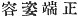
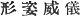
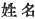
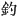
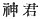

  
[Intangible Textual Heritage](../../index)  [Shinto](../index) 
[Index](index)  [Previous](kj071)  [Next](kj073) 

------------------------------------------------------------------------

[Buy this Book at
Amazon.com](https://www.amazon.com/exec/obidos/ASIN/B0028Y4SZY/internetsacredte)

------------------------------------------------------------------------

  
*The Kojiki*, translated by Basil Hall Chamberlain, \[1919\], at
Intangible Textual Heritage

------------------------------------------------------------------------

p. 218

## \[SECT. LXV.—EMPEROR SŪ-JIN (PART III: STORY OF OHO-TATA-NE-KO'S BIRTH)\]

The reason why this person called Oho-tata-ne-ko was known to be a
Deity's child, was that the above-mentioned Iku-tama-yori-bime was
regularly beautiful, [1](#fn_1338) whereupon a
\[divine [2](#fn_1339)\] youth \[who thought\]
the majesty of her appearance without comparison in the world, [3](#fn_1340) came suddenly to her in the middle of
the night, So, as they loved each other and lived in matrimony together,
the maiden ere long was pregnant. Then the father and mother, astonished
at their daughter being pregnant, asked her, [4](#fn_1341) saying: "Thou art pregnant by thyself.
How art thou with child without \[having known\] a man?" She replied,
saying: I have naturally conceived through a beautiful young

p. 219

man, whose name [5](#fn_1342) I know not,
coming here every evening and staying with me." Therefore the father and
mother, wishing to know the man, instructed their daughter, saying:
"Sprinkle red earth in front of the couch, [6](#fn_1343) and pass a skein of hemp through a
needle, and pierce \[therewith\] the skirt of his garment." So she did
as they had instructed, and, on looking in the morning, the hemp that
had been put in the needle went out through the hole of the
door-hook, [7](#fn_1344) and all the hemp that
remained was three twists [8](#fn_1345) only.
Then forthwith, knowing how he had gone out by the hook-hole, they went
on their quest following the thread, which, reaching Mount Miwa, stopped
at the shrine of the Deity, So they knew \[that Oho-tata-neko was\] the
child of the Deity \[residing\] there. So the place was called by the
name of Miwa on account of the three twists of hemp that had remained.
(His Augustness Oho-tata-ne-ko, here referred to,
was the ancestor of the Dukes of Miwa [9](#fn_1346) and of the Dukes of
Kamo.) [10](#fn_1347)

------------------------------------------------------------------------

### Footnotes

[218:1](kj072.htm#fr_1342) It is not easy to
render literally into English the force of the characters  , containing this description
of the maiden's beauty, and of 
, in the next clause. But it is hoped that at least
the translation represents them better than do Motowori's readings *kaho
yokariki* and *kaho sugata*.

[218:2](kj072.htm#fr_1343) This word, which is
not in most texts, was supplied by the editor of 1687, and is adopted by
Motowori on apparently satisfactory grounds.

[218:3](kj072.htm#fr_1344) Literally, "in the
time."

[218:4](kj072.htm#fr_1345) The text places the
word "daughter "here, instead of in the preceding clause. For the sake
of clearness, the translator has taken the liberty of transposing it.

[219:5](kj072.htm#fr_1346) The Chinese
characters are i, *i.e.*, "surname and personal (what we should call
'Christian') name." But Motowori's simple reading   "name," approves itself as
probably near to the author's intention.

[219:6](kj072.htm#fr_1347) Motowori indulges
in several conjectures as to the meaning of p.
220 this detail, which, it will be seen, is not referred to in
the sequel, and is therefore pointless.

[219:7](kj072.htm#fr_1348) The same Japanese
word *kagi*, which is used as the equivalent of the Chinese character
 , "hook," came in latter
times to denote a key.

[219:8](kj072.htm#fr_1349) "Three threads "are
in Japanese *mi wa*, whence the etymology of the name of Miwa given
below in the text. The real derivation is altogether doubtful. The
shrine of Miwa was in very early times regarded with such extraordinary
reverence, that the term *Oho-gami*, "Great Deity," unless otherwise
qualified, was commonly understood to refer to the god of Miwa.

[219:9](kj072.htm#fr_1350) *Miwa no kimi*,
written simply  
(literally, "Divine Dukes,") another sign of the estimation in which the
shrine of Miwa was held.

[219:10](kj072.htm#fr_1351) *Kama no kimi*.

------------------------------------------------------------------------

[Next: Section LXVI.—Emperor Sū-jin (Part IV.—War With King
Take-hani-yasu)](kj073)
