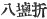
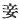

  
[Intangible Textual Heritage](../../index)  [Shinto](../index) 
[Index](index)  [Previous](kj076)  [Next](kj078) 

------------------------------------------------------------------------

[Buy this Book at
Amazon.com](https://www.amazon.com/exec/obidos/ASIN/B0028Y4SZY/internetsacredte)

------------------------------------------------------------------------

  
*The Kojiki*, translated by Basil Hall Chamberlain, \[1919\], at
Intangible Textual Heritage

------------------------------------------------------------------------

p. 230 \[187\]

## \[SECT. LXX. EMPEROR SUI-NIN (PART II. CONSPIRACY OF KING SAHO-BIKO AND THE EMPRESS SAHO-BIME).\]

When this Heavenly Sovereign made Saho-bime his Empress, Her Augustness
Saho-bime's elder brother, King Saho-biko, asked his younger sister,
saying: "Which is dearer \[to thee\], thine elder brother or thy

p. 231

husband?" She replied, saying "Mine elder brother is dearer." Then King
Saho-biko conspired, saying: "If I be truly the dearer to thee, let me
and thee rule the empire," and forthwith he made an eight times tempered
stiletto, [1](#fn_1428) and handed it to his
younger sister, saying: "Slay the Heavenly Sovereign in his sleep with
this small knife." So the Heavenly Sovereign, not knowing of this
conspiracy, was augustly sleeping, with the Empress’ august knees as his
pillow. Then the Empress tried to cut his august throat with the
stiletto; but though she lifted it thrice, she could not cut the throat
for an irrepressible feeling of sadness, and she wept tears, which fell
overflowing [2](#fn_1429) onto \[the Heavenly
Sovereign's\] august face. Straightway the Heavenly Sovereign started
up, and asked the Empress, saying: "I have had a strange dream: A
violent shower came from the direction of Saho and suddenly wetted my
face; again a small damask-coloured snake coiled itself round my neck.
Of what may such a dream be the omen?" Then the Empress, thinking it
improper to dispute, [3](#fn_1430) forthwith
informed the Heavenly Sovereign, saying: "Mine elder brother King
Saho-biko asked me, [4](#fn_1431) saying:
'Which is dearer \[to thee\], thy husband or thine elder brother?' So,
as I was embarrassed by \[this\] direct question, I replied, saying:
'Oh! mine elder brother is the dearer.' Then he charged [5](#fn_1432) me, saying: 'I and thou will together
rule the \[188\] Empire; so the Heavenly Sovereign must be slain;'—and
so saying, he made an eight times tempered stiletto, and handed it to
me. Therefore I wanted to cut thine august throat; but though I thrice
lifted \[the weapon\], a feeling of regret suddenly arose, so that I
could not cut thy throat, and the tears that I wept fell and wetted

p. 232

thine august face. \[The dream\] was surely the omen of this." Then the
Heavenly Sovereign said: "How nearly have I been destroyed! "and
forthwith he raised an army to smite King Saho-biko, whereupon the King
made a rice-castle [6](#fn_1433) to await the
fray. At this time Her Augustness Saho-bime, unable to forget her elder
brother, fled out through the back-gate \[of the palace\], and came into
the rice-castle.

------------------------------------------------------------------------

### Footnotes

[231:1](kj077.htm#fr_1432) For stiletto see
above, Sect. XXXVI, Note 8. The curious word ya-shio-wori ( ) in the text seems to have the
sense of "eight times tempered," *i.e.*, tempered over and over again,
which Motowori assigns to it. The same expression is used in Sect. XVIII
(Note 16) to denote the refining of rice-liquor.

[231:2](kj077.htm#fr_1433) This word
"overflowing" is more appropriately placed in the version of the story
given in the "Chronicles," where the author makes her tears first fill
her sleeve (a common Japanese figure of speech), and thence "overflow
"on to the sleeping Monarch's face.

[231:3](kj077.htm#fr_1434) *I.e.*, seeing that
it would be vain in deny the truth.

[231:4](kj077.htm#fr_1435) The First Personal
Pronoun is written with the self-depreciatory character  , "concubine."

[231:5](kj077.htm#fr_1436) Or "enticed."

[232:6](kj077.htm#fr_1437) This expression,
which is repeated elsewhere, is one which has given rise to a
considerable amount of discussion. The "Chronicles" tell us expressly
that "rice \[stalks\] were piled up to make a castle,"—an assertion
which, as Motowori remarks, is simply incredible. He therefore adopts
Mabuchi's suggestion that a castle *like* a rice-castle is what is
intended,—"rice-castle" being taken "to mean rice-store" or "granary,"
such granaries having probably been stoutly built in order to protect
them from thieves. The historian of the Tang dynasty quoted in the
"Exposition of the Foreign Notices of Japan" says that the Japanese had
no castles, but only palisades of timber. The latter might well however
have been called castles by the Japanese, though they
[would](errata.htm#46) not have been accounted such by the Chinese, who
already built theirs of stone.

------------------------------------------------------------------------

[Next: Section LXXI.—Emperor Sui-nin (Part III.—Birth of Prince
Homu-chi-wake and Death of the Conspirators)](kj078)
