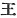
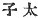

  
[Intangible Textual Heritage](../../index)  [Shinto](../index) 
[Index](index)  [Previous](kj082)  [Next](kj084) 

------------------------------------------------------------------------

[Buy this Book at
Amazon.com](https://www.amazon.com/exec/obidos/ASIN/B0028Y4SZY/internetsacredte)

------------------------------------------------------------------------

  
*The Kojiki*, translated by Basil Hall Chamberlain, \[1919\], at
Intangible Textual Heritage

------------------------------------------------------------------------

p. 248 \[201\]

## \[SECT. LXXVI.—EMPRESS KEI-KO (PART I,—GENEALOGIES)\]

The Heavenly Sovereign Oho-tarashi-hiko-oshiro-wake dwelt in the palace
of Hishiro at Makimuku, [1](#fn_1509) and
ruled the Empire. This Heavenly Sovereign wedded the Elder Lady of Inabi
in Harima, [2](#fn_1510) daughter of
Waka-take, Prince of Kibi [3](#fn_1511)
ancestor of the Grandees of Kibi, [4](#fn_1512) and begot

p. 249

august children: King Kushi-tsunu-wake; [5](#fn_1513) next His Augustness Ohousu; [6](#fn_1514) next His Augustness Wo-usu, another
name for whom is His Augustness Yamato wo-guna; [7](#fn_1515) next His Augustness
Yamato-ne-ko; [8](#fn_1516) next King
Kamu-kushi. [9](#fn_1517) Again wedding Her
Augustness Princess Yasaka-no-iri, [10](#fn_1518) \[202\] daughter of His Augustness
Prince Yasaka-no-iri, he begot august children: His Augustness Prince
Waka-rarashi; [11](#fn_1519) next His
Augustness Prince Iho-ki-no-iri; [12](#fn_1520) next His Augustness
Oshi-no-wake; [13](#fn_1521) next Her
Augustness Princess Iho-ki-no-iri. [14](#fn_1522) Children by another concubine were:
King Toyo-to-wake; [15](#fn_1523) next the
Lady Nunoshiro. [16](#fn_1524) Children by
another concubine were: the Lady Nunaki; [17](#fn_1525) next Her Augustness Princess
Kago-yori; [18](#fn_1526) next King Prince
Waka-ki-no-iri; [19](#fn_1527) next King the
Elder Prince of Kibi-no-ye; [20](#fn_1528)
next Her Augustness Princess Takaki; [21](#fn_1529) next Her Augustness Princess
Oto. [22](#fn_1530) Again wedding Princess
Mi-hakashi of Himuku, [23](#fn_1531) he begot
an august child: King Toyo-kuni-wake. [24](#fn_1532) Again wedding the Younger Lady of
Inabi, [25](#fn_1533) younger sister of the
Elder Lady of Inabi, [26](#fn_1534) he begot
august children: King Ma-waka; next King Hiko-hito-no-oho-ye. [27](#fn_1535) Again wedding Princess \[203\]
Ka-guro, [28](#fn_1536) daughter of King
Princess Sume-iro-oho-naka-tsu-hiko, [29](#fn_1537) great-grand-child of His Augustness
Yamato-take, [30](#fn_1538) he begot an august
child: King Oho-ye. [31](#fn_1539) The august
children of this Heavenly Sovereign Oho-tarashi-hiko numbered in all
twenty-one kings and queens [32](#fn_1540) of
whom there is a register, and fifty-nine kings and queens of whom there
is no record,—eighty kings and queens altogether, out of whom His
Augustness Waka-tarashi-hiko and also His Augustness Yamato-take, and
also His Augustness Prince I-ho-ki-no-iri,—these three Kings,—bore the
name of Heirs Apparent. [33](#fn_1541) The
seventy-seven

p. 250

kings and queens beside these [34](#fn_1542)
were all granted Rulerships in the various lands, or else \[posts as\]
Lords, Territorial Lords or Departmental Chiefs. [35](#fn_1543) So His Augustness Waka-tarashi-hiko
\[was he who afterward\] ruled the Empire. His Augustness Wo-usu subdued
the savage deities and likewise the unsubmissive people in the East
\[204\] and West. The next, King Kushi-tsunu-wake (was the ancestor of the chiefs of Mamuta). [36](#fn_1544) The next, His Augustness Oho-Usu,
(was the ancestor of the Dukes of Mori, [37](#fn_1545) of the Dukes of Ohota [38](#fn_1546) and of the Dukes of
Shimada.) [39](#fn_1547) The next, King
Kamukushi, (was the ancestor of the Sakabe Abiko in
the Land of Ki, [40](#fn_1548) and of the
Sakabe of Uda). [41](#fn_1549) The
next, King Toyo-kuni-wake (was the ancestor of the
Rulers of the Land of Himuka.) [42](#fn_1550)

p. 251 p. 252

------------------------------------------------------------------------

### Footnotes

[248:1](kj083.htm#fr_1513) p. 250 In the province of Yamato. The etymology of
*Makimuku* is obscure. *Hishiro* is tentatively derived by Motowori from
*hi*, the *Chamaecyparis obtusa* (a kind of conifer), and *shiro*, "an
enclosure."

[248:2](kj083.htm#fr_1514) *Harima no inabi no
oho-iratsume*. Inabi is also known under the alternative form of
*Inami*: etymology uncertain.

[248:3](kj083.htm#fr_1515) *Waka-take Kibi tsu
biko*, *Waka-take* signifies "young brave."

[248:4](kj083.htm#fr_1516) *Kibi no omi*.

[249:5](kj083.htm#fr_1517) *Kushi* signifies
"wondrous," and wake either "young," or "lord." The meaning of *tsunu*
is obscure.

[249:6](kj083.htm#fr_1518) The names of this
prince and the next signify respectively "great-foot-pestle" and "little
foot-pestle," the origin of the bestowal of which singular designations
is thus related in the parallel passage of the "Chronicles:" "The
Imperial child Oho-usu and His Augustness Wo-usu were born together the
same day as twins. The Heavenly Sovereign, astonished, informed the
foot-pestle. So the two Kings were called Great Foot-pestle and
[Little](errata.htm#50) Foot-pestle." What the import of this passage
may be is, however, a mystery both to Tanigaha Shisei and to Motowori.

[249:7](kj083.htm#fr_1519) Motowori supposes
*wo-guna* to have been an archaic word for "boy," "me-guna" signifying
"girl." *Yamato wo-guna* would thus signify *the* boy of Japan." a not
inappropriate designation for this prince, who under his later name of
Yamato-take (Japan Brave," *i.e.* *the* brave man of Japan") has
remained as the chief legendary type of the martial prowess of his
native land.

[249:8](kj083.htm#fr_1520) p. 251 *I.e.*. Yamato Prince.

[249:9](kj083.htm#fr_1521) *Komu-kushi no
miko*, *i.e.*, "divine wondrous."

[249:10](kj083.htm#fr_1522) *Yamasaka no
iri-bime no mikoto*. The signification of this name and of the next
(*Ya-saka no iri-biko no mikoto*) is obscure.

[249:11](kj083.htm#fr_1523) *Waka-tarashi-hiko
no mikoto*, i.e., "young and perfect prince."

[249:12](kj083.htm#fr_1524) *I-ho-ki no
iri-biko no mikoto*. Signification obscure.

[249:13](kj083.htm#fr_1525) Or, *Oshi-wake*,
*i.e.*, perhaps "Great Lord."

[249:14](kj083.htm#fr_1526) *I-ho-ki no
iri-bime no mikoto*. Signification obscure.

[249:15](kj083.htm#fr_1527) *Toyo-to-wake no
mikoto*, *i.e.*, perhaps "luxuriant swift prince."

[249:16](kj083.htm#fr_1528) *Nunoshiro no
iratsumo*. Signification obscure.

[249:17](kj083.htm#fr_1529) *Nunaki no
iratsume*. Signification obscure.

[249:18](kj083.htm#fr_1530) *Kago yori-hime no
mikoto*. *Yori ime* probably means "good princess." The sense of *kago*
is very doubtful, for it may either be the name of a place, or else
identical with the Verb *kagayaku* "to shine," or with *kago*, "a stag."

[249:19](kj083.htm#fr_1531) *Waka-ki no
iri-biko no mikoto*. The signification of this name is obscure.

[249:20](kj083.htm#fr_1532) *Kibi no ye-hike
no mikoto*.

[249:21](kj083.htm#fr_1533) *Takaki-hime no
mikoto*. The meaning of *takaki* in this place is not certain.

[249:22](kj083.htm#fr_1534) *Oto-hime no
mikoto*, *i.e.*, "the younger princes."

[249:23](kj083.htm#fr_1535) *Himuka no
Mi-hakashi-bime*. *Mi-hakashi* signifies "august sabre." See Motowori's
Commentary, Vol. XXVI, p. 11, for a gloss on this curious name.

[249:24](kj083.htm#fr_1536) *Toyo-kuni-wake no
miko*, *i.e.*, perhaps "lord of the luxuriant land," or else "lord of
the land of Toyo," the Emperor Kei-kō having, according to the account
in the "Chronicles," spent some years fighting in South-Western Japan,
where the province of Toyo is situated.

[249:25](kj083.htm#fr_1537) *Inabi no
waki-iratsume*. See Note 2 to this Section.

[249:26](kj083.htm#fr_1538) *Ma-waka no miko*,
*i.e.*, "truly young prince."

[249:27](kj083.htm#fr_1539) *Hiko-hito no
oho-ye no miko*. *Hiko* signifies "prince," *hito* is "person" (or here,
according to Motowori, "headman"), and *oho ye* is "great elder
brother."

[249:28](kj083.htm#fr_1540) *Ka-guro-hime*,
*i.e.*, probably "the black-haired princess."

[249:29](kj083.htm#fr_1541)
*Sume-iro-oho-naka-tsu-biko-no-mikoto*. The signification of this name
is not clear. Motowori identifies *sume* with the like-sounding Verb
signifying "to be supreme." *Oha-naka-tsu-hiko* may signify "great
middle prince," referring to the comparative ages of this prince and his
brethren.

[249:30](kj083.htm#fr_1542) p. 252 There is here an evident error in the
genealogy, as it would make the emperor marry his own great-great-grand
daughter! A guess of the editor of 1687 that for Yamato-take we should
read Waka-take (a son of the Emperor Kō-rei) is approved by Motowori,
and may be adopted as probably correct,—*i.e.* (what is but little
likely) if this portion of the "Records" should eventually be proved to
be historically trustworthy. The question is discussed by Motowori in
Vol. XXVI, pp. 12-14. of his Commentary.

[249:31](kj083.htm#fr_1543) *Oho-ye no miko*.
This name would, as Motowori remarks, appear to have erroneously crept
in here through the influence of the name mentioned in Note 27, the
whole account of this union with Princess Ka-guro being corrupt.

[249:32](kj083.htm#fr_1544) The Japanese term
(  *miko*) includes both
males and females.

[249:33](kj083.htm#fr_1545)  .

[250:34](kj083.htm#fr_1546) As above remarked,
the Japanese term includes both males and females, and moreover some of
the female children are specially mentioned. The difficulty as to how
females could have been appointed to the offices here mentioned is not
solved by Motowori, whose note on this passage is evasive.

[250:35](kj083.htm#fr_1547) The four names of
offices (also used as "gentile names") here mentioned are in the
original Japanese *Kuni no Miyatsuko*, *Wake*, *Inaki*, and
*Agata-mushi*. (See Introduction, [p. xvi](kj002.htm#page_xvi).)

[250:36](kj083.htm#fr_1548) *Mamuta no
murazhi*. (See Sect. LIII, Note 1.)

[250:37](kj083.htm#fr_1549) *Mori no kimi*.
*Mori* seems to be the name of a place (perhaps in Mino); but nothing is
known of this family.

[250:38](kj083.htm#fr_1550) *Ohota no kimi*.
*Ohota* is the name of a place in Mino, and signifies "great
rice-field."

[250:39](kj083.htm#fr_1551) *Shimada no kimi*.
*Shimada* is perhaps the name of a place in Wohari. It signifies "island
rice-fields."

[250:40](kj083.htm#fr_1552) *Ki no kuni no
sakabe no abiko*. For also see Sect. LXXII, Note 85. *Sakabe* seems to
signify "liquor tribe," this family and the next having been entrusted
with the management of the Imperial feasts.

[250:41](kj083.htm#fr_1553) *Uda no sakabe*,
*i.e.*, the "Liquor Tribe of Uda." (in Yamato).

[250:42](kj083.htm#fr_1554) *Himuka no kuni no
miyatsuko*.

------------------------------------------------------------------------

[Next: Section LXXVII.—Emperor Kei-kō (Part II.—The Maidens Ye-Hime and
Oto-Hime).](kj084)
