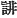
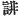

  
[Intangible Textual Heritage](../../index)  [Shinto](../index) 
[Index](index)  [Previous](kj087)  [Next](kj089) 

------------------------------------------------------------------------

[Buy this Book at
Amazon.com](https://www.amazon.com/exec/obidos/ASIN/B0028Y4SZY/internetsacredte)

------------------------------------------------------------------------

  
*The Kojiki*, translated by Basil Hall Chamberlain, \[1919\], at
Intangible Textual Heritage

------------------------------------------------------------------------

p. 258

## \[SECT. LXXXI.—EMPEROR KEI-KŌ (PART VI.—YAMATO-TAKE SLAYS THE IDZUMO BRAVO).

Forthwith entering the Land of Idzumo, and wishing to slay the Idzumo
bravo, he on arriving, forthwith bound \[himself to him in\] friendship.
So, having secretly \[209\] made \[the wood of\] an oak \[-trees [1](#fn_1586)\] into a false sword and augustly
girded it, he went with the bravo to bathe the River Hi. [2](#fn_1587) Then, His Augustness Yamato-take

p. 259

getting out of the river first, and taking and girding on the sword that
the Idzumo bravo had taken off and laid down, said: "Let us exchange
swords!" So afterwards the Idzumo bravo, getting out of the river,
girded on His Augustness Yamato-take's false sword. Hereupon His
Augustness Yamato-take, suggested, saying: "Come on! let us cross [3](#fn_1588) swords." Then on drawing his sword,
the Idzumo bravo could not draw the false sword. Forthwith His
Augustness Yamato-take drew his sword and slew the Idzumo bravo. Then he
sang augustly, saying:

"Alas that the sword girded on the Idzumo bravo, and wound round with
many a creeper, should have had no true blade!" [4](#fn_1589)

So having thus extirpated the \[bravoes\] and made \[the land\] orderly,
he went up \[to the capital\], and made his report \[to the Heavenly
Sovereign\].

------------------------------------------------------------------------

### Footnotes

[258:1](kj088.htm#fr_1590) The species
mentioned (*ichihi*) is the *Quercus gilva*.

[258:2](kj088.htm#fr_1591) See Sect. XVIII,
Note 2.

[259:3](kj088.htm#fr_1592) Lit., "let us join
swords." The word "suggested" (
) in this sentence is an emendation of Motowori's, the
text having  ,
"slandered." The older printed editions, while retaining the character
 , read it *azamukite*,
"deceived."

[259:4](kj088.htm#fr_1593) In its position in
the present text, this Song must be taken as an ironical lament of the
Prince for the dead bravo. In the "Chronicle" the time and the heroes of
the episode, and the singers of the Song are all different, and in that
context the lament sounds like a genuine one. The reader will remember
what was said in the Introduction as to the use of creepers for string.
That mentioned in the text is supposed to be the *Cocculus thunbergi*.

------------------------------------------------------------------------

[Next: Section LXXXII.—Emperor Kei-kō (Part VII.—Yamato-take is Sent to
Subdue the East, and Visits His Aunt at Ise)](kj089)
