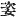

  
[Intangible Textual Heritage](../../index)  [Shinto](../index) 
[Index](index)  [Previous](kj090)  [Next](kj092) 

------------------------------------------------------------------------

[Buy this Book at
Amazon.com](https://www.amazon.com/exec/obidos/ASIN/B0028Y4SZY/internetsacredte)

------------------------------------------------------------------------

  
*The Kojiki*, translated by Basil Hall Chamberlain, \[1919\], at
Intangible Textual Heritage

------------------------------------------------------------------------

p. 263 \[212\]

## \[SECT. LXXXIV.—EMPEROR KEI-KŌ (PART IX.—YAMATO-TAKE'S EMPRESS STILLS THE WAVES.)

When he thence penetrated on, and crossed the sea of
Hashiri-midzu, [1](#fn_1604) the Deity of that
crossing raised the waves, tossing the ship so that it could not proceed
across. Then \[Yamato-take's\] Empress, [2](#fn_1605) whose name was Her Augustness Princess
Oto-tachibana [3](#fn_1606) said: "I [4](#fn_1607) will enter the sea instead of the
august child. [5](#fn_1608) The august child
must complete the service [6](#fn_1609) on
which he has been sent, and take back a report \[to the Heavenly
Sovereign\]." When she was about to enter the sea, she spread eight
thicknesses of sedge rugs, [7](#fn_1610) eight
thicknesses of skin rugs and eight thicknesses of silk rugs on the top
of the waves, and sat down on the top \[of them\] Thereupon the violent
waves at once went down, and the august ship was able to proceed. Then
the. Empress sang, saying:

"Ah! thou \[whom I\] enquired of, standing in the midst of the flames of
the fire burning on the little moor of Sagamu, where the true peak
pierces!" [8](#fn_1611)

So seven days afterwards the Empress's august comb \[213\] drifted onto
the sea-beach,—Which comb was forthwith taken and placed in an august
mausoleum which was made.

------------------------------------------------------------------------

### Footnotes

[263:1](kj091.htm#fr_1608) p. 263 *I.e.*, "running water."

[263:2](kj091.htm#fr_1609) *I.e.*, his
consort. Conf. Sect. [???](errata.htm#53), Note 5.

[263:3](kj091.htm#fr_1610) *Oto-tachibana-hime
no mikoto*. (See Sect. XCII, Note 3.)

[263:4](kj091.htm#fr_1611) Written with the
humble character  ,
literally "concubine."

[263:5](kj091.htm#fr_1612) *I.e.*, instead of
thee, the Prince."

[263:6](kj091.htm#fr_1613) More literally,
"finish the government."

[263:7](kj091.htm#fr_1614) Or "mats." But the
same word is used as that which must be translated "rugs" immediately
below.

[263:8](kj091.htm#fr_1615) p. 264 This Song gives much trouble to the
commentators, whose remarks (to be found in Motowori's "Commentary."
Vol. XXVII, pp. 67-9, and Moribe's "*Idzu no Koto-Waki*" Vol. III, pp,
6-9,) should be consulted by the student desirous of forming an opinion
of his own. The general purport of the poem is of course to allude to
Yamato-take's adventure on the burning moor, and at the same time to the
love which bound him and his consort together; almost each individual
line offers matter for doubt. Thus it is not certain whether the Verb
*tohishi*, here rendered "enquired of" (*i.e.*, attended upon by the
Empress). should not rather be given the word "thou" as subject, in
which case the signification would be "thou who enquiredst of \[*i.e.*,
wooedst\]." The word used for "thou;" is the Honorific equivalent of
that Pronoun signifying literally "prince." Moribe disputes the
propriety of considering Sagamu in this place as the name of a province,
and the word *sanesashi*, here translated "where the true peak pierces"
(Mt. Fuji being by some supposed to be thus alluded to) is of very
doubtful interpretation. Motowori tells us that the final Particles *ha
mo*, rendered by the initial Interjection "Oh," should here be
understood as an exclamation more forcible than that which usually
belongs to him. Finally Moribe points out that the Song does not suit
the context in which it is found, and has probably been erroneously
inserted here instead of in an earlier portion of the text.

------------------------------------------------------------------------

[Next: Section LXXXV.—Emperor Kei-kō (Part X.—Yamato-Take Slays the
Deity of the Ashigara Pass.)](kj092)
