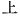

  
[Intangible Textual Heritage](../../index)  [Shinto](../index) 
[Index](index)  [Previous](kj095)  [Next](kj097) 

------------------------------------------------------------------------

[Buy this Book at
Amazon.com](https://www.amazon.com/exec/obidos/ASIN/B0028Y4SZY/internetsacredte)

------------------------------------------------------------------------

  
*The Kojiki*, translated by Basil Hall Chamberlain, \[1919\], at
Intangible Textual Heritage

------------------------------------------------------------------------

p. 270

The title was omitted from the printed version I was working from. I
have interpolated what I believe to be a plausible title—JBH

## \[SECT. LXXXIX. EMPEROR KEI-KŌ (PART XIV.—THE DEATH OF YAMATO-TAKE).\]

When he departed thence and reached the moor of \[218\] Tagi [1](#fn_1637) he said: "Whereas my heart always felt
like flying through the sky, my legs are now unable to walk. They have
become rudder-shaped." [2](#fn_1638) So that
place was called by the name of Tagi. Owing to his being very weary with
progressing a little further beyond that place, he leant upon an august
staff to walk a little. So that place is called by the name of the
Tsuwetsuki pass. [3](#fn_1639) On arriving at
the single pine-tree on Cape Wotsu, [4](#fn_1640) an august sword, which he had
forgotten at that place before when augustly eating, [5](#fn_1641) was still \[there\] not lost. Then he
augustly sang, saying:

p. 271

"O mine elder brother, the single pine-tree that art on Cape Wotsu which
directly faces Mohari! If thou, single pine-tree! wert a person, I would
gird \[my\] sword \[upon thee\], I would clothe thee with \[my\]
garments,—O mine elder brother, the single pine-tree!" [6](#fn_1642)

When he departed thence and reached the village of Mihe, [7](#fn_1643) he again said: "My legs are like
three-fold crooks, [8](#fn_1644) and very
weary." So that place was called by \[219\] the name of Mihe. When he
departed thence and reached the moor of Nobe, [9](#fn_1645) he, regretting [10](#fn_1646) \[his native\] land, [11](#fn_1647) sang, saying:

"As for Yamato, the most secluded of lands—Yamato, retired behind Mount
Awogaki encompassing it with its folds is delightful!" [12](#fn_1648)

Again he sang, saying:

"Let those whose life may be complete stick \[in their hair\] as a
head-dress the leaves of the bear-oak from Mount Heguri,—those
children!"

This song is a Land-Regretting Song. [13](#fn_1649) Again he sang, saying:

"How sweet! ah! from the direction of home clouds are rising and
coming!"

This is an Incomplete Song. [14](#fn_1650) At
this time, his august sickness was very urgent. Then, he sang augustly,
saying:

"The sabre-sword which I placed at the maiden's bed-side, alas! that
sword!" [15](#fn_1651)

As soon as he had finished singing, he died, Then a courier was
despatched \[to the Heavenly Sovereign.\]

p. 272 p. 273

------------------------------------------------------------------------

### Footnotes

[270:1](kj096.htm#fr_1642) p. 272 *Tagi-nu*. We might, following the Chinese
characters, translate thus; "and arrived on the Moor of Tagi." But the
character   has in this
context scarcely any meaning. The real etymology of *Tagi* (in classical
and modern parlance *taki* without the *nigori*) is "rapid "or
"waterfall," the cascade formed by the river Vo-ro in Mino being alluded
to. The derivation in the next sentence of the text from *tagishi*
supposed to mean "a rudder "is a mere fancy.

[270:2](kj096.htm#fr_1643) The word here
fended "rudder" is *tagishi*, which is written phonetically and does not
occur elsewhere, except in a few Proper Names of doubtful import. There
is however some probability in favour of the meaning assigned to it by
the native commentators.

[270:3](kj096.htm#fr_1644) *Tzuwe-tsuki-zaka*,
*i.e.*, "the pass of leaning on a staff." It is in the province of Ise
between Yokaichi and Ishi-yakushi.

[270:4](kj096.htm#fr_1645) *Wotsu-no-saki*, in
the province of Ise. The name probably signifies "° harbour of the
mountain declivity."

[270:5](kj096.htm#fr_1646) The former portion
of the text tells us nothing either of the meal or of the sword here
mentioned.

[271:6](kj096.htm#fr_1647) This quaintly
simple and apparently very ancient poem needs no elucidation.

[271:7](kj096.htm#fr_1648) In Ise. *Mihe*
signifies "three fold."

[271:8](kj096.htm#fr_1649) This is the literal
rendering of the text. Motowori thinks, however, that we should
understand that there were various swellings on his legs, such as would
be produced if the limb were tightly tied round with cord in three
places.

[271:9](kj096.htm#fr_1650) *Nobo-un* in the
province of Ise. The name seems to signify "the moor of mounting."

[271:10](kj096.htm#fr_1651) The Chinese
character here used signifies simply "thinking of;" but in such a
context its common Japanese interpretation is "loving "or "regretting,"
and so Motowori means us to understand it when he reads *shinukashite*.

[271:11](kj096.htm#fr_1652) Viz., Yamato.

[271:12](kj096.htm#fr_1653) This Song and the
two following form but one in the pages of the "Chronicles," where they
appear with several verbal differences, and are attributed, not to the
Prince, but to his father the Emperor. Moribe decides that in the latter
particular the text of these "Records" gives the preferable account, but
that the "Chronicles" are right in making the three Songs one continuous
poem. The expression "this Song is a Land-Regretting Song" strongly
supports this view; for, though we might also render in the Plural
"these Songs are, etc.," such a translation would be less natural, as in
similar cases the numeral is used, thus p.
273 "these *two* Songs are, etc." The expression "this is an
Incomplete Song "points as [decidedly](errata.htm#56) to some mutilation
of the original document, from which the compiler of the "Records"
copied this passage. Taking then the three Songs as one, the entire
drift is that of a paean on Yamato, the poet's native land, which he
could not hope ever to see again:—Commencing by praising its still
seclusion as it lies there behind its barrier of protecting mountains,
he goes on to mention the rural pleasures enjoyed by those who,
wandering over the hill-sides, deck their hair with garlands of leaves
and flowers. For himself indeed these delights are no more; "but," says
he, "do you, ye children full of health and happiness, pursue your
innocent enjoyment!" In conclusion he. lovingly apostrophises the clouds
which, rising up from the south-west, are, as it were, messengers from
home. The word *mahoroha*, rendered "secluded," is a great crux to the
commentators, and Motowori's "Examination of the Synonyms of Japan," pp.
17-18. and Moribe's "*Idzu no Koto Waki*," Vol. III, p. 31, should be
consulted by the student desirous of forming his own opinion on the
point. Another apparent difficulty is the word *gomoreru*, whose
position in the sentence Motowori seems to have misunderstood. By
following Moribe, and taking it as a compound with the word
*Awogaki-yama* into *Awogaki yama-gomoreru* the difficulty vanishes, and
we are likewise relieved from the necessity of supposing anything so
highly improbable as that the Verb *komoreru* when not compounded,
should have commenced with a *nigori*’ed syllable. "Complete "signifies
"healthy." Mount Heguri is preceded in the original by *tatamikomo*
(Moribe reads *tatamigomo* with the *nigori*) a Pillow-Word whose import
is disputed. In any case, being a punning one, it cannot be translated.
For the "bear-oak" see Sect. LXXII, Note 19. Moribe labours, but without
success, to prove that "come," the last word of the translation,
signifies "go," and imagines that the prince is expressing his envy of
the clouds which are rising and going off in the direction of the home
which he will never revisit.

[271:13](kj096.htm#fr_1654) *I.e.*, a Song of
loving regret for his native land.

[271:14](kj096.htm#fr_1655) "Incomplete Song"
[must](errata.htm#57) be understood as the designation of a poem of a
certain number of lines, viz, three, and was probably given by
comparison with the greater length of poetical compositions in general.

[271:15](kj096.htm#fr_1656) This poem is an
exclamation of distress at the thought of the sword which he had left
with his mistress Princess Miyazu and which, if he had had it with him,
would doubtless have preserved him from the evil influences of the god
of Mount Ibuki, which were the beginning of p.
274 his end.—" Sabre-sword" ([*tsurugi*](errata.htm#58) *no
tachi*) is a curious expression, which Moribe thinks means "double-edged
sword."

------------------------------------------------------------------------

[Next: Section XC.—Emperor Kei-kō (Part XV.—Yamato-take Turns into a
White Bird)](kj097)
