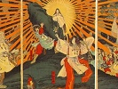
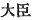
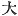
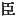
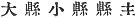

  
[Intangible Textual Heritage](../../index)  [Shinto](../index) 
[Index](index)  [Previous](kj100)  [Next](kj102) 

------------------------------------------------------------------------

[Buy this Book at
Amazon.com](https://www.amazon.com/exec/obidos/ASIN/B0028Y4SZY/internetsacredte)

------------------------------------------------------------------------

  
*The Kojiki*, translated by Basil Hall Chamberlain, \[1919\], at
Intangible Textual Heritage

------------------------------------------------------------------------

## \[SECT. XCIV.—EMPEROR SEI-MU.\]

The Heavenly Sovereign Wata-tarashi-hiko dwelt at the palace of
Taka-anaho at Shiga [1b](#fn_1708) in
Chika-tsu-Afumi and ruled the empire. This Heavenly Sovereign wedded
\[227\] the Lady Oho-takara, [2](#fn_1709)
daughter of Take-oshiyama-tari-ne, [3](#fn_1710) ancestor of the Grandees of
Hodzumi, [4](#fn_1711) and begot an august
child: King Wata-nuke [5](#fn_1712) (one
Deity). So \[the

p. 282

\[paragraph continues\] Heavenly
Sovereign\] raised the Noble Take-uchi [6](#fn_1713) \[to the office of\] Prince
Minister, [7](#fn_1714) deigned to settle the
Rulers of the Great Countries and Small Countries, [8](#fn_1715) and likewise deigned to settle the
boundaries of the various countries, as also the Department Lords of the
Great Departments and Small Departments. [9](#fn_1716) The Heavenly Sovereign's august years
were ninety-five, and his august mausoleum is at Tatanami near
Saki. [10](#fn_1717)

------------------------------------------------------------------------

### Footnotes

[281:1b](kj101.htm#fr_1713) *Shiga no
Taka-anaho*. *Shiga* is the name of a well known district, and is of
uncertain, signification, as is also *Taka-anaho*. For *Chika-tsu-Afumi*
see Sect. XXIX, Note 20.

[281:2](kj101.htm#fr_1714) *Oto-takara no
iratsume*. *Oto* signifies "younger \[sister\]," and *takara* is
"treasure."

[281:3](kj101.htm#fr_1715) *Oshiyama* is the
name of a place in Ise, *take* signifies "brave" and *tari* and *ne* are
Honorifics of frequent occurrence.

[281:4](kj101.htm#fr_1716) *Hodzumi no omi*.
See Sect. LXI, Note 4.

[281:5](kj101.htm#fr_1717) *Waka-nuke no
miko*. This name is of doubtful signification, and Motowori suspects
that it is corrupt, and that the true reading would be *Waka-take*,
"young-brave."

[282:6](kj101.htm#fr_1718) See Sect. LXI, Note
25.

[282:7](kj101.htm#fr_1719)  . Motowori tries to prove that
in the earliest times this official title was simply an Honorific
surname formed by prefixing the Adjective 
 "great" to 
, a surname read "Omi" (the character signifies
properly "attendant," "subject.") Probably like other "gentile names" it
combined both characters, and had a tendency to become hereditary.

[282:8](kj101.htm#fr_1720) *Oho-kuni wo-kuni
no kuni no miyatsuko*.

[282:9](kj101.htm#fr_1721) *Oho-agata wo-agata
no agata nushi* ( ). Their
duties are supposed to have consisted in supervising the government
farms.

[282:10](kj101.htm#fr_1722) For *Saki* see
Sect. LXXV, Note 5. *Tatanami* may perhaps signify "putting shields in a
row."

------------------------------------------------------------------------

[Next: Section XCV.—Emperor Chiū-ai (Part I.—Genealogies)](kj102)
