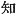
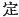
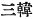
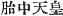

  
[Intangible Textual Heritage](../../index)  [Shinto](../index) 
[Index](index)  [Previous](kj101)  [Next](kj103) 

------------------------------------------------------------------------

[Buy this Book at
Amazon.com](https://www.amazon.com/exec/obidos/ASIN/B0028Y4SZY/internetsacredte)

------------------------------------------------------------------------

  
*The Kojiki*, translated by Basil Hall Chamberlain, \[1919\], at
Intangible Textual Heritage

------------------------------------------------------------------------

p. 283

## \[SECT. XCV.—EMPEROR CHIŪ-AI (PART I.—GENEALOGIES).\]

The Heavenly Sovereign Tarashi-naka-tsu-hiko dwelt at the palace of
Toyora at Anado, [1](#fn_1718) and likewise at
the palace of Kashihi [2](#fn_1719) in
Tsukushi, and ruled the Empire. \[328\] This Heavenly Sovereign wedded
Her Augustness Oho-naka-tsu-hime, [3](#fn_1720) daughter of King Oho-ye, and begot
august children: King Kagosaka and King Oshikuma (two Deities). Again he
wedded Her Augustness Princess Okinaga-tarashi. This Empress [4](#fn_1721) gave birth to august children: His
Augustness Homu-ya-wake, [5](#fn_1722) and
next His Augustness Oho-tomo-wake, [6](#fn_1723) another name for whom was His
Augustness Homuda-wake. [7](#fn_1724) The
reason why this Heir Apparent [8](#fn_1725)
was given the august name of His Augustness Oho-tomo-wake was that when
first [9](#fn_1726) born, he had on his august
arm \[a protuberance of\] flesh resembling an elbow-pad, [10](#fn_1727) whence the august name bestowed on
him. By this it was known while he was in the womb that he would rule
countries. [11](#fn_1728) In this august reign
the granaries of Ahaji were established.

------------------------------------------------------------------------

### Footnotes

[283:1](kj102.htm#fr_1723) p. 283 For *Anado* see Sect. LXXX (Note 22).
*Toyora* (for *Toyo-ura*) signifies "fertile shore."

[283:2](kj102.htm#fr_1724) This name seems to
be derived from that of the evergreen oak. It will be noticed that both
these capitals are in the South-Western Island of Kiushiu, whereas, from
Jim-mu downwards, the capitals of all the Emperors previously mentioned
are either in Yamato or in one of the adjacent central provinces.

[283:3](kj102.htm#fr_1725) For this and the
three following names see Sect. XCII, and for *Okinaga tarashi* Sect.
LXII, Note 72.

[283:4](kj102.htm#fr_1726) Written  . It is she who is celebrated
in Japanese history under the name of Jin-gō Kōgō, and in the
"Chronicles" her reign is counted separately. In these "Records,"
however, the period of her rule is forming part of the reign of her son
O-jin.

[283:5](kj102.htm#fr_1727) The signification
of this name is obscure.

[283:6](kj102.htm#fr_1728) p. 284 *I.e.*, "great [elbow-pad](errata.htm#61)
lord," *tomo* signifying "elbow pad." The next sentence of the text
gives the traditional origin of this curious name.

[283:7](kj102.htm#fr_1729) *I.e.*, lord of
Homuda. *Homuda* is supposed by Motowori and Moribe to be the name of a
place, they (apparently with reason) rejecting as a late addition a note
to the "Chronicles," which states that *homuda* was synonymous with
*tomo* "elbow-pad."

[283:8](kj102.htm#fr_1730) For "heir apparent
"see Sect. XXXIII, Note 2.

[283:9](kj102.htm#fr_1731) This word, says
Motowori, is redundant.

[283:10](kj102.htm#fr_1732) For the use of
elbow-pads in war see Sect XIII, Note 7.

[283:11](kj102.htm#fr_1733) The word rendered
"rule" (*shiru*,  ) is
supplied by the editor of 1687. Motowori supplies the evident lacuna in
the text by the word "establish" (*sadamaru*  ); but this seems less good.
Motowori's reasons for taking the word *kuni* ("country") in the Plural
are, however, convincing,—the three countries into which Korea was
anciently divided, and which are appropriately designated by the title
of *San Kan* ( ), being
evidently designated by the expression in the text, as may be seen both
by reference to the parallel passage in the "Chronicles," and also by
considering that in this manner that warlike implement the elbow-pad,
with the semblance of which the young Emperor was born, obtains its
proper significance. This Emperor (for it is he who is known as Ō-jin
Ten-nō) is sometimes designated by the name of the "Emperor in the Womb"
( ).

------------------------------------------------------------------------

[Next: Section XCVI. Emperor Chiū-ai (Part II.—The Possession of Korea
Divinely Promised)](kj103)
