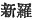
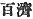
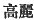
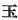
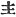
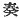

  
[Intangible Textual Heritage](../../index)  [Shinto](../index) 
[Index](index)  [Previous](kj104)  [Next](kj106) 

------------------------------------------------------------------------

[Buy this Book at
Amazon.com](https://www.amazon.com/exec/obidos/ASIN/B0028Y4SZY/internetsacredte)

------------------------------------------------------------------------

  
*The Kojiki*, translated by Basil Hall Chamberlain, \[1919\], at
Intangible Textual Heritage

------------------------------------------------------------------------

p. 289

## \[SECT. XCVIII.—EMPEROR CHIŪ-AI (PART IV.—THE EMPRESS JIN-GŌ CONQUERS KOREA)\]

So the wave [1](#fn_1754) of the august vessel
pushed up onto the land of Shiragi [2](#fn_1755) reaching to the middle of the country.
Thereupon the chieftain [3](#fn_1756) of the
country, alarmed and trembling. petitioned [4](#fn_1757) \[the Empress\], saying: "From this
time forward obedient to the Heavenly Sovereign's commands, I will feed
his august horses and will marshal vessels every year, nor ever let the
vessels' keels [5](#fn_1758) dry or their
poles and oars dry, and will respectfully serve him without drawing back
while heaven and earth shall last." [6](#fn_1759) So therefore the Land of
[Shiragi](errata.htm#66) [7](#fn_1760) was
constituted the feeder of the august horses, and the Land of Kudara
\[133\] was constituted the crossing store. [8](#fn_1761) Then the Empress stuck her august
staff on the gate of the chieftain of Shiragi, and having made the Rough
August Spirits [9](#fn_1762) of the Great
Deities of the Inlet of Sumi [10](#fn_1763)
the guardian Deities of the land, she laid them to rest, [11](#fn_1764) and crossed back. So while this
business [12](#fn_1765) was yet unconcluded,
\[the child\] with which she was pregnant was about to be born.
Forthwith, in order to restrain her august womb, she took a stone and
wound it round the waist of her august skirt, [13](#fn_1766) and the august child was born after
she had crossed \[back\] to the Land of Tsukushi. [14](#fn_1767) So the name by which the place was
called where the \[234\] august child was born was Umi. [15](#fn_1768) Again the stone which she wound round
her august skirt is at the village of Ito [16](#fn_1769) in the Land of Tsukushi.

p. 290

------------------------------------------------------------------------

### Footnotes

[289:1](kj105.htm#fr_1759) p. 289 *I.e.*, "the wave on which the august vessel
was riding."

[289:2](kj105.htm#fr_1760) In Sinico-Japanese
*Shin ra* ( ), one of the
three states into which Korea was anciently divided, the other two being
known in pure p. 290 Japanese as *Kudara* and
*Koma* (in Sinico-Japanese *Hiyaku-sai* 
 and Kōrai 
). *Shiragi* is evidently a mere corruption of the
Sinico-Japanese form, which closely resembles the native Korean
*Shin-la*. The origin of the pure Japanese forms of the other two names
is obscure.

[289:3](kj105.htm#fr_1761) The editions
previous to Motowori's have "King" (
 instead of 
); but as the latter character is used in all parallel
passages of this work, we must attribute the occurrence of the former in
this single place to a copyist's error, and accuse the author rather
than his commentator of the ill-natured degradation of the Korean King
into a mere chieftain (more literally a "master").

[289:4](kj105.htm#fr_1762) The character  , which is here used, is that
employed in speaking of a subject's addressing his sovereign.

[289:5](kj105.htm#fr_1763) Literally
"bellies."

[289:6](kj105.htm#fr_1764) Literally, "with
heaven and earth."

[289:7](kj105.htm#fr_1765) See Note 2.

[289:8](kj105.htm#fr_1766) *I.e.*, the
sea-store." The author means to say that from the Land of Kudara tribute
was to be paid with the regularity implied by the King's asseveration to
the effect that the keels, poles, and oars of the \[tribute-bearing\]
vessels should never remain dry.

[289:9](kj105.htm#fr_1767) *Ara-mi-tama*, the
antithetical term to which is *Nigi-mi-tama*, '' Gentle August Spirit."
We also find *Saki-mi-tama* and *Kushi-mi-tama*, which signify
respectively "August Luck-Spirit "and "Wondrous August Spirit." In this
passage it must be understood that the spirits which floated above the
Imperial junk to protect it were the "Gentle August Spirits," while the
"Rough August Spirits" presided at the Empress's feats of arms and kept
the enemy in subjection. Motowori warns us not to fall into the mistake
of supposing that the Rough and Gentle Spirits of a god were separate
individualities, they being only, according to him, various
manifestations of the same individuality. The student is advised to
consult his beautifully written note on the subject of these spirits in
Vol. XXX, pp. 72-76 of his Commentary.

[289:10](kj105.htm#fr_1768) See Sect. X Note
22.

[289:11](kj105.htm#fr_1769) Literally
"established and worshipped." Motowori says that this mention of their
being laid to rest is made with an implied reference to the journey on
which the deities in question had accompanied the Imperial army. He also
tries to prove that this laying to rest of the deities must have
occurred after the return of the Empress to Japan, as it is not possible
to suppose that the gods could find a home in a foreign land (!). But
the wording of the text is against him

[289:12](kj105.htm#fr_1770) p. 291 Literally "government"

[289:13](kj105.htm#fr_1771) *I.e.*, as
Motowori suggests, "she wrapped the stone up, and tied it into the waist
of her skirt in something resembling a sash."

[289:14](kj105.htm#fr_1772) In South-Western
Japan.

[289:15](kj105.htm#fr_1773) *I.e.*, "bearing."
The word, however, also signifies "sea." According to the "Chronicles"
the original name of the village was Kada.

[289:16](kj105.htm#fr_1774) This word
signifies "thread," and would therefore, one might think, find a more
appropriate place in I the legend next narrated, where the "threads "of
the Empress's garment are specially mentioned.

------------------------------------------------------------------------

[Next: Section XCIX.—Emperor Chiū-ai (Part V.—The Empress Jin-gō Fishes
in Tsukushi)](kj106)
