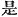
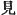
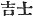
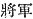
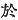
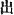

  
[Intangible Textual Heritage](../../index)  [Shinto](../index) 
[Index](index)  [Previous](kj106)  [Next](kj108) 

------------------------------------------------------------------------

[Buy this Book at
Amazon.com](https://www.amazon.com/exec/obidos/ASIN/B0028Y4SZY/internetsacredte)

------------------------------------------------------------------------

  
*The Kojiki*, translated by Basil Hall Chamberlain, \[1919\], at
Intangible Textual Heritage

------------------------------------------------------------------------

p. 292 \[235\]

## \[SECT. C.—EMPEROR CHIŪ-AI (PART VI.—THE EMPRESS JIN-GŌ SUBDUES YAMATO).\]

Hereupon, when Her Augustness Princess Okinaga-tarashi was returning up
to Yamato, she, owing to doubts concerning the disposition [1](#fn_1776) of the people, prepared a
mourning-vessel, [2](#fn_1777) set the august
child in that mourning-vessel, and let a report ooze out that the august
child was already dead. While she went up thus, King Kagosaka and King
Oshikuma, [3](#fn_1778) having heard \[of the
circumstance\], thought to waylay [4](#fn_1779) her, went forth to the moor of
Toga, [5](#fn_1780) and hunted for an omen.
Then King Kagosaka climbed up an oak-tree, [6](#fn_1781) and then [7](#fn_1782) a large and angry boar came forth, dug
up the oak-tree, and forthwith devoured King Kagosaka. His younger
brother, King Oshikuma, undaunted by this circumstance, raised an army
and lay in wait \[for the Empress\], to close with the mourning-vessel
as being an empty [8](#fn_1783) vessel. Then
an army was landed from the mourning-vessel, [9](#fn_1784) and joined in combat \[with the
opposing forces\]. At this time King Oshikuma made the Noble
Isahi, [10](#fn_1785) ancestor of \[236\] the
Kishi Clan of Naniha, [11](#fn_1786) his
generalissimo; [12](#fn_1787) and on

p. 293

the august side of the Heir Apparent His Augustness
Naniha-ne-ko-take-furu-kuma, [13](#fn_1788)
ancestor of the Grandees of Wani, [14](#fn_1789) was made generalissimo. So when \[the
Empress's troops\] had driven \[King Oshikuma's troops\] as far as
Yamashiro, \[the latter\] turned and made a stand, and both \[sides\]
fought together without retreating. Then His Augustness Take-furu-kuma
planned, and caused it to be said that, as Her Augustness
Okinaga-tarashi was already dead, there was no need for further
fighting,—forthwith snapping his bowstrings and feigning submission.
Therefore King Oshikuma's generalissimo, believing the falsehood, unbent
his bows and put away his arms. Then \[the Empress's troops\] picked out
of their topknots some prepared bowstrings (one name
\[of the bowstrings\] was *usa-yu-dzuru*; [15](#fn_1790)) stretched \[their bows\]
again, and pursued and smote \[the enemy\]. So \[these\] fled away to
Afusaka, [16](#fn_1791) rallied, and fought
again. Then \[the Empress's troops\] pursued on, and defeated them, and
cut to pieces that army at Sasanami. [17](#fn_1792) Thereupon King Oshikuma, together
with the Noble Isahi, being pursued and pressed, got on board a vessel
and floated on the sea, and sang, saying:

"Come on, my lord! rather than be stricken \[237\] by Furu-kuma's
hurtful hand, I will plunge like the grebe into the Sea of Afumi,—I
will!" [18](#fn_1793)

Forthwith they plunged into the sea, and died together.

p. 294

------------------------------------------------------------------------

### Footnotes

[292:1](kj107.htm#fr_1781) p. 293 Literally, "the hearts."

[292:2](kj107.htm#fr_1782) *I.e.*, a boat or
junk containing a coffin. We might also (adopting the interpretation
given by the older editors to the character in this passage) translate
by "specially prepared a mourning-vessel."

[292:3](kj107.htm#fr_1783) These two princes,
who are first mentioned at the end of Sect. p.
294 XCII (Notes 40 and 41), were. according to the story, elder
sons of the late monarch Chiū-ai, and therefore step-sons of the Empress
Jingō and half-brothers to the young Emperor Ō-jin.

[292:4](kj107.htm#fr_1784) Literally, "wait
for and catch." This "catch" is always taken by Motowori to mean "slay."

[292:5](kj107.htm#fr_1785) *Taga-nu*. It was
in the province of Settsu. The etymology of the name is obscure.

[292:6](kj107.htm#fr_1786) The species
mentioned in the text the *Quercus serrata*.

[292:7](kj107.htm#fr_1787) Motowori's
conjecture that the character 
, "then," is a copyist's error for  , "saw "or "looked," seems
hardly called for, and the translator has therefore not departed from
the traditional reading.

[292:8](kj107.htm#fr_1788) *I.e.*,
defenceless, not filled with troops.

[292:9](kj107.htm#fr_1789) Which of course was
in reality no mourning-vessel, but full of the soldiers who had just
returned from conquering Korea.

[292:10](kj107.htm#fr_1790) *Isahi no Sakune*.
*Isahi* or *Isachi* is supposed to mean "leading elder."

[292:11](kj107.htm#fr_1791) *Naniha no Kishi
be*. Naniha is the old name of the sea and river-shore on which I now
stands the town of Ohosaka. The name Kishi is said by Motowori to be
properly a Korean official designation (
), but it is one whose origin is to be sought in
China.

[292:12](kj107.htm#fr_1792)  , *Shōgun*. This is the
earliest mention of this office, which, passing from the military to the
political sphere, played such a great part in the mediaeval and modern
history of Japan.

[293:13](kj107.htm#fr_1793) The signification
of all the elements of this compound name is not clear, but it is partly
Honorific and descriptive of the bravery of its bearer.

[293:14](kj107.htm#fr_1794) *Wani no omi* (see
Sect. LXII, Note 11).

[293:15](kj107.htm#fr_1795) The text is here
somewhat obscure, and the note in small print is of doubtful
authenticity. If we retain it, we must understand it to mean that
*usa-yu-dzuru*, a term whose derivation is by no means clear, was an
alternative name of the *make dzuru*, *i.e.*, "prepared bowstrings,"
such as they had brought [with](errata.htm#67) them concealed in their
top-knots.

[293:16](kj107.htm#fr_1796) *I.e.*, "the pass
\[or hill\] of meeting." It was on the boundaries of the provinces of
Yamashiro and Afumi. The modern pronunciation is *Osaka* (not to be
confounded with the like-sounding name of a well-known town in Central
Japan).

[293:17](kj107.htm#fr_1797) *I.e.*, in Afumi.
Mabuchi, in his "Dictionary of Pillow-Words," explains this name to mean
"bamboo-grass bending." Motowori, following the *Shim-puku-ji* MS.,
alters the character  
before the word *Sasanami* to 
, but without sufficient warrant.

[293:18](kj107.htm#fr_1798) p. 295 The meaning of the poem is. "Rather than
fall beneath the attacks of the enemy, let us drown ourselves in the Sea
of Afumi'' (Lake Biwa).—For the expression "stricken by a hurtful hand
"see Sect. XLIV, Note 33.

------------------------------------------------------------------------

[Next: Section CI.—Emperor Chiū-ai (Part VIII.—The Heir Apparent
Exchanges Names with the Great Deity Izasa-Wake)](kj108)
