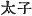
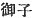
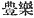
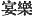

  
[Intangible Textual Heritage](../../index)  [Shinto](../index) 
[Index](index)  [Previous](kj113)  [Next](kj115) 

------------------------------------------------------------------------

[Buy this Book at
Amazon.com](https://www.amazon.com/exec/obidos/ASIN/B0028Y4SZY/internetsacredte)

------------------------------------------------------------------------

  
*The Kojiki*, translated by Basil Hall Chamberlain, \[1919\], at
Intangible Textual Heritage

------------------------------------------------------------------------

p. 308

## \[SECT. CVII.—EMPEROR Ō-JIN (PART IV.—HE GRANTS PRINCESS KAMINAGA TO HIS SON OHO-SAZAKI).\]

The Heavenly Sovereign, hearing of the beauty of Princess
Kaminaga, [1](#fn_1876) daughter of the Duke
of Muragata [2](#fn_1877) in the land of
Himuka, and thinking to employ her [3](#fn_1878) sent down for her, [4](#fn_1879) whereupon the Heir Apparent [5](#fn_1880) His Augustness Oho-sazaki, having seen
the maiden land at \[248\] the port of Naniha, and being charmed with
the grace of her appearance, forthwith directed the Prince Minister the
Noble Taka-uchi, to intercede for him in the august presence of the
Heavenly Sovereign, and make \[the latter\] grant to him Princess
Kami-naga, whom he had sent down for. Then on the Prime Minister the
Noble Take-uchi requesting the great commands, [6](#fn_1881) the Heavenly Sovereign forthwith
granted Princess Kami-naga to his august child. The way he granted her
was this:—the Heavenly Sovereign, on a day when he partook of a copious
feast, [7](#fn_1882) gave Princess Kami-naga
the great august liquor oak-\[leaf [8](#fn_1883)\] to present to the Heir Apparent.
Then he augustly sang, saying:

"Come on, children! oh! the fragrant flowering orange-tree on my way as
I go to pluck the wild garlic,—to pluck the garlic,—has its uppermost
branches withered by birds perching on them, and its lowest branches
withered through people plucking from them. But the budding fruit on the
middle branch, like three chestnuts,—the ruddy maiden, oh! if thou lead
her off with thee, it will be good, oh!' [9](#fn_1884)

\[249\] Again he augustly sang, saying:

"Driving the dyke-piles into Lake Yosami p.
309 where the water collects, my heart (ignorant of the pricking
of the stumps of the water-caltrop, ignorant of the creeping of the
roots of the *Brasenia peltata*), being more and more laughable, is now
indeed repentant." [10](#fn_1885)

Having thus sung, he bestowed \[her on the Heir Apparent\]. So after
having been granted the maiden, the Heir Apparent sang, saying:

"Oh! the maiden of Kohada in the back of the road! though I heard of her
like the thunder, we mutually intertwine \[our arms\] as pillows." [11](#fn_1886)

Again he sang saying":

"I think lovingly ah! of how the maiden \[250\] of Kohada in the back of
the road sleeps \[with me\] without disputing" [12](#fn_1887)

 

p. 310

------------------------------------------------------------------------

### Footnotes

[308:1](kj114.htm#fr_1881) *Kami-naga-hime*.
The name signifies "the long-haired princess."

[308:2](kj114.htm#fr_1882) *Murakata no kami*.
*Murakata* seems to signify "many towns."

[308:3](kj114.htm#fr_1883) *I.e.*, wed her.

[308:4](kj114.htm#fr_1884) Literally,
"summoned her up." The same phrase occurs immediately below.

[308:5](kj114.htm#fr_1885)  . Mabuchi thinks that  , "august child," should be
substituted for the reading in the text. But Motowori insists that the
title translated Heir Apparent was anciently borne by all the sons of an
Emperor, and that consequently no emendation is called for.

[308:6](kj114.htm#fr_1886) *I.e.*, the
Emperor's orders.

[308:7](kj114.htm#fr_1887) The native term
translated "copious feast" is *toyo no akari*, variously written with
the characters  ,  , 
, etc., etc. It literally signifies "copious
brightness," in allusion to the ruddy glow which wine gives to the faces
of the revellers, and henceforward perpetually recurs in this history.
In later times it specifically denoted the festival of, the tasting of
the first rice, but anciently its meaning was not thus limited.
Motowori's note on the subject, in Vol. XXXII, pp. 57-59 of his
Commentary, may be consulted with advantage.

[308:8](kj114.htm#fr_1888) *I.e.*, an oak-leaf
which was used as a cup to sip out of. Leaf-platters p. 310 for food have already been mentioned.
Motowori says that the word *kashika* (properly the name of a deciduous
oak, the *Quercus dentata*) was employed to denote any kind of leaf thus
used.

[308:9](kj114.htm#fr_1889) The whole gist of
this Song is contained in the last three lines. "The ruddy maiden, oh if
thou lead her off with thee, it will be good,"—*i.e.* "thou and the
maiden, will form a fitting couple." All that goes before is what is
technically called a "Preface," though its bearing is so clear as to
admit of translation, and even in English to form an appropriate
introduction to the Song:—It is not the stinking garlic, but the
fragrant orange that the singer has met by the way, and it is the
choicest young fruit in the very middle of the tree that forms a
suitable comparison for the lovely young girl.—With the favourite
allusion to upper, middle, and lower the reader is already familiar, and
the Pillow-Word "three chestnuts" was explained in the note on the
[preceding](errata.htm#75) Song (Sect. CVI, Note 8).

[309:10](kj114.htm#fr_1890) The gist of the
Song is: "I knew not that thou, my son, hadst conceived a secret passion
for the maiden; but I am now conscious of my own mistake, and my foolish
old heart is ashamed of itself." With this explanation the elaborate
comparison between the state of the monarch's mind and the condition of
the peasant driving piles for the foundation of a dyke, and having his
feet either lacerated by the stumps of the water-caltrop, or made slimy
by brushing against the roots of the *Brasenia peltata* at the bottom of
the water, becomes intelligible and appropriate.—The word *kuri*,
rendered "roots," perplexed Motowori, who suggests that it may be but a
second name of the *Brasenia*, appended to the first; but Moribe's
suggestion that it is to be identified with *kori*, and taken in the
signification of "roots" though not quite convincing, is at least more
plausible. The text of this Song is corrupt in these "Records" and has
to be corrected by a comparison with that of the "Chronicles." Moribe
goes into an amusing ecstasy over the picture of ancient manners which
it presents, and lauds the simplicity of days when a father and son
could so peacefully woo the same maiden without mutual concealment or
disastrous consequences!

[309:11](kj114.htm#fr_1891) The meaning of
this Song is: "At first I heard of the maiden of Kohada in the furthest
parts of Himuka as one hears the distant thunder; but now she is mine,
and we sleep locked in each other's arms."—This Kohada in Himuka must
not be confounded with the Kohata in Yamashiro mentioned in the
preceding Section. The "back of the road" means the remotest portion
(conf. Sect. LX, Note 20). The thunder must be understood to refer to a
very faint and distant p. 311 sound: the
Prince had first heard of the maiden vaguely, but now she is his and has
been his for some time; for this Song must be supposed to have been
composed after the occasion of the feast with the story of which it is
here connected.

[309:12](kj114.htm#fr_1892) The meaning of
this Song is: "I love this maiden of Kohada in Himuka, who disputed not
my desire and my father's grant, but willingly became my wife."—It is
hard to render into English the force of the string of Particles *wo shi
zo mo* in the penultimate line.

------------------------------------------------------------------------

[Next: Section CVIII.—Emperor Ō-jin (Part V.—Songs of the Territorial
Owners of Yeshinu)](kj115)
