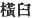
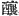

  
[Intangible Textual Heritage](../../index)  [Shinto](../index) 
[Index](index)  [Previous](kj114)  [Next](kj116) 

------------------------------------------------------------------------

[Buy this Book at
Amazon.com](https://www.amazon.com/exec/obidos/ASIN/B0028Y4SZY/internetsacredte)

------------------------------------------------------------------------

  
*The Kojiki*, translated by Basil Hall Chamberlain, \[1919\], at
Intangible Textual Heritage

------------------------------------------------------------------------

p. 311

## \[SECT. CVIII.—EMPEROR Ō-JIN (PART V.—SONGS OF THE TERRITORIAL OWNERS OF YESHINU).\]

Again, the Territorial Owners of Yeshinu, [1](#fn_1888) seeing the august sword which was
girded on His Augustness Oho sazaki, sang, saying:

"Sharp is the beginning, freezing is the end of the sword girded on
Oho-sazaki, Oho, sazaki, the solar august child of Homuda,—\[it is\]
chilly, chilly like the trees beneath the trunks of the winter
trees." [2](#fn_1889)

Again, having made a cross-mortar [3](#fn_1890) at Kashifu [4](#fn_1891) in \[251\] Yeshinu, and having in that
cross-mortar distilled [5](#fn_1892) some
great august liquor, they, when they presented the great august liquor
\[to the Heavenly Sovereign\], sang as follows, drumming with their
mouths:

"We have made a side-mortar at Kashinofu, and in the side-mortar we have
distilled some great august liquor, which do thou sweetly partake of, oh
our lord!" [6](#fn_1893)

This Song is one which it is the custom to chant down to the present day
when, from time to time, the Territorial Owners present a great feast
\[to the Sovereign\].

------------------------------------------------------------------------

### Footnotes

[311:1](kj115.htm#fr_1893) p. 312 Yeshinu is the modern Yoshino, in the
province of Yamato (see Sect. XLVI, Note 3). For the title of *kudzu*
see Sect. XLVI, Note 13, where it also occurs in connection with
Yeshinu.

[311:2](kj115.htm#fr_1894) According to
Moribe, whose interpretation seems best to the translator. the
signification of this difficult poem is: "The sword worn by Prince
Oho-sazaki, son of the Emperor Homuda (O-jin) is double-edged at its
upper part, and like glistening ice towards its point;—oh! ’tis like the
icicles on the plants that cluster about the trunks of the dead trees in
winter!" Almost every line, however (excepting those giving the name and
title of the Prince), is a subject of controversy, and the "*Gō-Gan
Shō*" *in loco* and Motowori's Commentary, Vol. XXXIII, pp. 2-5, should
be consulted for Keichiū's, Mabuchi's and Motowori's views on the
disputed point.—The expression "solar august child" signifies
"sun-descended prince," in allusion to the supposed descent of the
Japanese monarchs from the Sun-Goddess.

[311:3](kj115.htm#fr_1895) *Yoko-usu* or
*yokusu* ( ). It is not
plain what sort of mortar the author intended to designate by this term.
Motowori supposes it to mean a broad flat mortar in contradistinction to
a high and narrow one. [Keichiū's](errata.htm#76) view, which he quotes,
to the effect that it was a mortar that had been carved out of the,
block against the grain of the wood, seems an equally good guess, where
all is guess-work.

[311:4](kj115.htm#fr_1896) In the Song this
same name is read *Kashinofu*; but the commentators tell us that the
Genitive Particle *no* ("of") is simply inserted for the sake of rhythm,
and it is not unlikely that they are right. The name seems to signify
"\[a place where\] oak-trees grow."

[311:5](kj115.htm#fr_1897) See Sect. XVIII,
Note 16. The character  ,
rendered by "distil" or "brew," according to the view which one may take
of the resulting liquor, would seem to be here used in the sense of "to
pound."

[311:6](kj115.htm#fr_1898) In this simple Song
the Territorial Owners of Yoshino beg the Monarch to deign to partake of
the sake which they have made.

------------------------------------------------------------------------

[Next: Section CIX.—Emperor Ō-jin (Part VI.—Various Deeds)](kj116)
