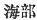

  
[Intangible Textual Heritage](../../index)  [Shinto](../index) 
[Index](index)  [Previous](kj115)  [Next](kj117) 

------------------------------------------------------------------------

[Buy this Book at
Amazon.com](https://www.amazon.com/exec/obidos/ASIN/B0028Y4SZY/internetsacredte)

------------------------------------------------------------------------

  
*The Kojiki*, translated by Basil Hall Chamberlain, \[1919\], at
Intangible Textual Heritage

------------------------------------------------------------------------

p. 312

## \[SECT. CIX.—EMPEROR Ō-JIN (PART VI.—VARIOUS DEEDS)\]

In this august reign were graciously established the Fisher Tribe, [1](#fn_1894) the Mountain Tribe, [2](#fn_1895) the Mountain Warden Tribe, [3](#fn_1896) and the Ise Tribe. [4](#fn_1897) Again the Pool of Tsurugi was made.
Again there came over \[to Japan\] some

p. 313

people from Shiragi. Therefore His Augustness the Noble Take-uchi,
having taken them with him and set them to labour on pools and
embankments, made the Pool of Kudara. [5a](#fn_1898)

------------------------------------------------------------------------

### Footnotes

[312:1](kj116.htm#fr_1899) p. 313 *Ama-be* (written   and read *Una-be* in the Old
Printed Edition and in the edition of 1687, and perhaps better rendered
"Sea-Tribe.") The name of this guild or clan does not seem to have
remained, like the two mentioned together with it, as a "gentile name."

[312:2](kj116.htm#fr_1900) *Yama-be*. Motowori
thinks that this word has crept into the text erroneously through the
influence of that next mentioned, as the functions of the tribes or
guilds thus separately named were identical The differentiation may have
taken place after the terms had come to be used as "gentile names."

[312:3](kj116.htm#fr_1901) *Yama-moribe*.

[312:4](kj116.htm#fr_1902) *Ise-be*. Nothing
is known of this tribe or guild.

[313:5a](kj116.htm#fr_1903) Doubtless so named
after the Korean labourers employed upon it,—Kudara and Shiragi, as
different parts of the same peninsula, being confounded in thought.

------------------------------------------------------------------------

[Next: Section CX.—Emperor Ō-jin (Part VIII.—Tribute From Korea)](kj117)
