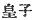
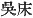
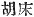
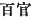
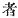
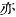
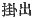
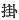
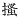

  
[Intangible Textual Heritage](../../index)  [Shinto](../index) 
[Index](index)  [Previous](kj118)  [Next](kj120) 

------------------------------------------------------------------------

[Buy this Book at
Amazon.com](https://www.amazon.com/exec/obidos/ASIN/B0028Y4SZY/internetsacredte)

------------------------------------------------------------------------

  
*The Kojiki*, translated by Basil Hall Chamberlain, \[1919\], at
Intangible Textual Heritage

------------------------------------------------------------------------

p. 316

## \[SECT. CXII.—EMPEROR Ō-JIN (PART IX.—TROUBLES WHICH FOLLOWED HIS DECEASE)\]

So after the decease of the Heavenly Sovereign, His Augustness
Ohosazaki, in conformity with the Heavenly Sovereign's commands, ceded
the Empire to Uji-no-waki-iratsuko. Thereupon His Augustness
Ohoyama-mori, disobeying the Heavenly Sovereign's commands, and anxious
in spite thereof to obtain the Empire, had the design to slay the
Prince [1](#fn_1917) his younger brother,
secretly raised an army, and prepared to attack him. Then His Augustness
Oho-sazaki, hearing that his elder brother had prepared an army,
forthwith despatched a messenger to apprise Uji-no-waki-iratsuko. So,
startled at the news, \[the latter\] set troops in ambush by the
river-bank, and likewise, after having drawn a fence of curtains and
raised a tent on the top of the hill, placed there publicly on a
throne [2](#fn_1918) one of his retainers to
pretend that he was the King, [3](#fn_1919)
the manner in which all the officials [4](#fn_1920) reverentially went and came being just
like that \[usual\] in the King's presence. And moreover, preparing for
the time \[255\] when the King his elder brother [5](#fn_1921) should cross the river, he arranged
and decorated a boat and oars, and moreover [6](#fn_1922) ground \[in a mortar\] the root of the
*Kadzura japonica*, and having taken the slime of its juice, rubbed

p. 317

therewith the grating [7](#fn_1923) inside the
boat, so as to make any who should tread on it fall down, and then
himself [8](#fn_1924) put on a cloth coat and
trowsers, and having assumed the appearance of a common fellow, stood in
the boat holding the oar. Hereupon, when the King his elder brother,
having hid his troops in ambush and put on armour beneath his clothes,
reached the river-bank and was about to get into the boat, he gazed at
the grandly decorated place \[on the hill\], thought the King his
younger brother was sitting on the throne, being altogether ignorant
\[of the fact\] that he was standing in the boat holding the oar, and
forthwith asked the fellow who was holding the oar, saying: "It has been
reported to me that on this mountain there is a large and angry boar. I
wish to take that boar. Shall I peradventure get that boar? "Then the
fellow holding the oar replied, saying: "Thou canst not." Again he
asked, saying: "For what reason?" \[The boat-man\] answered, saying: "He
is not to be got, however often and in however many places he be chased.
Wherefore I say that thou canst not \[catch him either\]. "When they had
crossed as far as the middle of the river, \[Prince
Uji-no-waki-iratsuko\] caused the boat to be tilted over, and \[his
elder brother\] to fall into the water. [9](#fn_1925) Then forthwith he rose to the surface,
and floated down with the current. Forthwith, as he floated, he sang,
saying:

"Whoever is swiftest among the boatmen of the Uji ferry will come to
me."' [10](#fn_1926)

Thereupon the troops that had been hidden on the \[256\] river-bank rose
up simultaneously on this side and on that side, and fixing their arrows
\[in their bows\], let him go floating down. So he sank on reaching
Kawara

p. 318

\[paragraph continues\] Point. [11](#fn_1927) So on their searching with
hooks [12](#fn_1928) the place where he had
sunk, \[the hooks\] struck on the armour inside his clothes, and made a
rattling sound. [13](#fn_1929) So the place
was called by the name of Kawara Point. Then when they hooked up [14](#fn_1930) his bones, the younger King, sang
saying:

"*Catalpa* bow, *Evonymus* standing by the ferry-bank of Uji! My heart
had thought to cut \[you\], my heart had thought to take \[you\]; but at
the base methought of the lord, at the extremity methought of the
younger sister; grievously methought of this, sorrowfully methought of,
that; and I came \[back\] without cutting it,—the *Catalpa* bow, the
*Evonymus*." [15](#fn_1931)

\[257\] So the bones of His Augustness Oho-yama-mori were buried on the
Nara [16](#fn_1932) mountain. His Augustness
Oho-yama-mori (was the ancestor of the Dukes of
Hijikata, [17](#fn_1933) the Dukes of
Heki, [18](#fn_1934) and the Dukes of
Harihara. [19](#fn_1935))

p. 319

------------------------------------------------------------------------

### Footnotes

[316:1](kj119.htm#fr_1922) p. 318 
. This is the only passage in the work where this
expression occurs. *Uji-no-waki-iratsuko* is the personage thus
designated.

[316:2](kj119.htm#fr_1923) The same expression
has been in Sect. XXXI (near Note 16) rendered "couch." The characters
in the original are   or
 .

[316:3](kj119.htm#fr_1924) *I.e.*,
*Uji-na-maki-iratsuko*.

[316:4](kj119.htm#fr_1925) The Chinese phrase
 , "the hundred
officials," is here used.

[316:5](kj119.htm#fr_1926) *Q.d.*, his
Augustness Oho-yama-mori.

[316:6](kj119.htm#fr_1927) The text has the
character  , which, in
combination with the preceding words "oars" gives the sense of
"oarsman," "boatman." But Motowori reasonably suggests that it is an
error for  , the grass
hand forms of the two characters closely resembling each other, and
  making much better
sense; for who would talk of "decorating an oarsman"?

[317:7](kj119.htm#fr_1928) A bamboo grating.

[317:8](kj119.htm#fr_1929) Literally "that
king's son."

[317:9](kj119.htm#fr_1930) It must be
understood that Uji-no-waki-iratsuko and his men. p.
319 having planned to act thus, were on their guard, and did not
fall into the water as did Oho-yama-mori, who was taken unawares.

[317:10](kj119.htm#fr_1931) This is Motowori's
view of the meaning of the Song, which he interprets as a request for
help to some friendly boatman. Moribe adopts quite a different view, and
thinks that the drowning prince is rather giving vent to sentiments of
pride and defiance. He says (speaking in the Prince's name): "It is not
that I have been capsized out of the boat into the river. but that I am
swimming off after a pole which has fallen into the water. If there be
any strong and willing fellows among my partizans, let them swim after
me." It must be explained that the word rendered "boatmen" in the
translation is literally "pole-takers" (or, according to Moribe's view,
"to take a pole.") Motowori's interpretation seems to do less violence
to the wording of the original, and Moribe's has not even the merit of
accounting for the use of the Future *komu* where the Imperative *kone*
would be what we should naturally expect.—*Uji* is preceded by the, in
this context, untranslatable Pillow-Word *chihayaburu* (see "Dictionary
of Pillow-Words," *s.v.*).

[318:11](kj119.htm#fr_1932) *Kawara no saki*.
The author, in the next sentence, derives this name from the rattling
sound made by the books as they struck on the armour. But there seems a
great deal to be said in favour of Arawi Hakuseki's view that *kawara*
is an old word itself signifying "armour."

[318:12](kj119.htm#fr_1933) The word *kagi*
here used occurs elsewhere to denote the hooks employed for fastening
doors, and in later times took the specific meaning of "key."

[318:13](kj119.htm#fr_1934) Literally,
"sounded *kawara*."

[318:14](kj119.htm#fr_1935) The text has the
characters  . But Motowori
says that   stands for
 , and that we must
interpret the passage to mean that they scratched \[about to find\] and
take out \[his corpse\].

[318:15](kj119.htm#fr_1936) The signification
of this Song is: "I came here meaning to kill thee as I might cut down
and kill that *Catalpa* tree, that *Evonymus*, growing on the
river-bank. But the thought of our father and of thy sister (or wife)
touched me with pity, and I return without having drawn my bow at
thee."—Uji is preceded by the untranslatable Pillow-Word *chihayahito*
(see Dictionary of Pillow-Words" s.v.;—Motowori reads it *chihaya-hito*
without the *nigori*).—The words *adzusa-yumi ma-yumi*, here
respectively rendered "*Catalpa* bow "and "*Evonymus*," are difficult,
and the doubt as to whether we should understand the prince to be
speaking simply of the trees, or to intend likewise to allude to his bow
which was made of the wood of one of those trees, is probably not to be
settled, as the [words](errata.htm#78) in question have always
oscillated between the two p. 320 meanings,
and here evidently contain a double allusion. Motowori thinks that the
first of the two forms only a sort of Pillow-Word for the second.—The
word rendered "bank," in accordance with Moribe's suggestion, is
literally "reach."—No special importance must be attached to the
expressions "base" (or "main part") and "extremity," though they may
doubtless be thought to allude to the father and sister, the
recollection of whom softened the victorious younger brother's heart.
The word *iranakeku*, rendered "grievously," is of not quite certain
interpretation.—It must be understood that though, by overturning the
boat, Uji-no-waki-iratsuko did constructively cause Oho-yama-mori's
death, he did not actually shoot at and slay him when in the water, but
followed down the river-side lamenting over what had happened.—This Song
is singled out by Moribe for special praise.

[318:16](kj119.htm#fr_1937) See Sect. LXXII,
Note 23.

[318:17](kj119.htm#fr_1938) Tohotafumi
(Tōtōmi). In the original *Hijikata no kimi*.

[318:18](kj119.htm#fr_1939) *Heki na kimi*. Of
Heki nothing is known,

[318:19](kj119.htm#fr_1940) *Harihara no
kimi*. In Tohotafumi. *Harihara* signifies "alder plantation."

------------------------------------------------------------------------

[Next: Section CXIII.—Emperor Ō-jin (Part X.—Princes Oho-sazaki And
Uji-no-waki-iratsuko Cede the Empire to Each Other)](kj120)
