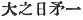
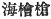
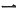
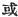
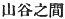
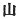
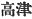

  
[Intangible Textual Heritage](../../index)  [Shinto](../index) 
[Index](index)  [Previous](kj120)  [Next](kj122) 

------------------------------------------------------------------------

[Buy this Book at
Amazon.com](https://www.amazon.com/exec/obidos/ASIN/B0028Y4SZY/internetsacredte)

------------------------------------------------------------------------

  
*The Kojiki*, translated by Basil Hall Chamberlain, \[1919\], at
Intangible Textual Heritage

------------------------------------------------------------------------

## \[SECT. CXIV.—EMPEROR Ō-JIN (PART XI.—AMA-NO-HI-BOKO CROSSES OVER TO JAPAN)\]

Moreover of old there had been \[a man\] called by the name of
Ama-no-hi-boko, [1](#fn_1942) child of the
ruler of the land of Shiragi. This person crossed over here \[to
Japan\]. The reason of his crossing over here was \[this\]: In the land
of Shiragi there was a certain lagoon, [2](#fn_1943) called by the name of the Agu
Lagoon. [3](#fn_1944) On the bank of this
lagoon [4](#fn_1945) a certain poor girl was
\[taking her\] midday sleep. Tunc solis radii, coelesti arcui similes,
in privatas partes impegerunt. Again there was a certain poor man,
\[259\] who, thinking this occurrence [5b](#fn_1946) strange, constantly watched the
woman's behaviour. So the woman, having conceived from the time of that
midday sleep, gave birth to

p. 322

a red jewel. Then the poor man who had watched her begged \[to be
allowed\] to take the jewel, and kept it constantly wrapped up by his
side. [6](#fn_1947) This person, having
planted a rice-field in a valley, [7](#fn_1948) had loaded a cow [8](#fn_1949) with food for the labourers, and was
getting into the middle of the valley, when he met the ruler's son,
Ama-no-hi-boko, who thereupon asked him, saying: "Why enterest thou the
valley with a load of food upon a cow? Thou wilt surely kill this cow
and eat her." Forthwith he seized the man and was about to put him into
prison, when the man replied, saying: "I was not going to kill the cow.
I was simply taking food to the people in the fields." But still \[the
ruler's child\] would not let him go. 'Then he undid the jewel \[which
hung\] at his side, and \[therewith\] bribed \[the ruler's child\]. So
\[the latter\] let the poor man go, brought the jewel \[home\], and
placed it beside his couch. Forthwith it was trans-formed into a
beautiful maiden, whom he straightway wedded, and made his chief wife.
Then the maiden perpetually prepared all sorts of dainties with which
she constantly fed her husband. So the ruler's child \[grew\] proud in
his heart, and reviled his wife. But the woman said: "I am not a woman
who ought to be the wife of such as thou. I will go to the land of my
ancestors;"—and forthwith she secretly embarked in a boat, and fled away
across here \[to Japan\], and landed [9](#fn_1950) at Naniha. [10](#fn_1951) (This is the
deity called Princess Akaru, [11](#fn_1952)
who dwells in the shrine of Hime-goso [12](#fn_1953) at Naniha.) Thereupon
Ame-no-hi-boko, hearing \[260\] of his wife's flight, forthwith pursued
her across hither, and was about to arrive at Naniha, when the Deity of
the passage [13](#fn_1954) prevented his
entrance. So he went back again, and landed in the country of
Tajima. [14](#fn_1955)

------------------------------------------------------------------------

### Footnotes

[321:1](kj121.htm#fr_1947) p. 323 Or, according to Motowori's reading, *Ame
no-hi boko*. The characters in the next, 
 signify "heavenly sun-spear." But the homonymous
characters  , with which
the name is written in the "Gleanings from Ancient Story," and which are
approved of both by Motowori and by Tanigaha Shisei. signify
"fisherman's chamaecyparis spear."

[321:2](kj121.htm#fr_1948) Apparently nothing
more is meant than that there was "*a* lagoon;" but still the *one*
( ) in this context is
curious, and Motowori retains it as *hito-tsu no* in the Japanese
reading. "A certain" seems best to render its force in English, as again
in the following sentences, where Motowori interprets it by the
character  . It is of
strangely frequent recurrence in the opening sentences of this Section,
which are altogether peculiar in style.

[321:3](kj121.htm#fr_1949) *Agu-numa*. The
meaning of this name is unknown.

[321:4](kj121.htm#fr_1950) The Old Printed
Edition has the word "mud" instead of "lagoon."

[321:5b](kj121.htm#fr_1951) Literally, "this
appearance."

[322:6](kj121.htm#fr_1952) Literally,
"attached to his loins."

[322:7](kj121.htm#fr_1953) The words rendered
"in a valley "are in the text 
, of which the commentators find it difficult to make
proper Japanese. The translator has followed them in neglecting the
character  , "mountain."

[322:8](kj121.htm#fr_1954) Or bull, or
bullock; for Japanese does not distinguish Genders.

[322:9](kj121.htm#fr_1955) Literally,
"stopped."

[322:10](kj121.htm#fr_1956) See Sect. XLIV,
Note 26.

[322:11](kj121.htm#fr_1957) *Akaru-hime*,
*i.e.*, "Brilliant Princess."

[322:12](kj121.htm#fr_1958) The signification
of this name is obscure. Motowori identifies the place with the modern
Kodzu ( ).

[322:13](kj121.htm#fr_1959) *I.e.*, the
water-god of the sea near Naniha.

[322:14](kj121.htm#fr_1960) See Sect. LXXIV,
Note 1.

------------------------------------------------------------------------

[Next: Section CXV.—Emperor Ō-jin (Part XII.—Descendants of
Ama-no-hi-boko, and Treasures Brought by Him.)](kj122)
